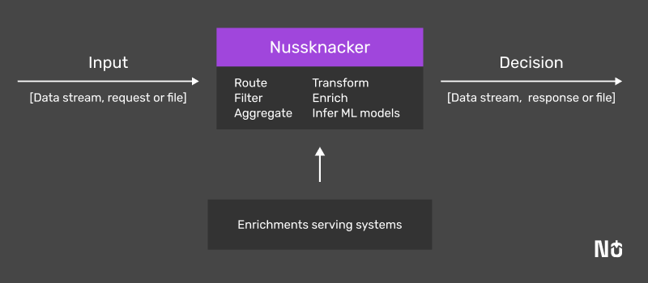

<div align="center">
  
</div>
</br>
<h1 align="center">Real-time actions on data</h1>

<div align="center">
  
  [](https://maven-badges.herokuapp.com/maven-central/pl.touk.nussknacker/nussknacker-designer_2.12)
  [](https://github.com/touk/nussknacker/actions?query=workflow%3ACI+branch%3Astaging++)
  [](https://artifacthub.io/packages/search?repo=touk)
  [](CONTRIBUTING.md#Contributing)

</div>
<h3 align="center">
  <a href="https://demo.nussknacker.io"><b>Demo</b></a> &bull;
  <a href="https://nussknacker.io/documentation"><b>Documentation</b></a> &bull;
  <a href="https://nussknacker.io/documentation/quickstart/docker/"><b>Quickstart</b></a> &bull;
  <a href="https://nussknacker.io/documentation/docs/installation/"><b>Installation</b></a> &bull;
  <a href="https://cloud.nussknacker.io"><b>Nu Cloud</b></a>  

</h3>


## What is Nussknacker

Nussknacker is a low-code visual tool for domain experts to build, run and monitor real-time decision algorithms instead of implementing them in the code.

In all IT systems, no matter the domain, decisions are made all the time. Which offer should a customer get? Who should receive a marketing message? Does this device need servicing? Is this a fraud?

Algorithms for making such decisions can be developed by programmers. With Nussknacker however, such decision algorithms can be authored and deployed without the need to involve IT.

An essential part of Nussknacker is a visual design tool for decision algorithms (scenarios in Nussknacker's speak). It allows not-so-technical users, like analysts or business people, to author decision logic in an imperative, easy-to-follow and understandable way. Scenario author uses prebuilt components to define the decision logic - routing, filtering,  data transformations, aggregations in time windows (Flink engine only - see below), enrichments with data from external databases or OpenAPI endpoints, applications of ML models, etc. Once authored, with a click of a button, scenarios are deployed for execution. And can be changed and redeployed anytime there’s a need.

The way the data are processed and the features available depend on the processing mode and engine used. 

Nussknacker supports three [processing modes](https://nussknacker.io/documentation/docs/about/ProcessingModes/): streaming, request-response and batch (planned in version 1.16). In streaming mode, Nussknacker uses Kafka as its primary interface: input streams of data and output streams of decisions. In request-response mode, it exposes HTTP endpoints with OpenAPI definitions. 

There are two engines to which scenarios can be deployed: Flink and Lite. Check out [this document](https://nussknacker.io/documentation/docs/about/engines/) to understand which of the two fits your use case better. 

## Why Nussknacker

Nussknacker is a tool for those who want to act on real-time data as easily as it is with [data at rest](https://en.wikipedia.org/wiki/Data_at_rest) and spreadsheets. Hundreds of millions of non-programmers create spreadsheets to crunch data at rest these days. The same should be possible with real-time data - and this is our promise with Nussknacker. If this promise is fulfilled, domain experts and developers can focus on tasks that each group is most happy to perform. Domain experts can author the decision algorithms and developers can solve problems beyond the reach of tools like Nussknacker.

We discovered that several factors heavily influence the development of algorithms that work with real-time data, including expectations placed on the tools used:
- **Domain experts** - often, these are domain experts who conceptualize the algorithms, and the expertise required is very domain-specific. Without proper tools for converting algorithms to code, domain experts have to delegate this work to programmers who are proficient in multiple tools, programming languages, and technologies. This approach costs money and takes time. With Nussknacker, domain experts build the algorithm from prefabricated blocks. The trick is to make these prefabricated blocks infinitely flexible to allow for any data transformation and flow control condition. Nussknacker achieves this by using [SpEL](https://nussknacker.io/documentation/docs/scenarios_authoring/Intro/#spel), an easy-to-learn expression language.
- **Experimentation** - the algorithms may require a lot of experimentation before one gets them right. If so, the iteration time to implement a change, deploy it, and see the result should be in single minutes if not seconds. With Nussknacker, non-technical users can achieve iteration time below one minute.
- **Data enrichment** - the data stream's or request's informational content can be very limited - for example, Call Data Records (CDRs), clickstream, and sensor readouts. After initial filtering, if one needs to build useful algorithms, the original data has to be enriched with data from external sources. Nussknacker supports SQL, OpenAPI and ML enrichments. As all of them can be treated as a function call they blend very well with the expression language used by Nussknacker and do not add any additional complexity to algorithm authoring.  
- **Productivity** - if low-code solutions want to be considered tools rather than toys, they must offer features available in professional developer toolkits. Nussknacker Designer has built-in [syntax checking, code completion](https://nussknacker.io/documentation/docs/about/KeyFeatures/#smart-code-suggestions-and-validation), versioning, [debugging, and testing support](https://nussknacker.io/documentation/docs/next/scenarios_authoring/TestingAndDebugging/).
- **Observability** - experimenting with algorithms requires insights going beyond pure technical metrics like throughput, Kafka topics lag, etc. Out of the box, Nussknacker comes with an integrated and ready-to-use monitoring subsystem which allows monitoring not only technical aspects of the running scenario but also its internal behavior - for example [events count](https://nussknacker.io/documentation/docs/next/scenarios_authoring/TestingAndDebugging/#watching-nodes-filtering-behaviour-with-counts) per scenario step. You will not need to spend developers' time on this functionality.
- **Architecture** - last but not least, the fundamentals on which you build matter. Nussknacker  achieves exceptional throughput, horizontal scalability, resilience, and high availability through the use of tools and platforms known for their rock-solid architecture - Kafka, Flink, and Kubernetes, which handle all processing tasks.

Check out [this document](https://nussknacker.io/documentation/docs/about/KeyFeatures/) for a concise summary of Nussknacker features. 


## Use cases



Nussknacker is typically used as a component of a larger system, but it can be used as an end-to-end solution too. The use cases follow a common pattern: a program working on a data stream, file or in a request-response interaction style, receives a set of data (event or request) and has to deliver a decision. To “take” the decision it needs to perform one or more of the following: discard irrelevant records, enrich incoming records with data from external sources, aggregate events in time windows (if working on a data stream), run one or more ML models, compute the decision and finally deliver it either as another data stream, file or a response.  The ‘decisions’ can be from a broad spectrum of vertical and horizontal applications:
- Is it a fraud?
- Should a loan be granted?
- Next Best Offer
- Clickstream analysis
- Real-time marketing
- ML models deployments with non-trivial pre and post-processing 
- IoT sensor readouts real-time analysis
- … 


## Where to learn more

- [Typical deployment](https://nussknacker.io/documentation/docs/about/typical%20implementation/Streaming/)
- [Authoring scenarios with Nussknacker](https://nussknacker.io/documentation/docs/scenarios_authoring/Intro/) 
- [Customer success story](https://nussknacker.io/case-studies/real-time-marketing-for-a-telecom-service-provider/)
- [Nussknacker Enterprise](https://nussknacker.io/documentation/docs/about/NussknackerEnterprise/)

## Quickstart

To run Nussknacker on your host as quickly as possible, just copy and paste the following code into your terminal:
```bash
curl -o- https://raw.githubusercontent.com/TouK/nussknacker-quickstart/main/download-and-start.sh | bash
```

To learn more about this quickstart please visit the [quickstart guide](https://nussknacker.io/documentation/quickstart/docker).

## Contact

Talk to us on [mailing list](https://groups.google.com/forum/#!forum/nussknacker)
or [start a discussion](https://github.com/TouK/nussknacker/discussions/new?category=q-a)

## Scala compatibility

Currently, we do support Scala 2.12 and 2.13, we cross publish versions. Default Scala version is 2.13. Docker images (both Designer and Lite Runtime) are tagged with `_scala-2.X` suffix (e.g. `1.8.0_scala_2.13` or `latest_2.12`). 
Tags without such suffix are also published, and they point to images with default Scala version build. Please be aware of that, especially if you use `latest` image tag.

## Flink compatibility

We currently support only one Flink version (more or less the latest one, please see flinkV in build.sbt). 
However, it should be possible to run Nussknacker with older Flink version. 

While we don't provide out-of-the-box
support as it would complicate the build process, there is separate [repo](https://github.com/TouK/nussknacker-flink-compatibility)
with detailed instructions how to run Nussknacker with some of the older versions.  

## Related projects

- [nussknacker-quickstart](https://github.com/TouK/nussknacker-quickstart) - Repository with quick setup (docker-compose) presenting typical usage of Nussknacker    
- [nussknacker-sample-components](https://github.com/touk/nussknacker-sample-components) - Start here if you intend to create own Nussknacker components
- [nussknacker-sample-helpers](https://github.com/touk/nussknacker-sample-helpers) - Sample project showing how to add custom helpers (user defined functions)
- [nussknacker-helm](https://github.com/TouK/nussknacker-helm) - Helm chart of the project                     
- [nussknacker-flink-compatibility](https://github.com/TouK/nussknacker-flink-compatibility) - Toolbox providing backward compatibility for older Flink's versions
- [nussknacker-benchmarks](https://github.com/TouK/nussknacker-benchmarks) - micro and e2e benchmarks visualization
- [flink-scala-2.13](https://github.com/TouK/flink-scala-2.13) - our patch for Flink, required if you want use Nussknacker built with scala 2.13
                                                   

## Contributing

Nussknacker is an open source project - contribution is welcome. Read how to do it in [Contributing guide](CONTRIBUTING.md).
There you can also find out how to build and run development version of Nussknacker.

## Legal

**Nussknacker** is published under [Apache License 2.0](http://www.apache.org/licenses/LICENSE-2.0).

By using **Nussknacker** you accept the [Privacy Policy](https://github.com/TouK/nussknacker/blob/staging/PRIVACY_POLICY.md).
