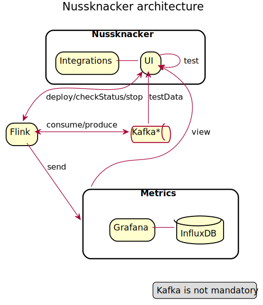

Nussknacker consists of three parts:

**engines** - are **libraries** which transform internal json process representation (process graph) into jobs. For example Flink engine generates Flink specific code, compiles and packages all needed components into JAR file for execution, and then runs the job via Flink REST API.

**ui** - is a standalone **application** which allows users to design process diagrams and to deploy them into runtime environments.

**integrations** - are your application specific classes like your model, http services, or custom stateful components.

##Engine
Engine consists of various modules that enable creation of processes building blocks in UI and interpretation of process diagrams. Engines implement `DeploymentManagerProvider`.

##UI
The **ui** application is a simple application written using Scala, Akka Http and Slick on the backend side and ReactJS on the front. Processes, their history, comments and other metadata are persisted in relational database (by default it's simple embedded H2). UI communicates with Apache Flink cluster using embedded Flink client. 
 
##Integrations
Integrations module implements `ProcessConfigCreator` interface which is an entry point of Nussknacker. See [API](API.md) for more datails.