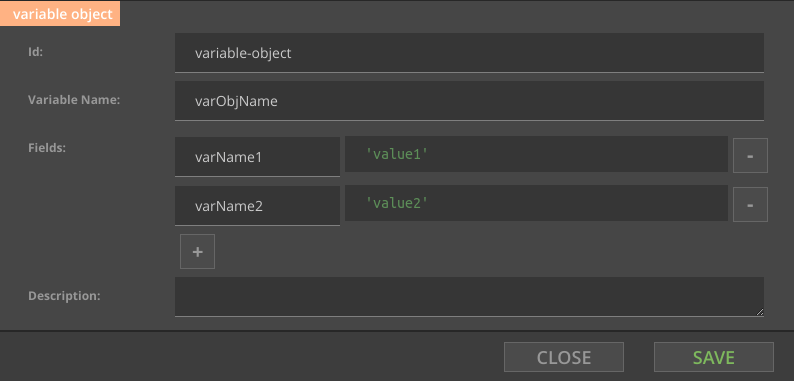

#Designing processes 

In this section you will learn how to create Nussknacker processes using defined model. In the examples we'll use sample model that comes with Nussknacker distribution. You can find latest sources [here](https://github.com/TouK/nussknacker/tree/master/engine/example/src/main/scala/).
  
If you want to learn how to develop your own model, please see [API](API.md)  

###Global process properties
* parallelism (see [Flink docs](https://flink.apache.org/faq.html#what-is-the-parallelism-how-do-i-set-it))
* checkpoint interval (see [Flink docs](https://ci.apache.org/projects/flink/flink-docs-release-{{book.flinkMajorVersion}}/setup/checkpoints.html))
* should state be kept in memory, or should RocksDB be used (see [Flink docs](https://ci.apache.org/projects/flink/flink-docs-release-{{book.flinkMajorVersion}}/ops/state_backends.html))
* properties for configuring ExceptionHandler of model

###Process variables
In the beginning there is only one variable - `input`, contains single record for processing.

###Expressions
Currently expressions in Nussknacker can be written using Spring Expression Language.
 You can find extensive documentation [here](https://docs.spring.io/spring/docs/current/spring-framework-reference/html/expressions.html). Autocomplete function (Ctrl-Space) is available in expression input boxes.

#Basic nodes
Node works with data stream. It can produce, fetch, send, collect data or organize data flow.

Each node has at least two parameters: `Id` and `Description`. Id has to be unique in process. It identifies node usage. Description is as everyone can see.

Depending on its type, node can have input and output. Input has to have exactly one assigned flow from another node. Output can have multiple flows, or none, or can have at least one obligatory.

## Filter 
Filter passes records which satisfies its condition. It can have one or two outputs. 
First output is for records satisfying the condition, second (optional) is for others.

Records from `source` which meet condition go to `true sink`, and others go to `false sink`. 

Records from `source` which meets condition go to `blue sink`, and others are filtered out. 

### Parameters

There are two parameters: `Expression`, and `Disabled`.

Expression is written in SpEL and it is evaluated for each record to logical value. Outgoing data flow depends on expression result.

When the node is Disabled, expression isn't evaluated, and always returns `true`.         

### Flow
Filter has one input and one or two outputs. 

If there is one output, only outgoing pipe is named `true`, and each record which expression evaluates to true passes. Otherwise record is gone.

If there are two outputs, one pipe is named `true` and another `false`. Each record which expression evaluates to `true` goes to `true` pipe, and other record goes to `false` pipe.  

##Split 
It doesn't have additional parameters. Each output receives all records and processes them independently. 

Every record from `source` go to `sink 1` and `sink 2`.

###Flow
Have at least one output. Each output has same record as input, so all outputs are identical.

##Switch
Distributes incoming records between outputs.
 

Each record form `source` is tested against condition defined on edge. If `color` is `blue` record goes to `blue sink`.  If `color` is `green` record goes to `green sink`. For every other value record goes to `sink for others`.

### Parameters 

There are two parameters `Expression` and `exprVal`. `Expression` contains expression which is evaluated for each record, and evaluated value is assigned to variable named in `exprVal`.
 
Edges outgoing from `Switch` node can be of one of two types.
 

Edge of the `Condition` type has an `Expression`. Record go to the first output with matching condition. Order of matching outgoing edges is not guaranteed.

There can be at most one edge of type `Default`, and it gets all records that don't match any `Condition` edge. 

### Flow
For each record from input switch `Expression` is evaluated and result is assigned to `exprVal` variable. After that records are tested against condition `Expressions` from output edges one by one. Record goes to first output which condition it satisfies. If record doesn't match any conditional output, and default output exists, record goes to default output. Otherwise mismatching record is filtered out.

## Variable
Evaluates `Expression`, and assigns to `Variable Name.`

Doesn't change records flow. Have to have exactly one output. Variable once defined cannot be overwritten.  

  

## Map Variable 
Defines new variable with one or more fields. Each field value is evaluated by using `Expression`.  

Doesn't change records flow. MapVariable once defined cannot be overwritten.  

## Sql Variable
Evaluates sql `Expression`, and assigns to `Variable Name.`

Doesn't change records flow. Have to have exactly one output. Variable once defined cannot be overwritten.  

##Subprocesses
Subprocesses let you abstract common used parts of process. See [subprocesses](Subprocesses.md) for more detailed description of how they work.

