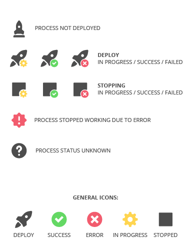

Points of integration with Apache Flink
=======================================

Nussknacker can be seen as a GUI for creating Apache Flink jobs. In this section we show how different Flink concepts can be used (or how are they mapped) in Nussknacker.

Handling state
--------------

Checkpoints, restarting
-----------------------

Handling time
-------------

Process state icons
-----

Choose icons that most accurately represent process states in your engine.
Intended use of icons is as shown below:

General icons are in case others don't match your engine.
We will most likely expand these icon pack in the future.

Note, that some icons have two versions: a normal one and with `-animated` in their name. We suggest using animated ones unless there are some browser compatibility problems (although most popular browsers fully support this feature).

