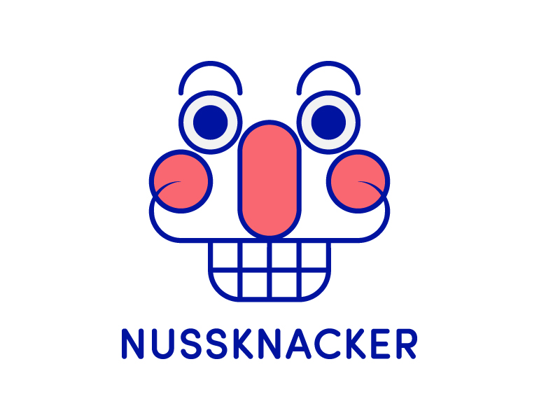

Nussknacker lets you design, deploy and monitor streaming data processing scenarios using GUI. You can run your scenarios on various engines. 

Nussknacker started as Apache Flink "self-service" processing scenarios authoring tool. We still leverage the power, performance and reliability of Apache Flink to make processing of stream data fast and accurate. 

But you are not limited to Flink. The request-response engine lets you create processing scenarios exposing REST API.

See:
* [Quickstart](Quickstart.md) to have a look around
* [Why Nussknacker](https://docs.nussknacker.io) to understand how Nussknacker can help you
* [Typical implementation](https://docs.nussknacker.io/about/TypicalImplementation) to understand how Nussknacker works
* [Documentation](https://docs.nussknacker.io/docs) To find how to use Nussknacker
* [PoweredBy](PoweredBy.md) to see where Nussknacker is used

Nussknacker is created by [TouK](https://touk.pl), hosted on [Github](https://github.com/touk/nussknacker) and licensed under ASL 2.0.