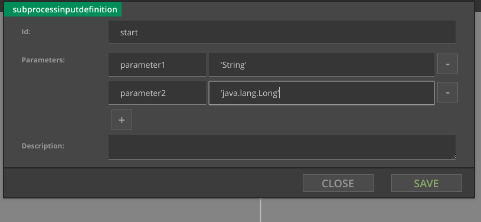
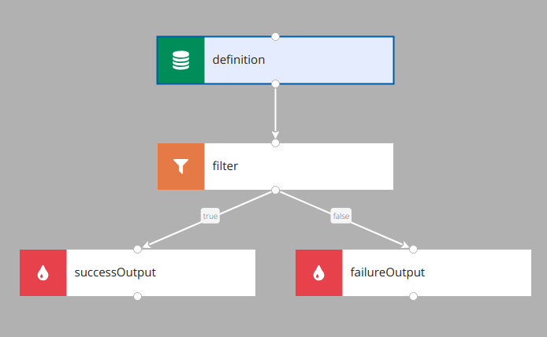

#Subprocesses

Subprocesses are a way to share fragments of diagrams. 

Subprocess first has to be designed (you can access subprocesses via Subprocesses tab) and then it can be used in 
other processes in same category

##Inputs

Subprocess can have one input. You can define parameters of subprocess:

Currently they have to be given as String (e.g. 'String', 'Long', or fully qualified Java type)

##Outputs

Subprocess can define zero, one or more outputs. Each of them has name, main process can then choose appropriate output.
Below you can see subprocess with two outputs:

##Limitations

- Subprocess cannot access variables from main process if they are not passed as parameters.
- Subprocesses cannot be nested (i.e. subprocess cannot invoke other subprocess).
- Currently subprocesses cannot pass any data to main process (no output variables). This may change in the future.
- When inputs/outputs of subprocess change, processes using it have to be corrected manually

