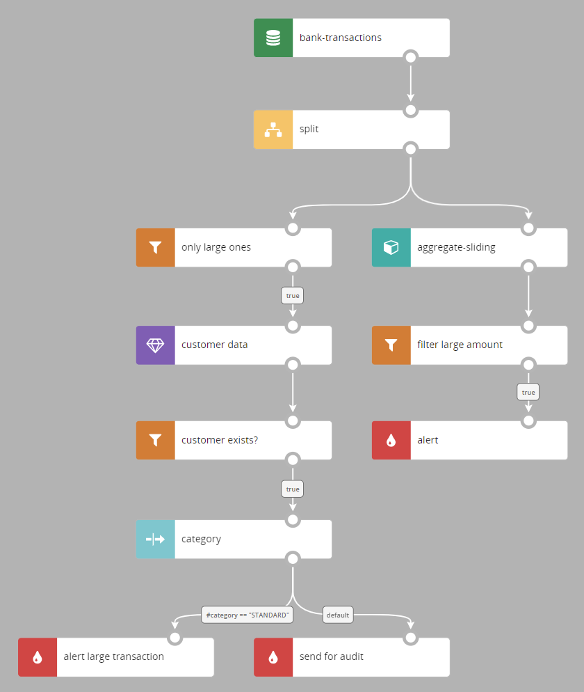
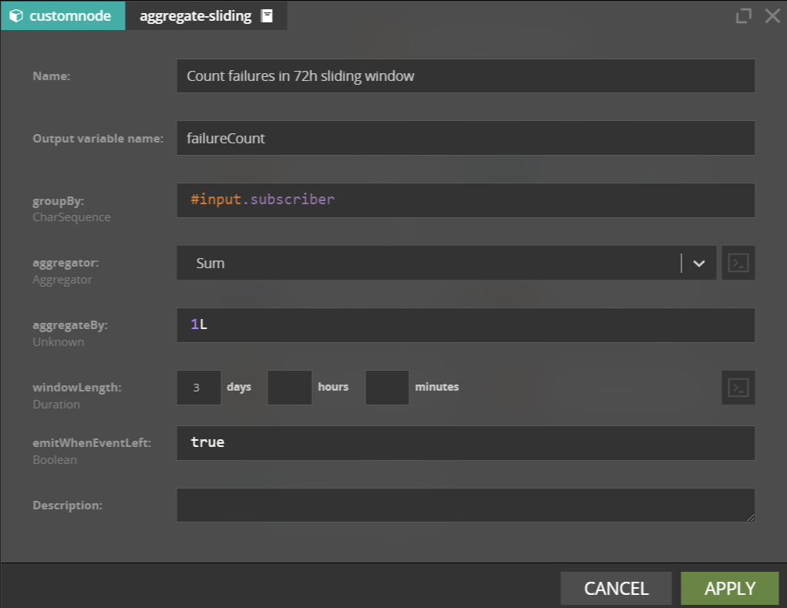
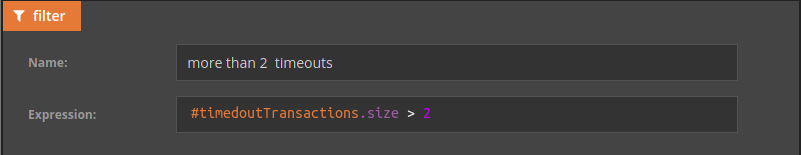
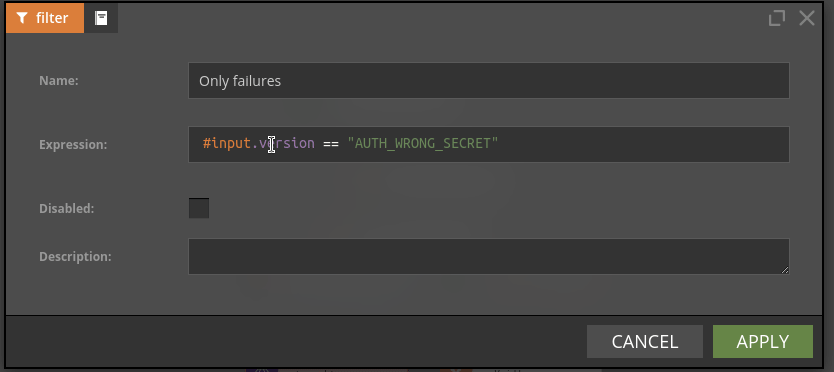
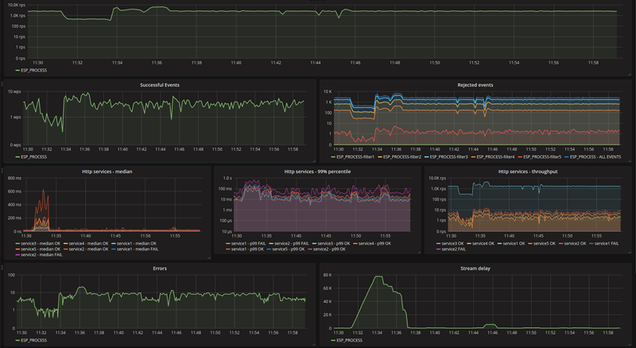

## Scenario authoring

Nussknacker provides a drag and drop visual authoring tool (Nussknacker Designer) allowing to define decision algorithms – we call them scenarios – without the need to write code.

A scenario is a sequence of different nodes:
- flow control functions: filter, switch, split etc.
- data enrichments from external sources (JDBC, OpenAPI)
- aggregates in different types of time windows (available with Flink-based [engine](./GLOSSARY.md#engine))
- custom, tailor-made components, which extend default functionality
- and more

Before a scenario is run, it can be tested to see if the algorithm works as expected with different samples of test data.

Check [introduction to scenario authoring](../scenarios_authoring/Intro.md) to learn more.

*Scenario in Nussknacker Designer*

*Node parameterization*

## SpEL

SpEL (Spring Expression Language) is a powerful expression language that supports querying and manipulating a data 
object at runtime. It is used by Nussknacker to access processed data. Some examples:
- create boolean expression (for example in filters) based on logical or relational (equal, greater than, etc) operators
- access, query and manipulate fields of the incoming data
- format output data
- provide helper functions like date and time, access to system variables, etc.
- and many more

*Example of SpEL expression used in a filter; the .size operator returns number of elements in a list*

## Smart code suggestions and validation

Nussknacker Designer has an advanced mechanism providing contextual expression suggestions, autocompletion and validation. 
It guides the user to discover and use available functions and data from sources and enrichments. It can also quickly 
detect most typical errors – from misspelling field names to wrong data type usage.

Nussknacker integrates with various metadata sources, to automatically discover structure of input and output data:
- Schema Registry for Kafka inputs and outputs
- OpenAPI for REST API enrichments
- SQL table metadata for database enrichments

*Example of code suggestions and validation*

## One click deployment

Once authored, with a click of a button, scenario definitions are deployed for processing. 
Processing can either be done by Nussknacker’s own engine or using Flink, depending on which better suits a particular 
use case.

Once deployed, scenarios can be modified and redeployed, again with just a click of a button. Nussknacker always 
encourages iterative improvement of decision logic by business users.

## Scenario monitoring

Nussknacker and Flink generate a wide range of metrics. Nussknacker out of the box makes these metrics available on 
a Grafana dashboard. You can easily check scenario throughput, statistics about decisions made, errors and more.

*Scenario monitoring dashboard*
