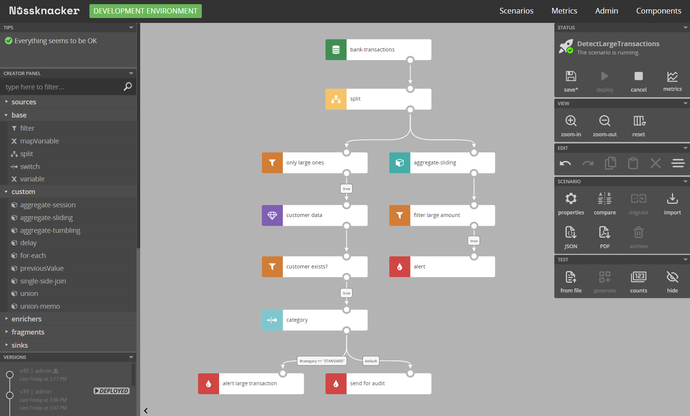

## What is Nussknacker

Nussknacker is a low-code visual tool for domain experts to define and run real-time decisioning algorithms instead of 
implementing them in the code.

In all IT systems, no matter the domain, decisions are made all the time. Which offer should a customer get? Who should 
receive a marketing message? Does this device need servicing? Is this a fraud?

Algorithms for making such decisions can be implemented in the code. Especially if high performance or integration of 
data from many sources is needed. But those algorithms often change: we have a new product we want to promote or we 
learn that some strange activity is not really a fraud. That requires changes in the code that would have to be made 
by developers.

Instead, such decision algorithms can be run by Nussknacker, where business experts can define and change them, 
without the need to trouble IT.

Nussknacker can make those decisions by processing event streams or in a request-response model, providing horizontal 
scalability and high availability. That way it fits various use cases in microservice and/or event driven architectures.

## Why Nussknacker

An essential part of Nussknacker is a visual design tool for decision algorithms. It allows not-so-technical users – 
analysts or business people – to define decision logic in an imperative, easy to follow and understand way. Once 
authored, with a click of a button, scenarios are deployed for execution. And can be changed and redeployed anytime 
there’s a need.

Nussknacker supports two processing modes: streaming and request-response. In streaming mode it uses Kafka as its 
primary interface: input streams of data and output streams of decisions. In request-response mode it exposes HTTP 
endpoints with OpenAPI definitions. And since input events or requests are often not enough to make a decision, 
Nussknacker can enrich them with data from databases and OpenAPI endpoints.

Nussknacker can be used with its own, lightweight, Kubernetes-based [engine](./GLOSSARY.md#engine). It provides 
scalability and high availability, while being straightforward to set up and maintain. However, in advanced streaming 
use cases, when aggregations are needed, Nussknacker can execute decision scenarios on Flink – one of the most advanced 
platforms for stream processing. More detailed engines comparison can be found [here](./engines/Engines.md).

*Scenario authoring with Nussknacker*
