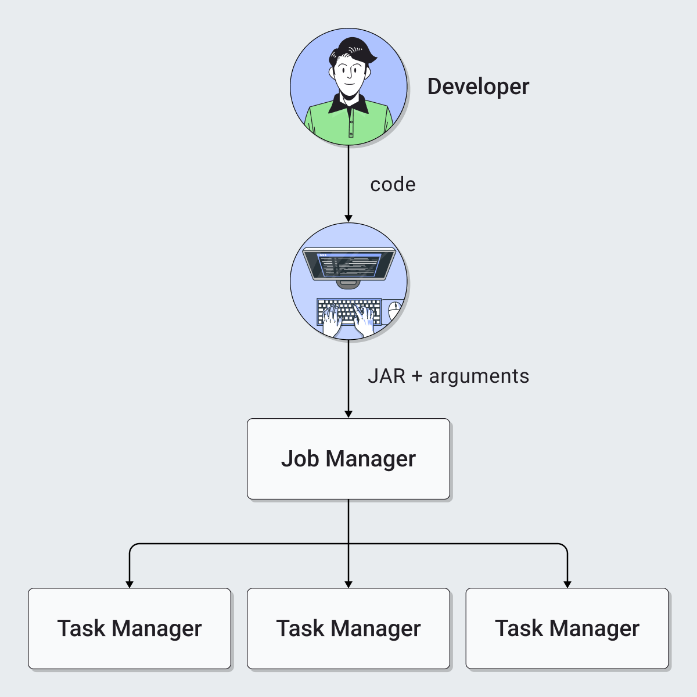
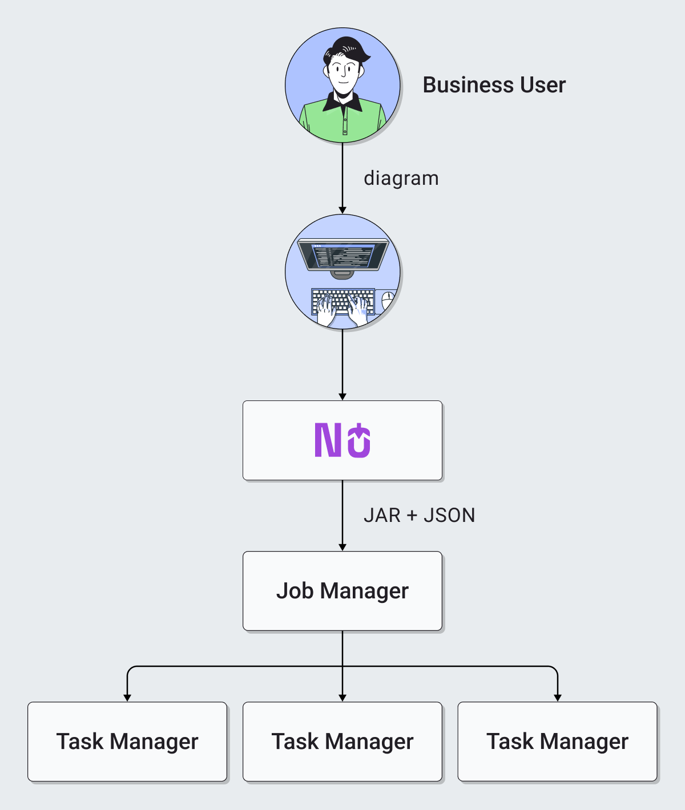

## Architecture overview

Nussknacker scenarios can be deployed on [Apache Flink](https://flink.apache.org/).

Following diagrams illustrate architecture of Nussknacker setup with Flink compared to standard Flink application 
deployment (more details about architecture of Flink itself can be found
[here](https://nightlies.apache.org/flink/flink-docs-stable/docs/concepts/flink-architecture/)):

  
  

This architecture assumes that:
* Flink should be deployed in [Session Mode](https://nightlies.apache.org/flink/flink-docs-stable/docs/deployment/overview/#session-mode)
* Scenario runtimes (within one scenario type) are executed on the same Flink cluster
* which means, that all scenario deployments (within one scenario type) use the same resources - unstable behavior of 
one job can have impact on others

## Scenario deployment

To deploy scenario to Flink cluster Nussknacker prepares JAR file with [Model](../GLOSSARY.md#model) code and 
serialized scenario representation. This package is then sent via 
[REST API](https://nightlies.apache.org/flink/flink-docs-stable/docs/ops/rest_api/) to Flink JobManager which takes 
the initiative and spawns a job on one or more Flink Task Managers.

## Scenario execution

The resulting job uses standard Flink API/Components, e.g. Kafka sources/sinks, 
[operators](https://nightlies.apache.org/flink/flink-docs-stable/docs/dev/datastream/operators/overview/#operators) 
which can be stateful, [checkpoints](https://nightlies.apache.org/flink/flink-docs-stable/docs/dev/datastream/fault-tolerance/checkpointing/) 
mechanisms to make processing fault-tolerant, etc.
