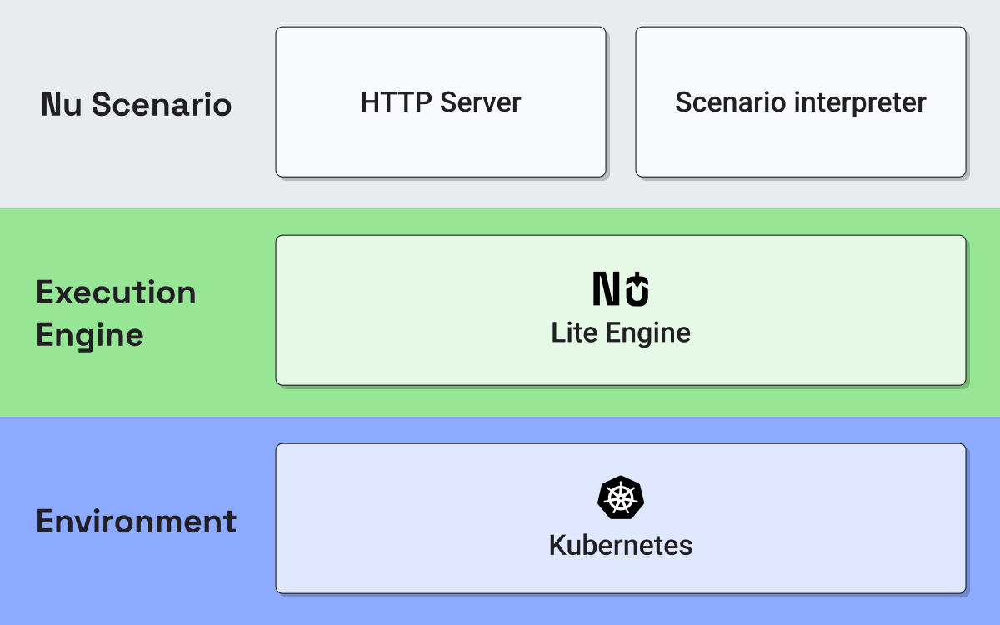
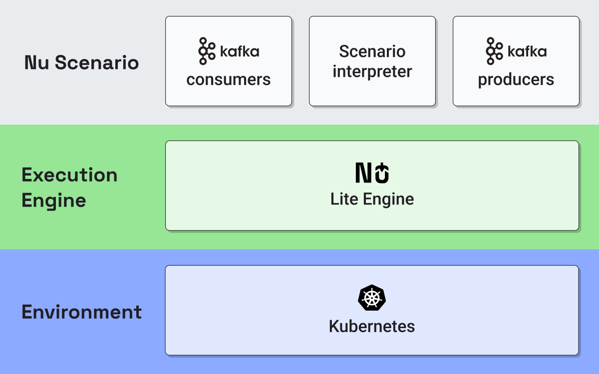
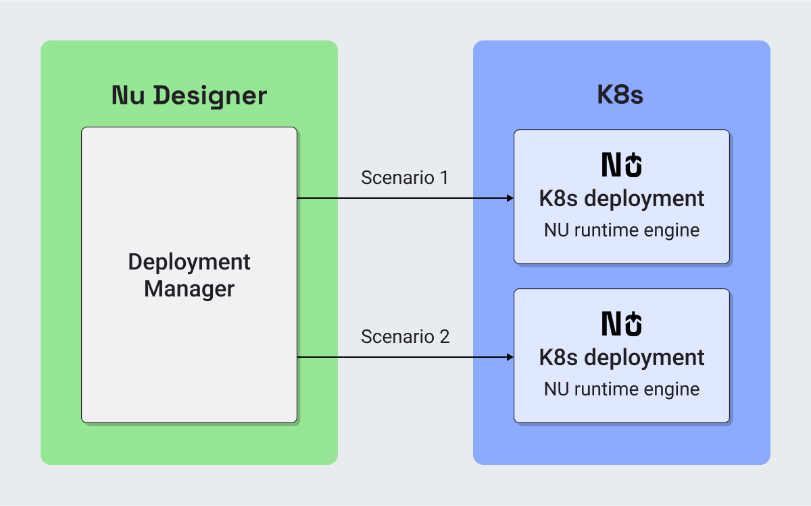
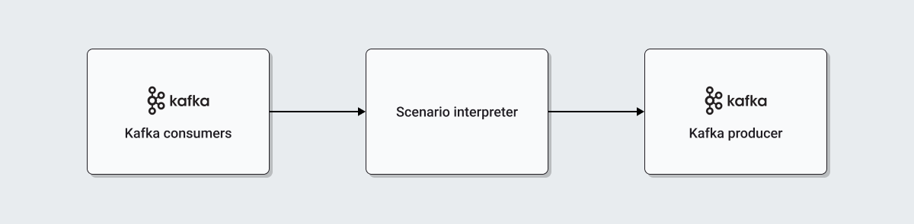

## Architecture overview

One of the runtime execution [engines](../GLOSSARY.md#engine) provided by Nu is called Lite
it provides a way to deploy a Nussknacker scenario as a Kubernetes microservice.

|  |  |
|:--:|:--:|
| Lite with request-response layers diagram | Lite with streaming layers diagram |

This architecture provides significant benefits:
* We leverage industry standards: K8s (and Kafka in streaming Processing mode) - to handle tough topics like scaling, 
resilience, operations, delivery guarantees.
* Scenario runtimes are independent of each other and the Designer,
* in particular, each scenario deployment runs and scales independently of other scenarios.

## Scenario deployment

Each Lite scenario creates a [K8s Deployment](https://kubernetes.io/docs/reference/glossary/?fundamental=true#term-deployment)
that uses a dedicated [nu-runtime-image](https://hub.docker.com/r/touk/nussknacker-lite-runtime-app),
each new deployment of a scenario creates a new Deployment version.
A detailed deployment configuration can be set through [deployment manager configuration](../../configuration/ScenarioDeploymentConfiguration.md),
both scenario and its configuration are passed to Nu runtime pods as Config Maps where an interpreter can
execute scenario logic as JVM code without an additional layer such as Flink.

## Scenario execution

Each scenario POD is composed of:
* Integration components
* Interpreted scenario

During deployment, runtime POD compiles scenario to interpretable parts. This is when components implementations 
are extracted. Some implementations are Lite engine and/or Processing mode specific but from the designer perspective,
most component definitions look the same for every execution engine.

### Streaming mode

Integration components consist of Kafka consumer and producer.

After compilation, the Lite runtime polls on the Kafka consumers to wait for incoming messages,
interprets compiled parts and results of scenario logic are produced to the output topic.
All of that happens in kafka transactions so messages have exactly once delivery guarantee.

### Request-Response mode

After compilation, Request-Response runtime exposes REST API, which for each request
interprets compiled parts and returns the results of scenario logic.
