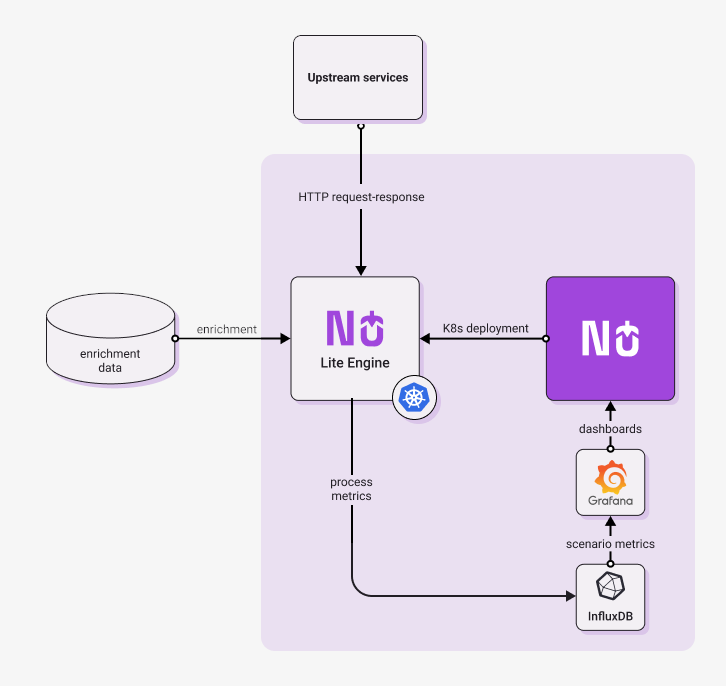

The diagram below shows architecture of a typical Nussknacker deployment in Request-Response mode. It shows not only 
components provided or needed by Nussknacker, 
but also elements of broader service architecture. 

The following paragraphs briefly explain the role of the architectural components in Nussknacker deployment. 
   
- **Nussknacker** - allows to author, deploy and monitor real-time decision scenarios. More on its capabilities can be 
found [here](../Overview.md).

- **Runtime engine** - Once authored, scenarios are deployed to the Lite engine for processing; Each service is deployed 
  as K8s Service, exposing REST API. 

- **Upstream services** - Other services communicating with Nussknacker via REST API

- **Enrichment data** - Nussknacker reads enrichment data from databases, OpenAPI services, ML models etc.

The Nussknacker scenario design information is used to send runtime metrics from runtime engine to Influx DB.
   
- **InfluxDB** - a high-performing time series database, metrics generated by scenario engine are stored here. 

- **Grafana** - open source analytics and interactive visualization web application, scenario metrics stored in InfluxDB 
are visualized as a Grafana dashboard.  
