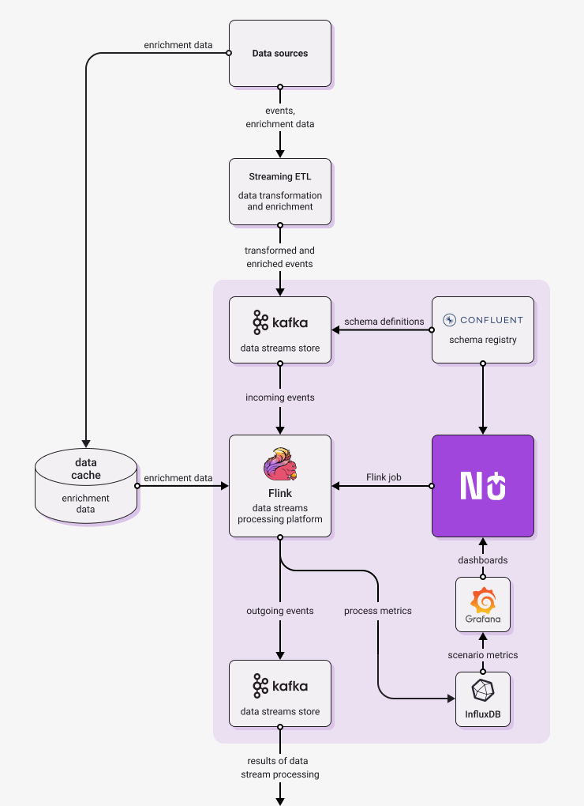
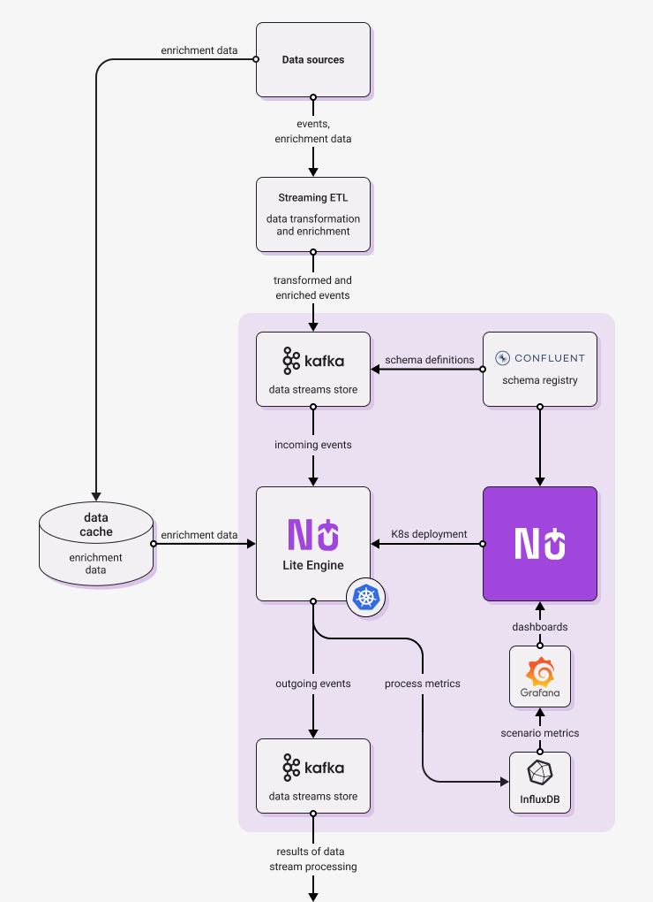

Diagrams below show architecture of typical Nussknacker deployment in Streaming mode. They show not only
components provided or needed by Nussknacker, but also elements of broader streaming architecture.
Larger organization probably have at least some of them already in place, while smaller deployments may need only 
simplified versions.

On the left, there is Flink engine version, on the right - Lite engine version.
As you can see, the diagrams are different only in [engine](../GLOSSARY.md#engine) part. This is not a coincidence, 
as general architecture of Nussknacker deployment and of stream processing solution remains the same, no matter 
which engine you choose.

  
  

The following paragraphs briefly explain the role of the architectural components in Nussknacker deployment.

- **Nussknacker** - allows to author, deploy and monitor real-time decision scenarios. More on its capabilities 
can be found [here](../Overview.md).

- **Schema Registry**  - stores versioned information about the structure of data transported in Kafka streams; in a 
sense performs a similar role to a relational database schema. Without it, scenarios that write to and read from a Kafka 
stream would not speak a common language.

Once authored, scenarios are deployed to the selected engine for processing (it can be Flink or Lite); the engine in 
turn interacts with Kafka streams:

- **Kafka**  - a distributed data streaming platform that allows publishing and subscribing to streams of records. 
A typical scenario diagram authored in Nussknacker starts from reading data from a Kafka stream and finishes with 
writing data to a Kafka stream.

- **Runtime engine** - Nussknacker can use one of the following engines as runtime for scenarios
    - **Flink** - a distributed processing engine for stateful computations over data. Flink can read data from different types of data sources, in the Nussknacker case it reads from Kafka topics.  Flink can reliably process millions of events per second.
      Custom components designed to run on Flink can use its rich Scala/Java API to perform more sophisticated, stateful data processing (e.g. aggregations).
    - **Lite** - scenarios are deployed as microservices on Kubernetes, they use Kafka to read and write events. This engine doesn't allow stateful processing, but is simpler and easier to maintain and operate in organizations which have K8s experience but do not have enough Flink skills.

- **Streaming ETL** - a tool which will be used to ingest incoming messages. Quite often incoming data are not represented
in the format desired by Nussknacker. To be processed they should be stored on Kafka in AVRO or JSON format. Because of 
that you probably need to use some ingestion software like Kafka Connect or Apache NiFi. We call them "streaming ETL" 
(Extract, Transform, Load) because they are quite similar to ETL for Data Lakes but in a real-time, streaming World.

The Nussknacker scenario design information is used to send runtime metrics from runtime engine to Influx DB.

- **InfluxDB** - a high-performing time series database, metrics generated by scenario engine are stored here.

- **Grafana** - open source analytics and interactive visualization web application, scenario metrics stored in InfluxDB 
are visualized as a Grafana dashboard.  
