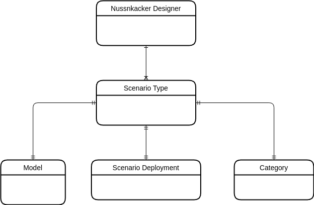

# Overview

## Minimal configuration file

The Docker image and the binary distribution contain minimal working [configuration file](https://github.com/TouK/nussknacker/blob/staging/nussknacker-dist/src/universal/conf/application.conf), which is designed as a base for further customizations using
additional configuration files. Check [Conventions section](#conventions) for more details how to amend and override the minimal configuration file.
This file is not used by the [Helm chart](https://artifacthub.io/packages/helm/touk/nussknacker), which prepares its own config file.

The location and name of the configuration files is defined by the `CONFIG_FILE` environment variable. Consult [Basic environment variables](../configuration/Common.md#basic-environment-variables) for information on how this variable is resolved.

Details of K8s based configuration can be found in  [Nussknacker Helm chart documentation](https://artifacthub.io/packages/helm/touk/nussknacker).
## Configuration areas

Nussknacker configuration is divided into several configuration areas, each area addressing a specific aspect of using Nussknacker:

* [Designer](../about/GLOSSARY#nussknacker-designer) configuration (web application ports, security, various UI settings, database),
* Scenario Types configuration, comprising of:
  * [Model](./model/ModelConfiguration.md) configuration.
  * [Scenario Deployment](./ScenarioDeploymentConfiguration.md) configuration,
  * [Category](./DesignerConfiguration.md#scenario-type-categories) configuration

[Model](../about/GLOSSARY#model) configuration defines which components and which [Processing Mode](../about/ProcessingModes) will be available for the user.
[Scenario Deployment](./ScenarioDeploymentConfiguration.md) configuration defines how scenario using these components will be deployed on the [Engine](../about/engines/Engines.md).
[Category](./DesignerConfiguration.md#scenario-type-categories) defines who has access to the given combination of [Model](../about/GLOSSARY#model) and [Scenario Deployment](./ScenarioDeploymentConfiguration.md).

The Scenario Type is a convenient umbrella term that groups all these things. Diagram below presents main relationships between configuration areas.

### Configuration file

Let's see how those concepts look in fragment of the configuration file:

<pre>
{/* Somehow, everything which is in the "pre" block is treated as jsx by Docusaurus */}
{/* so, we need to add opening curly bracket as comment */}
{/* and add leading spaces in a special way. If not, jsx parser will remove them */}
{/* Finally, do not worry - this is a valid jsx comment - you will not see it on Nu page*/}

<b># Designer configuration </b>
environment: "local"

{" "}# Each scenario type is configured here 
{" "}<b>scenarioTypes:</b> {"{"}
{" "}  "scenario-type-1": {"{"}

{" "}    # Configuration of scenario deployment (Flink used as example here)
{" "}    <b>deploymentConfig:</b> {"{"} 
{" "}      type: "flinkStreaming" 
{" "}      restUrl: "http://localhost:8081" 
{" "}    } 

{" "}    # Configuration of the model 
{" "}    <b>modelConfig</b>: {"{"}
{" "}      classPath: ["model/defaultModel.jar", "model/flinkExecutor.jar", "components/flink"]
{" "}      restartStrategy.default.strategy: disable
{" "}      components: {"{"}
{" "}      }
{" "}    }

{" "}  <b>category</b>: "Default"
{" "}  }
{" "}}
</pre>

It is worth noting that one Nussknacker Designer may be used to work with multiple Scenario Types and allow user:

* To use different set of components depending on the category
* To deploy scenarios on different [Engines](../about/engines/Engines.md)

See [development configuration](https://github.com/TouK/nussknacker/blob/staging/nussknacker-dist/src/universal/conf/dev-application.conf#L33) (used to test various Nussknacker features) for an example of configuration with more than one Scenario Type.

## Conventions

* We use HOCON (see the [introduction](https://github.com/lightbend/config#using-hocon-the-json-superset) or
  the [full specification](https://github.com/lightbend/config/blob/master/HOCON.md) for details) as our main
  configuration format. [Lightbend config library](https://github.com/lightbend/config/tree/master) is used for
  parsing configuration files - you can check the [documentation](https://github.com/lightbend/config#standard-behavior)
  for details on conventions of file names and merging of configuration files.
* `nussknacker.config.locations` Java system property (`CONFIG_FILE` environment variable for Docker image) defines
  location of configuration files (separated by comma). The files are read in order, entries from later files can
  override the former (using HOCON fallback mechanism). This mechanism is used to extend or override default
  configuration contained in the [minimal configuration file](#minimal-configuration-file)  - see docker demo
  for example:
  * [setting multiple configuration files](https://github.com/TouK/nussknacker-installation-example/blob/master/docker-compose.yml#L29)
  * [file with configuration override](https://github.com/TouK/nussknacker-installation-example/blob/master/designer/application-customizations.conf)
* If `config.override_with_env_vars` Java system property is set to true, it is possible to override settings with env
  variables. This property is set to true in the official Nussknacker Docker image.

It’s important to remember that model configuration is prepared a bit differently. Please read
[model configuration](./model/ModelConfiguration.md) for the details.

## What is next?
Most likely you will want to configure enrichers - they are configured under the `modelConfig.components` configuration
key - see the [configuration file](#configuration-file). The details of enrichers configuration are in
the [Integration chapter](../integration/index.mdx) of the documentation.

import DocCardList from '@theme/DocCardList';

<DocCardList />
