# Filter
Filter passes records which satisfies its condition. It can have one or two outputs. 
First output is for records satisfying the condition, second (optional) is for others.
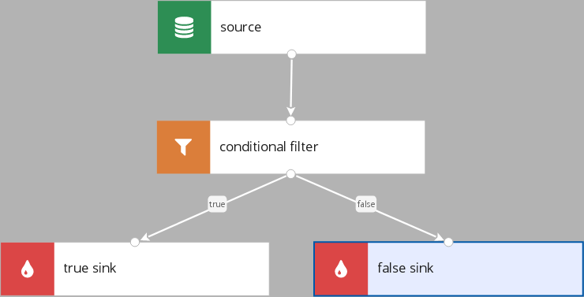

Records from the `source` which meet filter's condition go to the `true sink`, and others go to the `false sink`. 

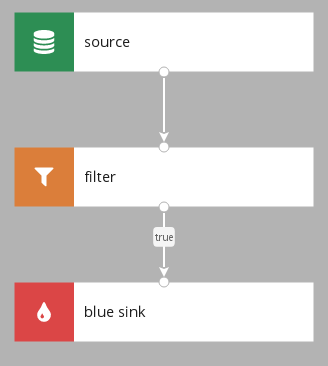

Records from the `source` which meets condition go to the `blue sink`, and others are filtered out. 

### Parameters
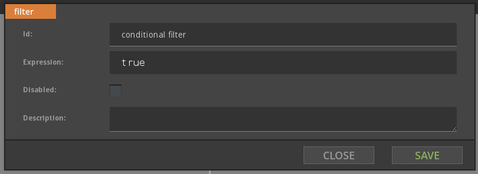
There are two parameters: `Expression`, and `Disabled`.

Expression is written in SpEL and it is evaluated for each record to logical value. Outgoing data flow depends on expression result.

When the node is Disabled, expression isn't evaluated, and always returns `true`.         

### Flow
Filter has one input and one or two outputs. 

If there is one output, only outgoing pipe is named `true`, and each record which expression evaluates to true passes. Otherwise record is gone.

If there are two outputs, one pipe is named `true` and another `false`. Each record which expression evaluates to `true` goes to `true` pipe, and other record goes to `false` pipe.  

# Split 
Each output receives all records and processes them independently. 

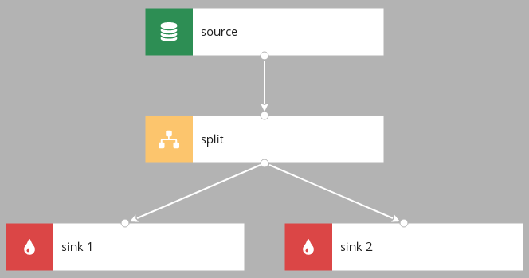

Every record from the `source` gos to `sink 1` and `sink 2`.

### Parameters
Split doesn't have additional parameters.

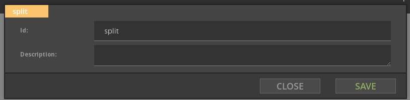

### Flow
Split has one or more outputs. Outputs have the same record as input, so all outputs are identical.

# Switch
Distributes incoming records between outputs.
 

Each record form the `source` is tested against condition defined on the edge. If `color` is `blue` record goes to the `blue sink`.  If `color` is `green` record goes to the `green sink`. For every other value record goes to the `sink for others`.

### Parameters 
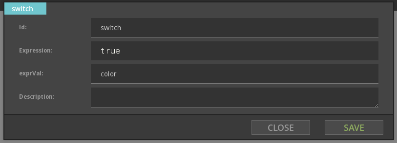

There are two parameters `Expression` and `exprVal`. `Expression` contains expression which is evaluated for each record, and evaluated value is assigned to variable named in `exprVal`.
 
Edges outgoing from `Switch` node can be of one of two types.
 
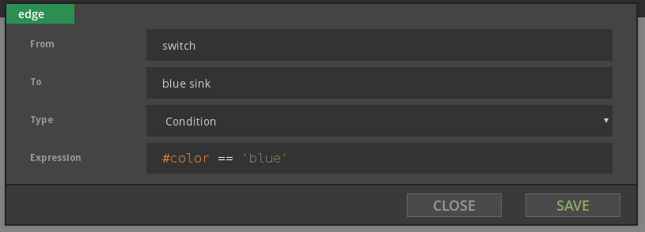

Edge of the `Condition` type has an `Expression`. Record go to the first output with matching condition. Order of matching outgoing edges is not guaranteed.

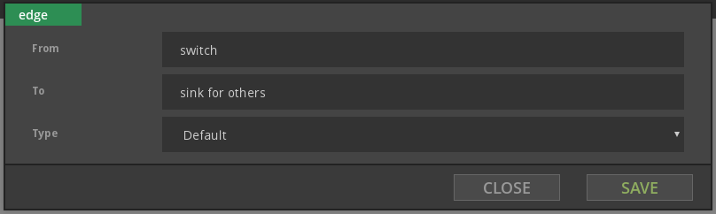

There can be at most one edge of type `Default`, and it gets all records that don't match any `Condition` edge. 

### Flow
For each incoming record `Expression` is evaluated and result is assigned to `exprVal` variable. After that, records are tested against condition `Expressions` from output edges one by one. Record goes to first output which condition it satisfies. If record doesn't match any conditional output, and default output exists, record goes to default output. Otherwise mismatching record is filtered out.

# Variable
Evaluates `Expression`, and assigns to `Variable Name.`

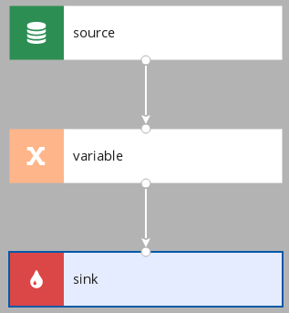

###  Parameters

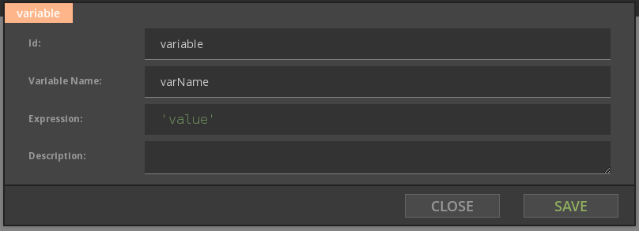

### Flow  
Doesn't change records flow. Have to have exactly one output. Variable once defined cannot be overwritten.

# Map Variable 
Defines a new variable with one or more fields. Each field value is evaluated by using `Expression`.  

### Parameters
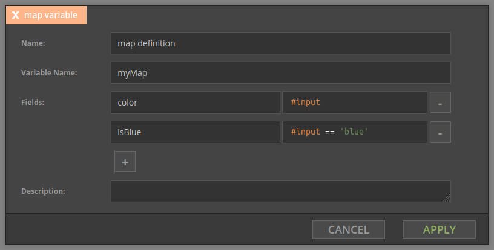

### Flow
Doesn't change records flow. Once defined value of this type cannot be overwritten.  

## Sql Variable
Evaluates sql `Expression`, and assigns to `Variable Name.`

### Parameters
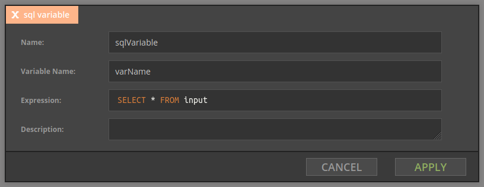

### Flow
Doesn't change records flow. Have to have exactly one output. Variable once defined cannot be overwritten.  
