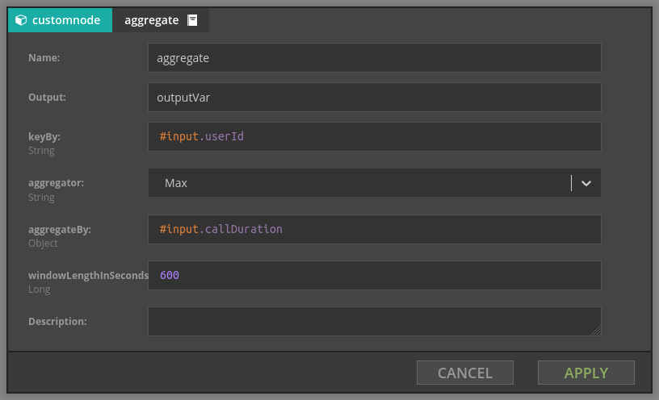

# Flink custom transformers

Nussknacker basic building blocks like filters, enrichers and processors serve stateless streams well, but
to use Flink stateful features we have to create more complex elements. 

We provide generic aggregations in `pl.touk.nussknacker.engine.flink.util.transformer` package in nusssknacker-flink-util subproject, 
you can use most of them with `genericAssembly.jar`

## Union


Joins multiple branches in one stream. For each incoming branch we have to define two expressions:
- key - it's value should be of type `String`, define how elements from branches will be matched together
- value - this is the output value which will be put the field with name the same as branch id

Union node defines new stream which is union of all branches. In this new stream there is only one variable, it's name
is defined by 'Output' parameter, it's value is: 
```$json
{
  "key": `value of key expression for given event`,
  "branch1": `value expression when event comes from branch1, otherwise null`,
  "branch2": `value expression when event comes from branch2, otherwise null`,
  ...
}
```  
Currently branches are identified by id of last node in this branch before union.

## UnionMemo

Works exactly like Union, but also memoize values for each branches. Memoized state will be cleared when there was no
subsequent events from any branch during `stateTimeout`. Produced object has values from all branches.

## AggregateSliding



This element defines generic aggregation of values in sliding time window of given length. Parameters are:
- keyBy - expression defining key for which we compute aggregate, e.g. `#input.userId`
- aggregator - type of aggregation (see below)
- aggregateBy - value which will be aggregated (e.g. `#input.callDuration`, `#input.productId`)
- windowLength - length of time window, window will cover range: (exclusive) now-windowLength, (inclusive) now
- emitWhenEventLeft - determine, if should be emitted aggregated value also when some event left the slide

For each event additional variable will be added. For example: for aggregate-sliding node with length of 10 minutes, aggregation max, emitWhenEventLeft = false and input events:
- `{userId: 1, callDuration: 1, hour: 10:10}`
- `{userId: 1, callDuration: 5, hour: 10:10}`
- `{userId: 2, callDuration: 4, hour: 10:15}`
- `{userId: 1, callDuration: 4, hour: 10:15}`
- `{userId: 1, callDuration: 3, hour: 10:23}`

Following events will be emitted:
- `{userId: 1, callDuration: 1, hour: 10:10, aggregate: 1}` - first event
- `{userId: 1, callDuration: 5, hour: 10:10, aggregate: 5}` - higher duration
- `{userId: 2, callDuration: 4, hour: 10:15, aggregate: 4}` - user with different id
- `{userId: 1, callDuration: 4, hour: 10:15, aggregate: 5}` - lower duration
- `{userId: 1, callDuration: 3, hour: 10:23, aggregate: 4}` - we ignore event from 10:10, as length = 10min

### Aggregator types
Currently we support following aggregations:
- First - computes first value
- Last - computes last value
- Min - computes minimal value
- Max - computes maximal value
- Sum - computes sum of values
- List - the result is list of incoming elements
- Set - the result is set of incoming elements (can be v. ineffective for large sets, try to use ApproximateSetCardinality in this case )
- ApproximateSetCardinality - computes approximate cardinality of set using [HyperLogLog](https://en.wikipedia.org/wiki/HyperLogLog) algorithm.

## AggregateTumbling

This aggregation in contrary to Aggregate uses tumbling window. All parameters are the same except that emitWhenEventLeft is replaced with:
- emitExtraWindowWhenNoData - determine, if should be emitted extra "zero", aggregated value when there was no data in subsequent window for some key
Example, for aggregate-tumbling node with length of 10 minutes, aggregation max, emitExtraWindowWhenNoData = false, and input events from previous example:
- `{userId: 1, callDuration: 5, hour: 10:20, aggregate: 5}` - highest duration during first ten minutes for userId: 1
- `{userId: 2, callDuration: 4, hour: 10:20, aggregate: 4}` - highest duration during first ten minutes for userId: 2
- `{userId: 1, callDuration: 3, hour: 10:30, aggregate: 4}` - highest duration during second ten minutes for userId: 1

## PreviousValue


Simple transformation which stores arbitrary value for given key. This element has two parameters:
- keyBy - expression defining key for which we compute aggregate, e.g. `#input.userId`
- value - stored value

So, for example, given stream of events which contain users with their current location, when we set 
- keyBy is `#input.userId`
- value is `#input.location`
then the value of output variable is the previous location for current user. If this is the first appearance of this user,
**current** location will be returned

## Outer join

Joins multiple branches in one stream. For each incoming branch we have to define two parameters:
- branchType - defined if branch is MAIN branch or JOINED branch (should be exact one branch of type MAIN and exact one of type JOINED)
- key - it's value should be of type `String`, define how elements from branches will be matched together
And common parameters not dependent from branch:
- aggregator - type of aggregation (see below)
- aggregateBy - value which will be aggregated (e.g. `#input.callDuration`, `#input.productId`)
- windowLength - length of time window, window will cover range: (exclusive) now-windowLength, (inclusive) now

Events from MAIN branch will be enriched with output variable having aggregated value from JOINED branch. For aggregation will be used AggregateSliding

## Delay

Delay event processing for a given delay duration