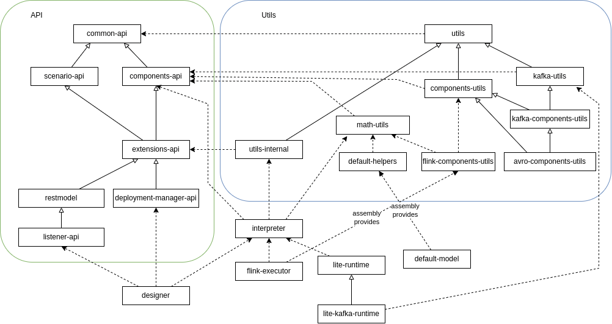

# Overview

Please make sure you know common [Glossary](../about/GLOSSARY) and [SpEL](../scenarios_authoring/Spel.md) (especially the Data types section) before proceeding further. 

This part of the documentation describes various ways of customizing Nussknacker - from adding own Components to adding listeners for various Designer actions. 
The main way of adding customizations to Nussknacker is [ServiceLoader](https://docs.oracle.com/en/java/javase/11/docs/api/java.base/java/util/ServiceLoader.html) 

**Please make sure to put jars with custom code on right classpath**
- Customizations of model (in particular `ComponentProviders`) can be loaded by adding libs/classes to dedicated `components/common/extra`, 
  `components/lite/extra` or `components/flink/extra` directory. For advanced usages, you can configure `modelConfig.classPath` 
  in [Model config](../configuration/model/ModelConfiguration.md).
- Code of Designer customizations should go to the main Designer classpath (e.g. put the jars in the `lib` folder)
 
## Types

Types of expressions are based on Java types. Nussknacker provides own abstraction of type, which can contain more information about given type than pure Java class - e.g. object type (like in [Typescript](https://www.typescriptlang.org/docs/handbook/2/everyday-types.html#object-types)) is represented in runtime as Java `Map`, but during compilation we know the structure of this map. 
We also handle union types (again, similar to [Typescript](https://www.typescriptlang.org/docs/handbook/2/everyday-types.html#union-types)) and we have `Unknown` type which is represented as Java `Object` in runtime, but behaves a bit like [Typescript any](https://www.typescriptlang.org/docs/handbook/2/everyday-types.html#any) (please note that `Unknown` should be avoided as default [Security settings](../configuration/DesignerConfiguration.md#security) settings prohibit omitting typechecking with `Unknown`.
 
`TypingResult` is the main class (sealed trait) that represents type of expression in Nussknacker.
`Typed` object has many methods for constructing `TypingResult`
      
## Components and ComponentProviders

[Components](../about/GLOSSARY#component) are main method of customizing Nussknacker. Components are created by configured `ComponentProvider` instances. 
There are following types of components:
- `SourceFactory`
- `SinkFactory`
- `CustomStreamTransformer` - types of transformations depend on type of Engine
- `Service` - mainly for defining stateless enrichments
To read more see [ComponentProvider API](./Components.md)

## Deployment of scenarios

The Designer uses [DeploymentManager](https://github.com/TouK/nussknacker/blob/staging/designer/deployment-manager-api/src/main/scala/pl/touk/nussknacker/engine/api/deployment/DeploymentManager.scala)
interface to perform actions on scenarios (deploy / cancel / etc.). All providers that are available in distribution deployment are located in `managers` directory and are added to the Designer classpath.
If you want to implement own `DeploymentManager`, you should implement this interface, package it, add to classpath and configure scenario type to use it. More info you can find on 
[Scenario Deployment Configuration page](../configuration/ScenarioDeploymentConfiguration.md) 

## Other SPIs for Nussknacker customization (documentation will follow soon...)

### Model customization

- Flink specific
  - [TypingResultAwareTypeInformationCustomisation](https://github.com/TouK/nussknacker/blob/staging/engine/flink/components-api/src/main/scala/pl/touk/nussknacker/engine/flink/api/typeinformation/TypingResultAwareTypeInformationCustomisation.scala)
  - [FlinkEspExceptionConsumerProvider](https://github.com/TouK/nussknacker/blob/staging/engine/flink/extensions-api/src/main/scala/pl/touk/nussknacker/engine/flink/api/exception/FlinkEspExceptionConsumer.scala)
  - [SerializersRegistrar](https://github.com/TouK/nussknacker/blob/staging/engine/flink/extensions-api/src/main/scala/pl/touk/nussknacker/engine/flink/api/serialization/SerializersRegistrar.scala)
  - [FlinkCompatibilityProvider](https://github.com/TouK/nussknacker/blob/staging/engine/flink/executor/src/main/scala/pl/touk/nussknacker/engine/process/FlinkCompatibilityProvider.scala)
- [CustomParameterValidator](https://github.com/TouK/nussknacker/blob/staging/components-api/src/main/scala/pl/touk/nussknacker/engine/api/definition/ParameterValidator.scala)
- [ToJsonEncoder](https://github.com/TouK/nussknacker/blob/staging/common-api/src/main/scala/pl/touk/nussknacker/engine/util/json/ToJsonEncoder.scala)
- [WithExceptionExtractor](https://github.com/TouK/nussknacker/blob/staging/extensions-api/src/main/scala/pl/touk/nussknacker/engine/api/exception/WithExceptionExtractor.scala)
- [ModelConfigLoader](https://github.com/TouK/nussknacker/blob/staging/extensions-api/src/main/scala/pl/touk/nussknacker/engine/modelconfig/ModelConfigLoader.scala)
- [ProcessMigrations](https://github.com/TouK/nussknacker/blob/staging/extensions-api/src/main/scala/pl/touk/nussknacker/engine/migration/ProcessMigration.scala)
- [DictServicesFactory](https://github.com/TouK/nussknacker/blob/staging/extensions-api/src/main/scala/pl/touk/nussknacker/engine/api/dict/DictServicesFactory.scala)

### Designer customization

- [ProcessChangeListenerFactory](https://github.com/TouK/nussknacker/blob/staging/designer/listener-api/src/main/scala/pl/touk/nussknacker/ui/listener/ProcessChangeListenerFactory.scala)
- Security
  - [AuthenticationProvider](https://github.com/TouK/nussknacker/blob/staging/security/src/main/scala/pl/touk/nussknacker/ui/security/api/AuthenticationProvider.scala)
  - [OAuth2ServiceFactory](https://github.com/TouK/nussknacker/blob/staging/security/src/main/scala/pl/touk/nussknacker/ui/security/oauth2/OAuth2ServiceFactory.scala)
- [CountsReporterCreator](https://github.com/TouK/nussknacker/blob/staging/designer/processReports/src/main/scala/pl/touk/nussknacker/processCounts/CountsReporter.scala)
- [AdditionalInfoProvider](https://github.com/TouK/nussknacker/blob/staging/extensions-api/src/main/scala/pl/touk/nussknacker/engine/additionalInfo/AdditionalInfoProvider.scala)
- [CustomProcessValidatorFactory](https://github.com/TouK/nussknacker/blob/staging/extensions-api/src/main/scala/pl/touk/nussknacker/engine/CustomProcessValidator.scala)
- [AdditionalUIConfigProviderFactory](https://github.com/TouK/nussknacker/blob/staging/components-api/src/main/scala/pl/touk/nussknacker/engine/api/component/AdditionalUIConfigProviderFactory.scala)
             
## Modules architecture and conventions

The diagram below shows dependencies between modules. You can see two main groups on it :
- API modules
- Utils

*API modules* contains interfaces that are needed by our core modules (on both Designer and runtime side).

On the other hand *Utils* modules contain classes built on top of API which can be used in extensions but are not mandatory. **API of *Utils* modules can be changed more often than API inside API modules**

Both *API modules* and *Utils modules* have several modules with `-components` part in name. They should be used to build own [Components](./Components.md)

`nussknacker-scenario-api` contains classes needed to operate on scenarios: creating it via DSL, marshalling to JSON, etc.

`nussknacker-deployment-manager-api` contains interfaces needed to create own  [DeploymentManager](https://github.com/TouK/nussknacker/blob/staging/designer/deployment-manager-api/src/main/scala/pl/touk/nussknacker/engine/api/deployment/DeploymentManager.scala)
that can be used to scenario execution.

`nussknacker-extensions-*` contains other extensions API.

Your code should depend only on `nussknacker-xxx-api` or `nussknacker-xxx-components-utils`/`nussknacker-xxx-extensions-utils` packages and not on implementation modules, like
`nussknacker-scenario-compiler`, `nussknacker-flink-executor`, `nussknacker-lite-runtime` or other `internal` modules. They should only be needed in `test` scope.

**If you find you need to depend on those modules, please bear in mind that they contain implementation details and their API should not be considered stable.**
            
## Plug-ins packaging

The plug-in jar should be fatjar containing all libraries necessary for running your customization, 
except for dependencies provided by execution engine. In particular, for custom component implementation, 
following dependencies **should** be marked as `provided` and not be part of customization jar:
- All Nussknacker modules with names ending in `-api`, e.g. `nussknacker-components-api`, `nussknacker-flink-components-api`, `nussknacker-lite-components-api`
- `nussknacker-utils`, `nussknacker-components-utils`, `nussknacker-helpers-utils` (are provided in `defaultModel.jar`)
- `nussknacker-flink-components-utils` (is provided in `flinkExecutor.jar`)
- Basic Flink dependencies: `flink-streaming-scala`, `flink-runtime`, `flink-statebackend-rocksdb` etc. for Flink components  (are provided in `flinkExecutor.jar`)
- `nussknacker-kafka-utils` for Streaming components in Lite engine

**Please remember that `provided` dependency are not transitive, i.e. if you depend on e.g. `nussknacker-flink-kafka-components-utils`
you still have to declare dependency on `nussknacker-flink-components-utils` explicitly 
(see [Maven documentation](https://maven.apache.org/guides/introduction/introduction-to-dependency-mechanism.html#dependency-scope) for further info).**
