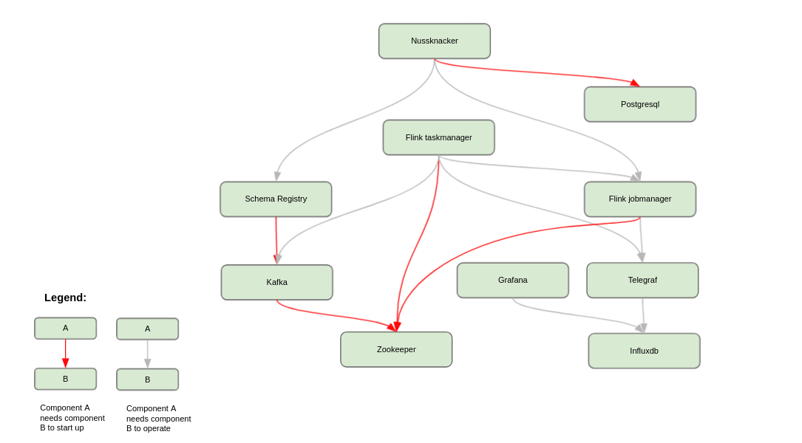

# Installation

Nussknacker relies on several open source components like Kafka, Grafana (or optionally, Flink), which need to be installed together with
Nussknacker. This document focuses on the configuration of Nussknacker and its integrations with those components;
please refer to their respective documentations for details on their optimal configuration.

### Flink
Nussknacker (both binary package and docker image) is published in two versions - built with Scala 2.12 and 2.13.
As for now, Flink does not support Scala 2.13 (see [FLINK-13414](https://issues.apache.org/jira/browse/FLINK-13414) issue),
so to use Nussknacker built with Scala 2.13 some [tweaks](https://github.com/TouK/nussknacker/blob/staging/engine/flink/management/src/it/scala/pl/touk/nussknacker/engine/management/DockerTest.scala#L60) in Flink installations are required.
Nussknacker built with Scala 2.12 works with Flink out of the box.

## Docker based installation

Nussknacker is available at [Docker Hub](https://hub.docker.com/r/touk/nussknacker/). You can check an example usage
with docker-compose at [Nussknacker Quickstart repository](https://github.com/TouK/nussknacker-quickstart) in `docker` directory.

Please note, that while you can install Designer with plain Docker (e.g. with `docker-compose`) with Lite engine configured, you still
need configured Kubernetes cluster to actually run scenarios in this mode - we recommend using Helm installation for that mode.

If you want to check locally Streaming processing mode with plain Docker and embedded engine just run:
```bash
docker run -it --network host -e KAFKA_ADDRESS=localhost:3032 -e SCHEMA_REGISTRY_URL=http://localhost:3082 touk/nussknacker:latest
```
Note: `--network host `only works on linux and is used to connect to existing kafka/schema registry. In case of other OS you have to use different methods to make it accessible from Nussknacker container (e.g start Kafka/SR and Nussknacker in a single docker network)
If you want to see Nussknacker in action without Kafka, using embedded Request-Response processing mode (scenario logic is exposed with REST API), run:
```bash
docker run -it -p 8080:8080 -p 8181:8181 touk/nussknacker:latest
```
After it started go to [http://localhost:8080](http://localhost:8080) and login using credentials: admin/admin.
REST endpoints of deployed scenarios will be exposed at `http://localhost:8181/scenario/<slug>`. Slug is defined in Properties, and by default it is scenario name.

More information you can find at [Docker Hub](https://hub.docker.com/r/touk/nussknacker/)

### Base Image

As a base image we use `eclipse-temurin:11-jre-jammy`. See [Eclipse Temurin Docker Hub](https://hub.docker.com/_/eclipse-temurin) for more
details.

### Container configuration

For basic usage, most things can be configured using environment variables. In other cases, can be mounted volume with
own configuration file. See [configuration](#configuration-with-environment-variables) section for more details. NUSSKNACKER_DIR is pointing to /opt/nussknacker.

## Kubernetes - Helm chart

We provide [Helm chart](https://artifacthub.io/packages/helm/touk/nussknacker) with basic Nussknacker setup, including:

- Kafka - required only in streaming processing mode
- Grafana + InfluxDB
- One of the available engines: Flink or Lite.

Please note that Kafka (and Flink if chosen) are installed in basic configuration - for serious production deployments you probably
want to customize those to meet your needs.

You can check example usage at [Nussknacker Quickstart repository](https://github.com/TouK/nussknacker-quickstart) in `k8s-helm` directory.

## Configuration with environment variables

All configuration options are described in [Configuration](../installation_configuration_guide/DesignerConfiguration.md).

Some of them can be configured using already predefined environment variables, which is mostly useful in the Docker setup.
The table below shows all the predefined environment variables used in the Nussknacker image. `$NUSSKNACKER_DIR` is a placeholder pointing to the Nussknacker installation directory.

Because we use [HOCON](../installation_configuration_guide/Common.mdx#conventions), you can set (or override) any configuration value used by Nussknacker even if the already predefined environment variable does not exist. This is achieved by setting the JVM property `-Dconfig.override_with_env_vars=true` and setting environment variables following conventions described [here](https://github.com/lightbend/config?tab=readme-ov-file#optional-system-or-env-variable-overrides).

### Basic environment variables

| Variable name                 | Type            | Default value                                                                                                                                 | Description                                                                                                                                                                                                                                               |
|-------------------------------|-----------------|-----------------------------------------------------------------------------------------------------------------------------------------------|-----------------------------------------------------------------------------------------------------------------------------------------------------------------------------------------------------------------------------------------------------------|
| JDK_JAVA_OPTIONS              | string          |                                                                                                                                               | Custom JVM options, e.g `-Xmx512M`                                                                                                                                                                                                                        |
| JAVA_DEBUG_PORT               | int             |                                                                                                                                               | Port to Remote JVM Debugger. By default debugger is turned off.                                                                                                                                                                                           |
| CONFIG_FILE                   | string          | $NUSSKNACKER_DIR/conf/application.conf                                                                                                        | Location of application configuration. You can pass comma separated list of files, they will be merged in given order, using HOCON fallback mechanism                                                                                                     |
| LOGBACK_FILE                  | string          | $NUSSKNACKER_DIR/conf/docker-logback.xml                                                                                                      | Location of logging configuration                                                                                                                                                                                                                         |
| WORKING_DIR                   | string          | $NUSSKNACKER_DIR                                                                                                                              | Location of working directory                                                                                                                                                                                                                             |
| STORAGE_DIR                   | string          | $WORKING_DIR/storage                                                                                                                          | Location of HSQLDB database storage                                                                                                                                                                                                                       |
| CLASSPATH                     | string          | $NUSSKNACKER_DIR/lib/*:$NUSSKNACKER_DIR/managers/*                                                                                            | Classpath of the Designer, _lib_ directory contains related jar libraries (e.g. database driver), _managers_ directory contains deployment manager providers                                                                                              |
| LOGS_DIR                      | string          | $WORKING_DIR/logs                                                                                                                             | Location of logs                                                                                                                                                                                                                                          |
| HTTP_INTERFACE                | string          | 0.0.0.0                                                                                                                                       | Network address Nussknacker binds to                                                                                                                                                                                                                      |
| HTTP_PORT                     | string          | 8080                                                                                                                                          | HTTP port used by Nussknacker                                                                                                                                                                                                                             |
| HTTP_PUBLIC_PATH              | string          |                                                                                                                                               | Public HTTP path prefix the Designer UI is served at, e.g. using external proxy like [nginx](#configuring-the-designer-with-nginx-http-public-path)                                                                                                       |
| DB_URL                        | string          | jdbc:hsqldb:file:${STORAGE_DIR}/db;sql.syntax_ora=true                                                                                        | Database URL                                                                                                                                                                                                                                              |
| DB_DRIVER                     | string          | org.hsqldb.jdbc.JDBCDriver                                                                                                                    | Database driver class name                                                                                                                                                                                                                                |
| DB_USER                       | string          | SA                                                                                                                                            | User used for connection to database                                                                                                                                                                                                                      |
| DB_PASSWORD                   | string          |                                                                                                                                               | Password used for connection to database                                                                                                                                                                                                                  |
| DB_CONNECTION_TIMEOUT         | int             | 30000                                                                                                                                         | Connection to database timeout in milliseconds                                                                                                                                                                                                            |
| AUTHENTICATION_METHOD         | string          | BasicAuth                                                                                                                                     | Method of authentication. One of: BasicAuth, OAuth2                                                                                                                                                                                                       |
| AUTHENTICATION_USERS_FILE     | string          | $NUSSKNACKER_DIR/conf/users.conf                                                                                                              | Location of users configuration file                                                                                                                                                                                                                      |
| AUTHENTICATION_HEADERS_ACCEPT | string          | application/json                                                                                                                              |                                                                                                                                                                                                                                                           |
| FLINK_REST_URL                | string          | http://localhost:8081                                                                                                                         | URL to Flink's REST API - used for scenario deployment                                                                                                                                                                                                    |
| FLINK_ROCKSDB_ENABLE          | boolean         | true                                                                                                                                          | Enable RocksDB state backend support                                                                                                                                                                                                                      |
| KAFKA_ADDRESS                 | string          | localhost:9092                                                                                                                                | Kafka address used by Kafka components (sources, sinks)                                                                                                                                                                                                   |
| KAFKA_AUTO_OFFSET_RESET       | string          |                                                                                                                                               | See [Kafka documentation](https://kafka.apache.org/documentation/#consumerconfigs_auto.offset.reset). For development purposes it may be convenient to set this value to 'earliest', when not set the default from Kafka ('latest' at the moment) is used |
| SCHEMA_REGISTRY_URL           | string          | http://localhost:8082                                                                                                                         | Address of Confluent Schema registry used for storing data model                                                                                                                                                                                          |
| GRAFANA_URL                   | string          | /grafana                                                                                                                                      | URL to Grafana, used in UI. Should be relative to Nussknacker URL to avoid additional CORS configuration                                                                                                                                                  |
| INFLUXDB_URL                  | string          | http://localhost:8086                                                                                                                         | URL to InfluxDB used by counts mechanism                                                                                                                                                                                                                  |
| MODEL_CLASS_PATH              | list of strings | (for flink) `"model/defaultModel.jar", "model/flinkExecutor.jar", "components/flink", "components/common", "flink-dropwizard-metrics-deps/"]` | Classpath of model (jars that will be used for execution of scenarios)                                                                                                                                                                                    |
| PROMETHEUS_METRICS_PORT       | int             |                                                                                                                                               | When defined, JMX MBeans are exposed as Prometheus metrics on this port                                                                                                                                                                                   |
| PROMETHEUS_AGENT_CONFIG_FILE  | int             | $NUSSKNACKER_DIR/conf/jmx_prometheus.yaml                                                                                                     | Default configuration for JMX Prometheus agent. Used only when agent is enabled. See `PROMETHEUS_METRICS_PORT`                                                                                                                                            |
| TABLES_DEFINITION_FILE        | string          | $NUSSKNACKER_DIR/conf/dev-tables-definition.sql                                                                                               | Location of file containing definitions of tables for Flink Table API components in Flink Sql                                                                                                                                                             |

### OAuth2 environment variables

| Variable name                                   | Type    | Default value     |
|-------------------------------------------------|---------|-------------------|
| OAUTH2_CLIENT_SECRET                            | string  |                   |
| OAUTH2_CLIENT_ID                                | string  |                   |
| OAUTH2_AUTHORIZE_URI                            | string  |                   |
| OAUTH2_REDIRECT_URI                             | string  |                   |
| OAUTH2_ACCESS_TOKEN_URI                         | string  |                   |
| OAUTH2_PROFILE_URI                              | string  |                   |
| OAUTH2_PROFILE_FORMAT                           | string  |                   |
| OAUTH2_IMPLICIT_GRANT_ENABLED                   | boolean |                   |
| OAUTH2_ACCESS_TOKEN_IS_JWT                      | boolean | false             |
| OAUTH2_USERINFO_FROM_ID_TOKEN                   | string  | false             |
| OAUTH2_JWT_AUTH_SERVER_PUBLIC_KEY               | string  |                   |
| OAUTH2_JWT_AUTH_SERVER_PUBLIC_KEY_FILE          | string  |                   |
| OAUTH2_JWT_AUTH_SERVER_CERTIFICATE              | string  |                   |
| OAUTH2_JWT_AUTH_SERVER_CERTIFICATE_FILE         | string  |                   |
| OAUTH2_JWT_ID_TOKEN_NONCE_VERIFICATION_REQUIRED | string  |                   |
| OAUTH2_GRANT_TYPE                               | string  | authorization_code |
| OAUTH2_RESPONSE_TYPE                            | string  | code              |
| OAUTH2_SCOPE                                    | string  | read:user         |
| OAUTH2_AUDIENCE                                 | string  |                   |
| OAUTH2_USERNAME_CLAIM                           | string  |                   |

## Binary package installation

Released versions are available at [GitHub](https://github.com/TouK/nussknacker/releases).

Please note, that while you can install Designer from `.tgz` with Lite engine configured, you still
need configured Kubernetes cluster to actually run scenarios in this mode - we recommend using Helm installation for that mode.

### Prerequisites

We assume that `java` (recommended version is JDK 11) is on path.

Please note that default environment variable configuration assumes that Flink, InfluxDB, Kafka and Schema registry are
running on `localhost` with their default ports configured. See [environment variables](#environment-variables) section
for the details. Also, `GRAFANA_URL` is set to `/grafana`, which assumes that reverse proxy
like [NGINX](https://github.com/TouK/nussknacker-quickstart/tree/main/docker/common/nginx) is used to access both Designer and
Grafana. For other setups you should change this value to absolute Grafana URL.

`WORKING_DIR` environment variable is used as base place where Nussknacker stores its data such as:

- logs
- embedded database files
- scenario attachments

### Startup script

We provide following scripts:

- `run.sh` - to run in foreground, it's also suitable to use it for systemd service
- `run-daemonized.sh` - to run in background, we are using `nussknacker-designer.pid` to store PID of running process

### File structure

| Location                                 | Usage in configuration                                  | Description                                                                                                                                  |
|------------------------------------------|---------------------------------------------------------|----------------------------------------------------------------------------------------------------------------------------------------------|
| $NUSSKNACKER_DIR/storage                 | Configured by STORAGE_DIR property                      | Location of HSQLDB database                                                                                                                  |
| $NUSSKNACKER_DIR/logs                    |                                                         | Location of logs                                                                                                                             |
| $NUSSKNACKER_DIR/conf/application.conf   | Configured by CONFIG_FILE property                      | Location of Nussknacker configuration. Can be overwritten or used next to other custom configuration. See Configuration document for details |
| $NUSSKNACKER_DIR/conf/logback.xml        | Configured by LOGBACK_FILE property in standalone setup | Location of logging configuration. Can be overwritten to specify other logger logging levels                                                 |
| $NUSSKNACKER_DIR/conf/docker-logback.xml | Configured by LOGBACK_FILE property in docker setup     | Location of logging configuration. Can be overwritten to specify other logger logging levels                                                 |
| $NUSSKNACKER_DIR/conf/users.conf         | Configured by AUTHENTICATION_USERS_FILE property        | Location of Nussknacker Component Providers                                                                                                  |
| $NUSSKNACKER_DIR/model/defaultModel.jar  | Used in MODEL_CLASS_PATH property                       | JAR with generic model (base components library)                                                                                             |
| $NUSSKNACKER_DIR/model/flinkExecutor.jar | Used in MODEL_CLASS_PATH property                       | JAR with Flink executor, used by scenarios running on Flink                                                                                  |
| $NUSSKNACKER_DIR/components              | Can be used in MODEL_CLASS_PATH property                | Directory with Nussknacker Component Provider JARS                                                                                           |
| $NUSSKNACKER_DIR/lib                     |                                                         | Directory with Nussknacker base libraries                                                                                                    |
| $NUSSKNACKER_DIR/managers                |                                                         | Directory with Nussknacker Deployment Managers                                                                                               |


### Logging

We use [Logback](http://logback.qos.ch/manual/configuration.html) for logging configuration. By default, the logs are
placed in `${NUSSKNACKER_DIR}/logs`, with sensible rollback configuration.  
Please remember that these are logs of Nussknacker Designer, to see/configure logs of other components (e.g. Flink)
please consult their documentation.

### Systemd service

You can set up Nussknacker as a systemd service using our example unit file.

1. Download distribution as described in [Binary package installation](Installation.md#Binary package installation)
2. Unzip it to `/opt/nussknacker`
3. `sudo touch /lib/systemd/system/nussknacker.service`
4. edit `/lib/systemd/system/nussknacker.service` file and add write content
   of [Systemd unit file](Installation.md#systemd-unit-file)
5. `sudo systemctl daemon-reload`
6. `sudo systemctl enable nussknacker.service`
7. `sudo systemctl start nussknacker.service`

You can check Nussknacker logs with `sudo journalctl -u nussknacker.service` command.

#### Sample systemd-unit-file

```unit file (systemd)
[Unit]
Description=Nussknacker

StartLimitBurst=5
StartLimitIntervalSec=600

[Service]
SyslogIdentifier=%N

WorkingDirectory=/opt/nussknacker
ExecStart=/opt/nussknacker/bin/run.sh
RuntimeDirectory=%N
RuntimeDirectoryPreserve=restart

SuccessExitStatus=143
Restart=always
RestartSec=60

[Install]
WantedBy=default.target
```

### Configuring the Designer with Nginx-http-public-path

Sample nginx proxy configuration serving Nussknacker Designer UI under specified `my-custom-path` path. It assumes Nussknacker itself is available under `http://designer:8080`
Don't forget to specify `HTTP_PUBLIC_PATH=/my-custom-path` environment variable in Nussknacker Designer.

```
http {
  server {
    location / {
      proxy_pass http://designer:8080;
    }
    location /my-custom-path/ {
      rewrite           ^/my-custom-path/?(.*) /$1;
    }
  }
}
```


## Configuration of additional applications

Typical Nussknacker deployment includes Nussknacker Designer and a few additional applications:



Some of them need to be configured properly to be fully integrated with Nussknacker.

The [quickstart](https://github.com/TouK/nussknacker-quickstart) contains `docker-compose` based sample installation of
all needed applications (and a few more that are needed for the demo).

If you want to install them from the scratch or use already installed at your organisation pay attention to:

- Metrics setup (please see quickstart for reference):
  - Configuration of metric reporter in Flink setup
  - Telegraf's configuration - some metric tags and names need to be cleaned
  - Importing scenario dashboard to Grafana configuration
- Flink savepoint configuration. To be able to use scenario verification
  (see `shouldVerifyBeforeDeploy` property in [scenario deployment configuration](../installation_configuration_guide/ScenarioDeploymentConfiguration.md))
  you have to make sure that savepoint location is available from Nussknacker designer (e.g. via NFS like in quickstart
  setup)


