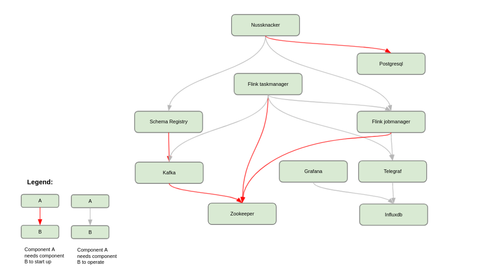

# Installation

Nussknacker relies on several open source components like Kafka, Grafana (or optionally, Flink), which need to be
installed together with Nussknacker. This document focuses on the installation of Nussknacker. The configuration part
is covered [further](../configuration/index.mdx) in our documentation.

### Nussknacker and its dependencies

As you see on the diagram above, Nussknacker interacts and depends on the following services:
* [Postgres](https://www.postgresql.org/) - a database for the Nussknacker Designer
* [Flink](https://flink.apache.org/) - a powerful steaming processing framework
* [Kafka](https://kafka.apache.org/) - a broker for steaming data
* [Schema Registry](https://docs.confluent.io/platform/current/schema-registry/index.html) - a schema registry for the data in Kafka's topics
* [AKHQ](https://akhq.io/) - a UI for Kafka & Schema Registry
* [Grafana](https://grafana.com/) & [InfluxDB](https://www.influxdata.com/) & [Telegraf](https://www.influxdata.com/time-series-platform/telegraf/) - for the purpose of scenarios monitoring
* [Nginx](https://nginx.org/en/) - a gateway for Designer and other UIs

Please refer to services' documentation to install and configure them properly.
You can also check our repository with the Nu stack [installation example](https://github.com/TouK/nussknacker-installation-example/).

:::note

Nussknacker (both binary package and docker image) is published in two versions - built with Scala 2.12 and 2.13.
As for now, Flink does not support Scala 2.13 (see [FLINK-13414](https://issues.apache.org/jira/browse/FLINK-13414) issue),
so to use Nussknacker built with Scala 2.13 some [tweaks](https://github.com/TouK/nussknacker/blob/staging/engine/flink/management/src/it/scala/pl/touk/nussknacker/engine/management/DockerTest.scala#L60) in Flink installations are required.
Nussknacker built with Scala 2.12 works with Flink out of the box, so if you don't create your custom Nussknacker components
using Scala 2.13, just pick the packages with Scala 2.12.

:::

###

### Nussknacker installation methods

import DocCardList from '@theme/DocCardList';

<DocCardList />
