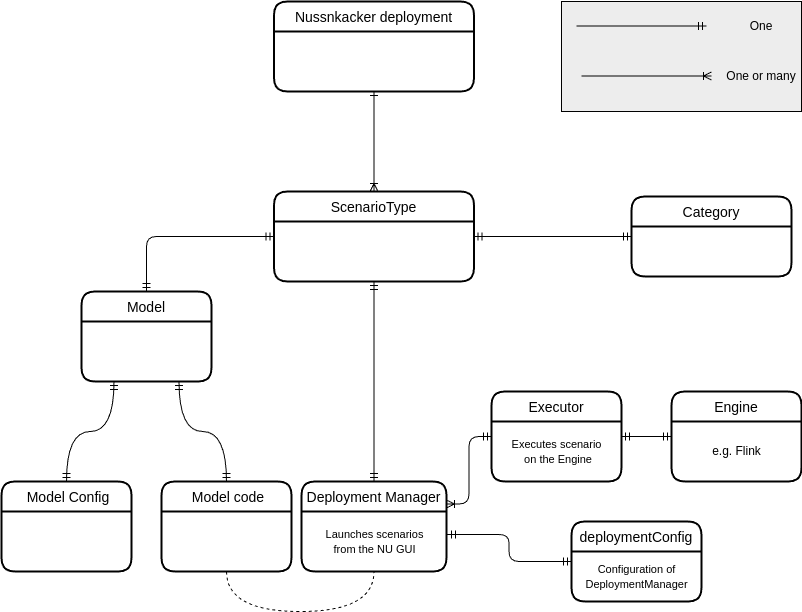

# Configuration 


## Configuration areas

Nussknacker configuration is divided into several configuration areas, each area addressing a specific aspect of using Nussknacker:

* [Designer](/about/GLOSSARY#nussknacker-designer) configuration
* Scenario Types configuration, comprising of:
    * [Deployment Manager](/about/GLOSSARY#deployment-manager) / [Executor](/about/GLOSSARY#executor) configuration
    * [Model](/about/GLOSSARY#executor) configuration

Designer configuration  contains all settings for Nussknacker Designer - e.g. web application ports, security, various UI settings. 

One Nussknacker Designer deployment may be used to create various Scenario Types which:
                          
* can be deployed with various [Deployment Managers](DeploymentManagerConfiguration.md)  to e.g. different Flink clusters 
* use different components and [model configurations](ModelConfiguration.md) 

See [development configuration](https://github.com/TouK/nussknacker/blob/staging/nussknacker-dist/src/universal/conf/dev-application.conf#L33) (used to test various Nussknacker features) for an example of configuration with more than one Scenario Type.

Diagram below presents main relationships between configuration areas.


                  
Let's see how those concepts look in fragment of main configuration file:
```hocon
# Designer configuration 
environment: "local"
...

# Each scenario type is configured here 
scenarioTypes {
  "scenario-type-1": {
    # Configuration of DeploymentManager (Flink used as example here) 
    deploymentConfig: {
      type: "flinkStreaming"
      restUrl: "http://localhost:8081"
    }
    # Configuration of model
    modelConfig: {
      classPath: ["model/genericModel.jar", "components/baseComponents.jar", "components/kafkaComponents.jar"]
      restartStrategy.default.strategy: disable
      components {
        ...
      }
    }
  }
}

```

[This](https://github.com/TouK/nussknacker/blob/staging/nussknacker-dist/src/universal/conf/application.conf) is how it looks in default configuration file in NU distribution.

## Environment variables

Environment variables are described in [Installation guide](./Installation.md), they are mostly helpful in the docker setup.

## Hocon - configuration format

We use HoCon (see [introduction](https://github.com/lightbend/config#using-hocon-the-json-superset) or [full specification](https://github.com/lightbend/config/blob/master/HOCON.md) for details) as our main configuration format. [Lightbend config library](https://github.com/lightbend/config/tree/master) is used for parsing configuration files - you can check [documentation](https://github.com/lightbend/config#standard-behavior) for details on conventions of file names and merging of configuration files. 

Following Nussknacker specific rules apply:

* `nussknacker.config.locations` system property (`CONFIG_FILE `environment variable for Docker image) defines location of configuration files (separated by comma). The files are read in order, entries from later files can override the former (using HoCon fallback mechanism) - see docker demo for example:
    * [setting multiple configuration files](https://github.com/TouK/nussknacker-quickstart/blob/main/docker-compose.yml#L12)
    * [file with configuration override](https://github.com/TouK/nussknacker-quickstart/blob/main/nussknacker/nussknacker.conf)
* [defaultUiConfig.conf](https://github.com/TouK/nussknacker/blob/staging/ui/server/src/main/resources/defaultUiConfig.conf) contains defaults for Nussknacker Designer
* `config.override_with_env_vars` is set to true, so it’s possible to override settings with env variables

It’s important to remember that model configuration is prepared a bit differently. Please read [model configuration](ModelConfiguration.md) for the details. 
