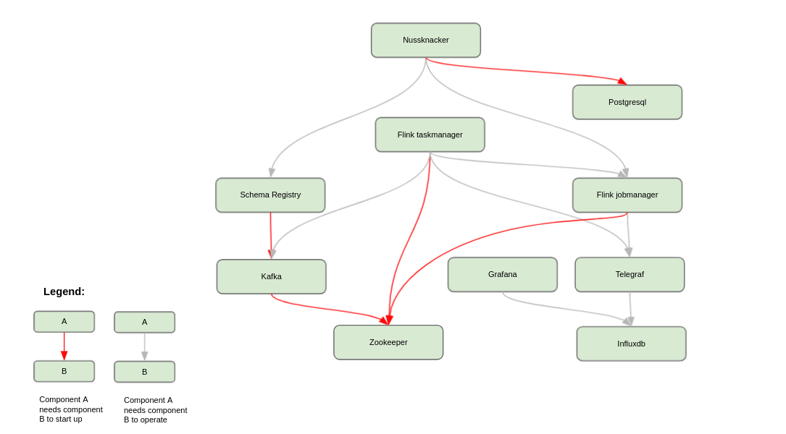

# Installation

Nussknacker relies on several open source components like Flink or Kafka, which need to be installed together with
Nussknacker. This document focuses on the configuration of Nussknacker and its integrations with those components;
please refer to their respective documentations for details on their optimal configuration.

## Docker based installation

Nussknacker is available at [Docker hub](https://hub.docker.com/r/touk/nussknacker/). You can check an example usage
with docker-compose at [Nussknacker Quickstart Repository](https://github.com/TouK/nussknacker-quickstart).

### Base Image

As a base image we use `openjdk:11-jdk`. See [Open JDK's Docker hub](https://hub.docker.com/_/openjdk) for more
details.

### Container configuration

For basic usage, most things can be configured using environment variables. In other cases, can be mounted volume with
own configuration file. See "Configuration" section for more details. NUSSKNACKER_DIR is pointing to /opt/nussknacker.

### Kubernetes - Helm chart

We provide [Helm chart](https://artifacthub.io/packages/helm/touk/nussknacker) with basic Nussknacker setup, including:

- Flink
- Kafka
- Grafana + InfluxDB

Please note that Flink, Kafka are installed in basic configuration - for serious production deployments you probably
want to customize those to meet your needs.

## Binary package installation

Released versions are available at [GitHub](https://github.com/TouK/nussknacker/releases)

### Prerequisites

We assume that `java` (recommended version is JDK 11) is on path.

Please note that default environment variable configuration assumes that Flink, InfluxDB, Kafka and Schema registry are
running on `localhost` with their default ports configured. See [environment variables](#environment-variables) section
for the details. Also, `GRAFANA_URL` is set to `/grafana`, which assumes that reverse proxy
like [NGINX](https://github.com/TouK/nussknacker-quickstart/tree/main/nginx) is used to access both Designer and
Grafana. For other setups you should change this value to absolute Grafana URL.

`WORKING_DIR` environment variable is used as base place where Nussknacker stores its data such as:

- logs
- embedded database files
- scenario attachments

### Startup script

We provide following scripts:

- `run.sh` - to run in foreground, it's also suitable to use it for systemd service
- `run-daemonized.sh` - to run in background, we are using `nussknacker-designer.pid` to store PID of running process

### Logging

We use [Logback](http://logback.qos.ch/manual/configuration.html) for logging configuration. By default, the logs are
placed in `${NUSSKNACKER_DIR}/logs`, with sensible rollback configuration.  
Please remember that these are logs of Nussknacker Designer, to see/configure logs of other components (e.g. Flink)
please consult their documentation.

## Systemd service

You can set up Nussknacker as a systemd service using our example unit file.

1. Download distribution as described in [Binary package installation](Installation#Binary package installation)
2. Unzip it to `/opt/nussknacker`
3. `sudo touch /lib/systemd/system/nussknacker.service`
4. edit `/lib/systemd/system/nussknacker.service` file and add write content
   of [Systemd unit file](Installation#systemd-unit-file)
5. `sudo systemctl daemon-reload`
6. `sudo systemctl enable nussknacker.service`
7. `sudo systemctl start nussknacker.service`

You can check Nussknacker logs with `sudo journalctl -u nussknacker.service` command.

## Configuration of additional applications

Typical Nussknacker deployment includes Nussknacker Designer and a few additional applications:



Some of them need to be configured properly to be fully integrated with Nussknacker.

The [quickstart](https://github.com/TouK/nussknacker-quickstart) contains `docker-compose` based sample installation of
all needed applications (and a few more that are needed for the demo).

If you want to install them from the scratch or use already installed at your organisation pay attention to:

- Metrics setup (please see quickstart for reference):
  - Configuration of metric reporter in Flink setup
  - Telegraf's configuration - some metric tags and names need to be cleaned
  - Importing scenario dashboard to Grafana configuration
- Flink savepoint configuration. To be able to use scenario verification
  (see `shouldVerifyBeforeDeploy` property in [Deployment Manager documentation](./DeploymentManagerConfiguration.md))
  you have to make sure that savepoint location is available from Nussknacker designer (e.g. via NFS like in quickstart
  setup)

# Configuration

All configuration options are described in [Configuration](./Configuration.md). Some of them can be configured using
environment variables. It is mostly helpful in docker setup.

## Environment variables

Available Nussknacker image environment variables below. $NUSSKNACKER_DIR is a placeholder pointing to Nussknacker
installation directory.

### Basic environment variables

| Variable name                   | Type            | Default value                                                                                   | Description                                                                                                                                                           |
| --------------                  | --------        | -------------                                                                                   | -----------                                                                                                                                                           |
| CONFIG_FILE                     | string          | $NUSSKNACKER_DIR/conf/application.conf                                                          | Location of application configuration. Can be used multiple comma separated list of files. They will be merged in order, via HOCON fallback mechanism                 |
| LOGBACK_FILE                    | string          | $NUSSKNACKER_DIR/conf/logback.xml                                                               | Location of logging configuration                                                                                                                                     |
| WORKING_DIR                     | string          | $NUSSKNACKER_DIR                                                                                | Location of working directory                                                                                                                                         |
| STORAGE_DIR                     | string          | $WORKING_DIR/storage                                                                            | Location of HSQLDB database storage                                                                                                                                   |
| LOGS_DIR                        | string          | $WORKING_DIR/logs                                                                               | Location of logs                                                                                                                                                      |
| HTTP_INTERFACE                  | string          | 0.0.0.0                                                                                         | Http interface used by Nussknacker                                                                                                                                    |
| HTTP_PORT                       | string          | 8080                                                                                            | Http port used by Nussknacker                                                                                                                                         |
| HTTP_PUBLIC_PATH                | string          |                                                                                                 | Http public path used to indicate Nussknacker at which url fragment Designer UI is served e.g. using external proxy like [nginx](Installation#nginx-http-public-path) |
| DB_URL                          | string          | jdbc:hsqldb:file:${STORAGE_DIR}/db;sql.syntax_ora=true                                          | Database URL                                                                                                                                                          |
| DB_DRIVER                       | string          | org.hsqldb.jdbc.JDBCDriver                                                                      | Database driver class name                                                                                                                                            |
| DB_USER                         | string          | SA                                                                                              | User used for connection to database                                                                                                                                  |
| DB_PASSWORD                     | string          |                                                                                                 | Password used for connection to database                                                                                                                              |
| DB_CONNECTION_TIMEOUT           | int             | 30000                                                                                           | Connection to database timeout in millis                                                                                                                              |
| AUTHENTICATION_METHOD           | string          | BasicAuth                                                                                       | Method of authentication. One of: BasicAuth, OAuth2                                                                                                                   |
| AUTHENTICATION_USERS_FILE       | string          | $NUSSKNACKER_DIR/conf/users.conf                                                                | Location of users configuration                                                                                                                                       |
| AUTHENTICATION_HEADERS_ACCEPT   | string          | application/json                                                                                |                                                                                                                                                                       |
| FLINK_REST_URL                  | string          | http://localhost:8081                                                                           | URL to Flink's REST API - used for scenario's deployment                                                                                                              |
| FLINK_QUERYABLE_STATE_PROXY_URL | string          | localhost:9069                                                                                  | URL to Flink's queryable state proxy service - can by used by custom components that exposes theirs state via queryable state API                                     |
| FLINK_ROCKSDB_ENABLE            | boolean         | true                                                                                            | Enable RocksDB state backend support                                                                                                                                  |
| KAFKA_ADDRESS                   | string          | localhost:9092                                                                                  | Kafka address used by kafka components (sources, sinks) for messaging                                                                                                 |
| SCHEMA_REGISTRY_URL             | string          | http://localhost:8082                                                                           | Address of Confluent Schema registry used for storing of data model                                                                                                   |
| GRAFANA_URL                     | string          | /grafana                                                                                        | URL to Grafana. Is used on client (browser) site. Should be relative to Nussknacker URL to avoid CORS configuration need                                              |
| INFLUXDB_URL                      | string          | http://localhost:8086                                                                     | URL to Influxdb used by counts mechanism                                                                                                                              |
| MODEL_CLASS_PATH                | list of strings | `["model/genericModel.jar", "components/baseComponents.jar", "components/kafkaComponents.jar"]` | Classpath of model (jars that will be used for execution of scenarios)                                                                                                |

### OAuth2 environment variables

| Variable name                                   | Type     | Default value      |
| --------------                                  | -------- | -------------      |
| OAUTH2_CLIENT_SECRET                            | string   |                    |
| OAUTH2_CLIENT_ID                                | string   |                    |
| OAUTH2_AUTHORIZE_URI                            | string   |                    |
| OAUTH2_REDIRECT_URI                             | string   |                    |
| OAUTH2_ACCESS_TOKEN_URI                         | string   |                    |
| OAUTH2_PROFILE_URI                              | string   |                    |
| OAUTH2_PROFILE_FORMAT                           | string   |                    |
| OAUTH2_IMPLICIT_GRANT_ENABLED                   | boolean  |                    |
| OAUTH2_ACCESS_TOKEN_IS_JWT                      | boolean  | false              |
| OAUTH2_USERINFO_FROM_ID_TOKEN                   | string   | false              |
| OAUTH2_JWT_AUTH_SERVER_PUBLIC_KEY               | string   |                    |
| OAUTH2_JWT_AUTH_SERVER_PUBLIC_KEY_FILE          | string   |                    |
| OAUTH2_JWT_AUTH_SERVER_CERTIFICATE              | string   |                    |
| OAUTH2_JWT_AUTH_SERVER_CERTIFICATE_FILE         | string   |                    |
| OAUTH2_JWT_ID_TOKEN_NONCE_VERIFICATION_REQUIRED | string   |                    |
| OAUTH2_GRANT_TYPE                               | string   | authorization_code |
| OAUTH2_RESPONSE_TYPE                            | string   | code               |
| OAUTH2_SCOPE                                    | string   | read:user          |
| OAUTH2_AUDIENCE                                 | string   |                    |

# File structure

| Location                                 | Usage in configuration                                  | Description                                                                                                                                   |
| --------                                 | --------------------                                    | -----------                                                                                                                                   |
| $NUSSKNACKER_DIR/storage                 | Configured by STORAGE_DIR property                      | Location of HSQLDB database                                                                                                                   |
| $NUSSKNACKER_DIR/logs                    |                                                         | Location of logs                                                                                                                              |
| $NUSSKNACKER_DIR/conf/application.conf   | Configured by CONFIG_FILE property                      | Location of Nussknacker configuration. Can be overwritten or used next to other custom configuration. See NUSSKNACKER_CONFIG_FILE for details |
| $NUSSKNACKER_DIR/conf/logback.xml        | Configured by LOGBACK_FILE property in standalone setup | Location of logging configuration. Can be overwritten to specify other logger logging levels                                                  |
| $NUSSKNACKER_DIR/conf/docker-logback.xml | Configured by LOGBACK_FILE property in docker setup     | Location of logging configuration. Can be overwritten to specify other logger logging levels                                                  |
| $NUSSKNACKER_DIR/conf/users.conf         | Configured by AUTHENTICATION_USERS_FILE property        | Location of Nussknacker Component Providers                                                                                                   |
| $NUSSKNACKER_DIR/model/genericModel.jar  | Used in MODEL_CLASS_PATH property                       | JAR with generic model (base components library)                                                                                              |
| $NUSSKNACKER_DIR/components              | Can be used in MODEL_CLASS_PATH property                | Directory with Nussknacker Component Provider JARS                                                                                            |
| $NUSSKNACKER_DIR/lib                     |                                                         | Directory with Nussknacker base libraries                                                                                                     |
| $NUSSKNACKER_DIR/managers                |                                                         | Directory with Nussknacker Deployment Managers                                                                                                |

# Sample configurations

### Systemd-unit-file

```unit file (systemd)
[Unit]
Description=Nussknacker

StartLimitBurst=5
StartLimitIntervalSec=600

[Service]
SyslogIdentifier=%N

WorkingDirectory=/opt/nussknacker
ExecStart=/opt/nussknacker/bin/run.sh
RuntimeDirectory=%N
RuntimeDirectoryPreserve=restart

SuccessExitStatus=143
Restart=always
RestartSec=60

[Install]
WantedBy=default.target
```

### Nginx-http-public-path

Sample nginx proxy configuration serving Nussknacker Designer UI under specified `my-custom-path` path. It assumes Nussknacker itself is available under `http://designer:8080`
Don't forget to specify `HTTP_PUBLIC_PATH=/my-custom-path` environment variable in Nussknacker Designer.

```
http {
  server {
    location / {
      set $designer_url http://designer:8080;
      proxy_pass $designer_url;
    }
    location /my-custom-path/ {
      rewrite           ^/my-custom-path/(.*) /$1;
    }
  }
}
```
