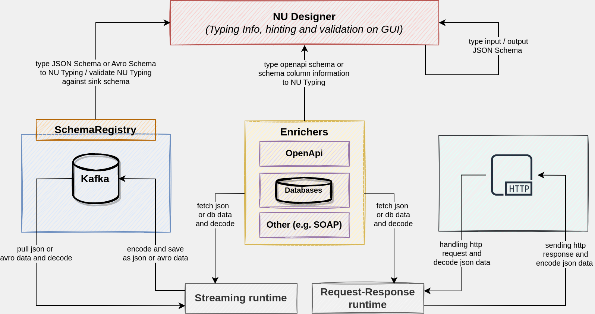

# Data Typing and Schemas Handling

## Overview

Nussknacker as a platform integrates diverse data sources, e.g. kafka topic or http request, and also allows to
enrich data using e.g. [OpenAPI](https://swagger.io/specification/) or databases. These integrations can return several
types of data like JSON, Binary, and DB data. In each case format of these data is described in a different way:

* Request-response inputs and outputs are described by JSON Schema, stored in Nussknacker scenario's properties
* Source [Kafka](https://kafka.apache.org/) with JSON data is described by JSON Schema, stored in the schema registry
* Source [Kafka](https://kafka.apache.org/) with binary data is described by Avro schema, stored in the schema registry
* [OpenAPI](https://swagger.io/specification/) enricher uses JSON data described by OpenAPI interface definition
* Database data are described by JDBC metadata, that contain column information

To provide consistent and proper support for these formats Nussknacker converts meta-information about data to its
own `Typing Information`, which is used on the Designer's part to hint and validate the data. Each part of the diagram
is statically validated and typed on an ongoing basis.

## Avro schema

We support [Avro schema](https://avro.apache.org/) in version: `1.11.0`. Avro is available only
on [Streaming](../scenarios_authoring/DataSourcesAndSinks.md). You need
[Schema Registry](../integration/KafkaIntegration.md#schemas) if you want to use Avro Schema.

### Source conversion mapping

#### [Primitive types](https://avro.apache.org/docs/1.11.0/spec.html#schema_primitive)

| Avro type | Java type     | Comment                                                                                                                                         |
|-----------|---------------|-------------------------------------------------------------------------------------------------------------------------------------------------|
| null      | null          |                                                                                                                                                 |
| string    | String / Char | Defaults to Java `String` (UTF-8). Use the advanced configuration option `AVRO_USE_STRING_FOR_STRING_TYPE=false` to change it to `CharSequence` |
| boolean   | Boolean       |                                                                                                                                                 |
| int       | Integer       | 32 bit                                                                                                                                          |
| long      | Long          | 64 bit                                                                                                                                          |
| float     | Float         | single precision                                                                                                                                |
| double    | Double        | double precision                                                                                                                                |
| bytes     | ByteBuffer    |                                                                                                                                                 |

#### [Logical types](https://avro.apache.org/docs/1.11.0/spec.html#Logical+Types)

Conversion at source to the specific type means that behind the scene Nussknacker
converts [primitive type](https://avro.apache.org/docs/1.11.0/spec.html#schema_primitive)
to [logical type](https://avro.apache.org/docs/1.11.0/spec.html#Logical+Types) - Java objects, consequently, the
end-user has access to methods of these objects.

| Avro type                                | Java type  | Sample               | Comment                                                       |
|------------------------------------------|------------|----------------------|---------------------------------------------------------------|
| decimal (bytes or fixed)                 | BigDecimal |                      |                                                               |
| uuid (string)                            | UUID       |                      |                                                               |
| date (int)                               | LocalDate  | 2021-05-17           | Timezone is not stored.                                       |
| time - millisecond precision (int)       | LocalTime  | 07:34:00.12345       | Timezone is not stored.                                       |
| time - microsecond precision (long)      | LocalTime  | 07:34:00.12345       | Timezone is not stored.                                       |
| timestamp - millisecond precision (long) | Instant    | 2021-05-17T05:34:00Z | Timestamp (millis since 1970-01-01) in human readable format. |
| timestamp - microsecond precision (long) | Instant    | 2021-05-17T05:34:00Z | Timestamp (millis since 1970-01-01) in human readable format. |

[//]: # (Missing support for: Local timestamp millisecond precision, Local timestamp microsecond precision, Duration)

#### [Complex types](https://avro.apache.org/docs/1.11.0/spec.html#schema_complex)

| Avro type | Java type                                                   | Comment                                                     |
|-----------|-------------------------------------------------------------|-------------------------------------------------------------|
| array     | [list](../scenarios_authoring/Spel.md#arrayslists)          |                                                             |
| map       | [map](../scenarios_authoring/Spel.md#recordsobjectsmaps)    | Key - value map, where key is always represented by String. |
| record    | [record](../scenarios_authoring/Spel.md#recordsobjectsmaps) |                                                             |
| enums     | org.apache.avro.generic.GenericData.EnumSymbol              |                                                             |
| fixed     | org.apache.avro.generic.GenericData.Fixed                   |                                                             |
| union     | Any of the above types                                      | It can be any of the defined type in union.                 |

### Sink validation & encoding

| Java type                                                    | Avro type                                | Comment                                                                                                                       |
|--------------------------------------------------------------|------------------------------------------|-------------------------------------------------------------------------------------------------------------------------------|
| null                                                         | null                                     |                                                                                                                               |
| String                                                       | string                                   |                                                                                                                               |
| Boolean                                                      | boolean                                  |                                                                                                                               |
| Integer                                                      | int                                      |                                                                                                                               |
| Long                                                         | long                                     |                                                                                                                               |
| Float                                                        | float                                    |                                                                                                                               |
| Double                                                       | double                                   |                                                                                                                               |
| ByteBuffer                                                   | bytes                                    |                                                                                                                               |
| [list](../scenarios_authoring/Spel.md#arrayslists)           | array                                    |                                                                                                                               |
| [map](../scenarios_authoring/Spel.md#recordsobjectsmaps)     | map                                      |                                                                                                                               |
| [map](../scenarios_authoring/Spel.md#recordsobjectsmaps)     | record                                   |                                                                                                                               |
| org.apache.avro.generic.GenericRecord                        | record                                   |                                                                                                                               |
| org.apache.avro.generic.GenericData.EnumSymbol               | enums                                    |                                                                                                                               |
| String                                                       | enums                                    | On the Designer we allow to pass `Typing Information String`, but we can't verify whether value is a valid Enum's symbol.     |
| org.apache.avro.generic.GenericData.Fixed                    | fixed                                    |                                                                                                                               |
| ByteBuffer                                                   | fixed                                    | On the Designer we allow to pass `Typing Information ByteBuffer`, but we can't verify whether value is a valid Fixed element. |
| String                                                       | fixed                                    | On the Designer we allow to pass `Typing Information String`, but we can't verify whether value is a valid Fixed element.     |
| BigDecimal                                                   | decimal (bytes or fixed)                 |                                                                                                                               |                                                                                                |
| ByteBuffer                                                   | decimal (bytes or fixed)                 |                                                                                                                               |
| UUID                                                         | uuid (string)                            |                                                                                                                               |
| String                                                       | uuid (string)                            | On the Designer we allow to pass `Typing Information String`, but we can't verify whether value is a valid UUID.              |
| LocalDate                                                    | date (int)                               |                                                                                                                               |
| Integer                                                      | date (int)                               |                                                                                                                               |
| LocalTime                                                    | time - millisecond precision (int)       |                                                                                                                               |
| Integer                                                      | time - millisecond precision (int)       |                                                                                                                               |
| LocalTime                                                    | time - microsecond precision (long)      |                                                                                                                               |
| Long                                                         | time - microsecond precision (long)      |                                                                                                                               |
| Instant                                                      | timestamp - millisecond precision (long) |                                                                                                                               |
| Long                                                         | timestamp - millisecond precision (long) |                                                                                                                               |
| Instant                                                      | timestamp - microsecond precision (long) |                                                                                                                               |
| Long                                                         | timestamp - microsecond precision (long) |                                                                                                                               |
| Any matching type from the list of types in the union schema | union                                    | Read more about [validation modes](#validation-and-encoding).                                                                 |

If at runtime value cannot be converted to an appropriate logic schema (e.g. "notAUUID" cannot be converted to proper
UUID), then an error will be reported.

## JSON Schema

We support [JSON Schema](https://json-schema.org/) in version: `Draft 7` without:

[//]: # (See SwaggerBasedJsonSchemaTypeDefinitionExtractor)

* Numbers with a zero fractional part (e.g. `1.0`) as a proper value on decoding (deserialization)
  for [integer schema](https://json-schema.org/understanding-json-schema/reference/numeric.html#integer)
* [Recursion schemas](http://json-schema.org/understanding-json-schema/structuring.html#recursion)
* [Anchors](http://json-schema.org/understanding-json-schema/structuring.html#anchor)

JSON Schema is available on [Streaming](../scenarios_authoring/DataSourcesAndSinks.md)
and [Request-Response](../scenarios_authoring/RRDataSourcesAndSinks.md). To integrate with JSON on
streaming we use [Schema Registry](../integration/KafkaIntegration.md#schemas). On the
other hand, we have Request-Response
where [schemas](../scenarios_authoring/RRDataSourcesAndSinks.md#schemas) are stored in scenario
properties.

### Source conversion mapping

| JSON Schema                                                                                        | Java type                                             | Comment                                                                                                                                                                                  |
|----------------------------------------------------------------------------------------------------|-------------------------------------------------------|------------------------------------------------------------------------------------------------------------------------------------------------------------------------------------------|
| [null](https://json-schema.org/understanding-json-schema/reference/null.html)                      | null                                                  |                                                                                                                                                                                          |
| [string](https://json-schema.org/understanding-json-schema/reference/string.html)                  | String                                                | UTF-8                                                                                                                                                                                    |
| [boolean](https://json-schema.org/understanding-json-schema/reference/boolean.html)                | Boolean                                               |                                                                                                                                                                                          |
| [integer](https://json-schema.org/understanding-json-schema/reference/numeric.html#integer)        | Integer/Long/BigInteger                               | There will be chosen narrowest type depending upon minimum maximum value defined in the json schema. In the case when no min/max boundaries are available it will map to Long by default |
| [number](https://json-schema.org/understanding-json-schema/reference/numeric.html#number)          | BigDecimal                                            |                                                                                                                                                                                          |
| [enum](https://json-schema.org/understanding-json-schema/reference/generic.html#enumerated-values) | String                                                |                                                                                                                                                                                          |
| [array](https://json-schema.org/understanding-json-schema/reference/array.html)                    | [list](../scenarios_authoring/Spel.md#arrayslists) |                                                                                                                                                                                          |

#### String Format
We support the following JSON [string format](https://json-schema.org/understanding-json-schema/reference/string.html#format) keywords.

| JSON Schema | Java type     | Sample                    | Comment                     |
|-------------|---------------|---------------------------|-----------------------------|
| date-time   | ZonedDateTime | 2021-05-17T07:34:00+01:00 | Must carry zone information |
| date        | LocalDate     | 2021-05-17                | Timezone is not stored      |
| time        | LocalTime     | 07:34:00.12345+01:00      | Must carry zone information |

#### [Objects](https://json-schema.org/understanding-json-schema/reference/object.html)

| object configuration                                                      | Java type                                                | Comment                                                                      |
|---------------------------------------------------------------------------|----------------------------------------------------------|------------------------------------------------------------------------------|
| object with properties                                                    | [map](../scenarios_authoring/Spel.md#recordsobjectsmaps) | `Map[String, _]`                                                             |
| object with properties and enabled `additionalProperties`                 | [map](../scenarios_authoring/Spel.md#recordsobjectsmaps) | Additional properties are available at runtime. Similar to `Map[String, _]`. |
| object without properties and `additionalProperties: true`                | [map](../scenarios_authoring/Spel.md#recordsobjectsmaps) | `Map[String, Unknown]`                                                       |
| object without properties and `additionalProperties: {"type": "integer"}` | [map](../scenarios_authoring/Spel.md#recordsobjectsmaps) | `Map[String, Integer]`                                                       |

We support `additionalProperties`, but additional fields won't be available in the hints on the Designer. To get
an additional field you have to do `#inpute.get("additional-field")`, but remember that result of this expression is
depends on `additionalProperties` type configuration and can be `Unknown`.

#### [Schema Composition](https://json-schema.org/understanding-json-schema/reference/combining.html)

| type  | Java type                                  | Comment                        |
|-------|--------------------------------------------|--------------------------------|
| oneOf | Any from the available list of the schemas | We treat it just like a union. |
| anyOf | Any from the available list of the schemas | We treat it just like a union. |

### Sink validation & encoding

| Java type                                                    | JSON Schema                                                                                                    | Comment                                                                                                                                  |
|--------------------------------------------------------------|----------------------------------------------------------------------------------------------------------------|------------------------------------------------------------------------------------------------------------------------------------------|
| null                                                         | [null](https://json-schema.org/understanding-json-schema/reference/null.html)                                  |                                                                                                                                          |
| String                                                       | [string](https://json-schema.org/understanding-json-schema/reference/string.html)                              |                                                                                                                                          |
| Boolean                                                      | [boolean](https://json-schema.org/understanding-json-schema/reference/boolean.html)                            |                                                                                                                                          |
| Integer                                                      | [integer](https://json-schema.org/understanding-json-schema/reference/numeric.html#integer)                    |                                                                                                                                          |
| Long                                                         | [integer](https://json-schema.org/understanding-json-schema/reference/numeric.html#integer)                    | Only if the minimum/maximum values in json schema for this type are not defined or these values do not fit in java's Integer type range. |
| BigInteger                                                   | [integer](https://json-schema.org/understanding-json-schema/reference/numeric.html#integer)                    | Only if the minimum/maximum values in json schema for this type do not fit in java's Long type range.                                    |
| Float                                                        | [number](https://json-schema.org/understanding-json-schema/reference/numeric.html#number)                      |                                                                                                                                          |
| Double                                                       | [number](https://json-schema.org/understanding-json-schema/reference/numeric.html#number)                      |                                                                                                                                          |
| BigDecimal                                                   | [number](https://json-schema.org/understanding-json-schema/reference/numeric.html#number)                      |                                                                                                                                          |
| [list](../scenarios_authoring/Spel.md#arrayslists)           | [array](https://json-schema.org/understanding-json-schema/reference/array.html)                                |                                                                                                                                          |
| [map](../scenarios_authoring/Spel.md#recordsobjectsmaps)     | [object](https://json-schema.org/understanding-json-schema/reference/object.html)                              |                                                                                                                                          |
| String                                                       | [enum](https://json-schema.org/understanding-json-schema/reference/generic.html#enumerated-values)             | On the Designer we allow to pass `Typed[String]`, but we can't verify whether value is a valid Enum's symbol.                            |
| Any matching type from the list of types in the union schema | [schema composition](https://json-schema.org/understanding-json-schema/reference/combining.html): oneOf, anyOf | Read more about [validation modes](#validation-and-encoding).                                                                            |

#### Properties not supported on the Designer

| JSON Schema                                                                               | Properties                                                                                                                                                                                                                                                                                                                                                                                                                                                                                                                                                                                                                 | Comment                                                       |
|-------------------------------------------------------------------------------------------|----------------------------------------------------------------------------------------------------------------------------------------------------------------------------------------------------------------------------------------------------------------------------------------------------------------------------------------------------------------------------------------------------------------------------------------------------------------------------------------------------------------------------------------------------------------------------------------------------------------------------|---------------------------------------------------------------|
| [string](https://json-schema.org/understanding-json-schema/reference/string.html)         | [length](https://json-schema.org/understanding-json-schema/reference/string.html#length), [regular expressions](https://json-schema.org/understanding-json-schema/reference/string.html#length), [format](https://json-schema.org/understanding-json-schema/reference/string.html#length)                                                                                                                                                                                                                                                                                                                                  |                                                               |
| [numeric](https://json-schema.org/understanding-json-schema/reference/numeric.html)       | [multiples](https://json-schema.org/understanding-json-schema/reference/numeric.html#multiples)                                                                                                                                                                                                                                                                                                                                                                                                                               |                                                               |
| [array](https://json-schema.org/understanding-json-schema/reference/array.html)           | [additional items](https://json-schema.org/understanding-json-schema/reference/array.html#additional-items), [tuple validation](https://json-schema.org/understanding-json-schema/reference/array.html#tuple-validation), [contains](https://json-schema.org/understanding-json-schema/reference/array.html#contains), [min/max](https://json-schema.org/understanding-json-schema/reference/array.html#mincontains-maxcontains), [length](https://json-schema.org/understanding-json-schema/reference/array.html#length), [uniqueness](https://json-schema.org/understanding-json-schema/reference/array.html#uniqueness) |                                                               |
| [object](https://json-schema.org/understanding-json-schema/reference/object.html)         | [unevaluatedProperties](https://json-schema.org/understanding-json-schema/reference/object.html#unevaluated-properties), [extending closed](https://json-schema.org/understanding-json-schema/reference/object.html#extending-closed-schemas), [property names](https://json-schema.org/understanding-json-schema/reference/object.html#property-names), [size](https://json-schema.org/understanding-json-schema/reference/object.html#size)                                                            |                                                               |
| [composition](https://json-schema.org/understanding-json-schema/reference/combining.html) | [allOf](https://json-schema.org/understanding-json-schema/reference/combining.html#allof), [not](https://json-schema.org/understanding-json-schema/reference/combining.html#not)                                                                                                                                                                                                                                                                                                                                                                                                                                           | Read more about [validation modes](#validation-and-encoding). |

These properties will be not validated by the Designer, because on during scenario authoring time we work only on
`Typing Information` not on real value. Validation will be still done at runtime.

#### Pattern properties

##### Sources
Object (also nested) in source schema will be represented during scenario authoring as:
* Map - when there is no property defined in `properties` field
  * if only `additionalProperties` are defined then map values will be typed to according to schema in `additionalProperties` field
  * if both `additionalProperties` and `patternProperties` are defined then values will be typed as `Union` with all possible types from `additionalProperties` and `patternProperties`
* Record otherwise
  * all non explicit properties can then be accessed using `record["patternOrAdditionalPropertyName"]` syntax but for now only if `pl.touk.nussknacker.engine.api.process.ExpressionConfig.dynamicPropertyAccessAllowed` is enabled (only possible in deprecated instalations with own `ProcessConfigCreator`)

##### Sinks
Pattern properties add additional requirements during scenario authoring for types that should be encoded into JSON Schema object type:
* Strict mode
  * only records types are allowed (no map types) and only if their fields' types are valid according to pattern properties restrictions (in addition to properties and additionalProperties)
* Lax mode
  * records are allowed under the same conditions as in strict mode but additionally Unknown type is allowed as a value's type
  * map types are allowed if their value's type matches any of property, patternProperty or additionalProperties schema or is an Unknown type

## Validation and encoding

As we can see above on the diagram, finally preparing data (e.g. Kafka sink / response sink) is divided into two parts:

* during validation on the Designer, the `Typing Information` is compared against the sink schema
* encoding data at runtime based on the data type, the data is converted to the internal representation expected by the
  sink

Sometimes situations can happen that are not so obvious to handle, e.g. how we should pass and validate `Unknown`
and `Union` types.

##### type `Unknown`

A situation when Nussknacker can not detect the exact type of data.

##### type `Union`

A situation when the data can be any of [several representation](https://en.wikipedia.org/wiki/Union_type).

In the case of `Union` and `Unknown` types, the actual data type is known only at runtime - only then the decision how
to encode can be taken. Sometimes, it may happen that encoding will not be possible, due to the mismatch of the actual
data type and data type expected in the sink and the runtime error will be reported. The number of runtime encoding
errors can be reduced by applying strict schema validation rules during scenario authoring. This is the place where
validation mode comes in.

## Validation modes

Validation modes determines how Nussknacker handles validation `Typing Information` against the sink schema during the
scenario authoring. You can set validation mode by setting `Value validation mode` param on sinks where `raw editor` is
enabled.

|                                   | Strict mode                                                                   | Lax mode                                                        | Comment                                                                                                                                                |
|-----------------------------------|-------------------------------------------------------------------------------|-----------------------------------------------------------------|--------------------------------------------------------------------------------------------------------------------------------------------------------|
| allow passing additional fields   | no                                                                            | yes                                                             | This option works only at Avro Schema. JSON Schema manages additional fields itself explicitly by schema property: [`additionalProperties`](#objects). |
| require providing optional fields | yes                                                                           | no                                                              |                                                                                                                                                        |
| allow passing `Unknown`           | no                                                                            | yes                                                             | When data at runtime will not match against the sink schema, then error be reported during encoding.                                                   |
| passing `Union`                   | `Typing Information` union has to be the same as union schema of the sink | Any of element from `Typing Information` union should match | When data at runtime will not match against the sink schema, then error be reported during encoding.                                                   |

General intuition is that in `strict` mode a scenario that was successfully validated should not produce any type connect encoding errors during runtime (it can still produce errors e.g. for range validation in JSON Schema or valid enum entry validation in Avro).
On the other hand, in `lax` mode NU allows to deploy scenario if there is any chance it can encode data properly, but responsibility for passing valid type to sink (e.g. in Unknown type) is on end-user side.

We leave to the user the decision of which validation mode to choose. But be aware of it, and remember it only impacts
how we validate data during scenario authoring, and some errors can still occur during encoding at runtime.
