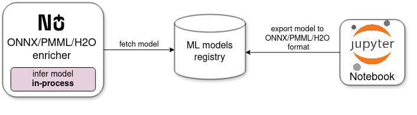
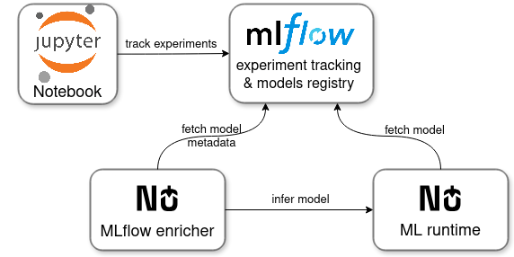

# Machine Learning (Enterprise only)

Nussknacker can infer ML models using the Machine Learning enrichers. We support both in-process inference and inference
using a dedicated ML runtime.

Nussknacker ML enrichers can infer **in-process** models exported in the following formats:
- [ONNX](https://onnx.ai/)
- [PMML](https://en.wikipedia.org/wiki/Predictive_Model_Markup_Language)
- [H2O](https://h2o.ai/)

Executing ML models in the same process as the Nussknacker scenario is a matter of configuring an ML enricher. No 
additional components are required to infer models. Also, invoking exported models using their native runtimes 
should result in both minimal latency and low resource requirements. However, this approach has some limitations. 
Namely, not all models and not all popular ML libraries are covered by these formats. The export process itself
can feel cumbersome.

Nussknacker can discover exported models from file (e.g. local directory, NFS) or HTTP based registries.
We also plan to support MLflow as a registry for exported models in these formats.

The diagram below shows the interactions for ML enricher inferring an exported model:

Because of some restrictions with exporting models, we also support inference of **any Python ML model** using our
*Nussknacker ML runtime* component. ML models are discovered and fetched from the [MLflow](https://mlflow.org/)
model registry which also serves as an experiment tracking tool for data scientists. This way, data scientists do not
have to worry about exporting trained models to other formats, they just log the models in the MLflow model registry.
They also have the flexibility to use various Python ML libraries.

Nussknacker ML runtime offers higher throughput at the cost of higher inference latency. Since the ML runtime
is a separate component of Nussknacker installation, a GPU can be also harnessed to infer ML models.

The diagram below shows the interactions for MLflow enricher and ML runtime: 

A Kubernetes cluster is recommended for installing the Nussknacker ML runtime. However, the ML runtime can also be
installed as a standalone application.

You can read more about this approach in our [blog post](https://nussknacker.io/blog/ml-models-inference-in-fraud-detection/)
where we present a complete path from analysing a dataset to training a model and finally inferring the model
in a Nussknacker scenario.

The ML enrichers are Enterprise components of Nussknacker and require a separate license. Please contact
<info@nussknacker.io> for license terms and more details.
