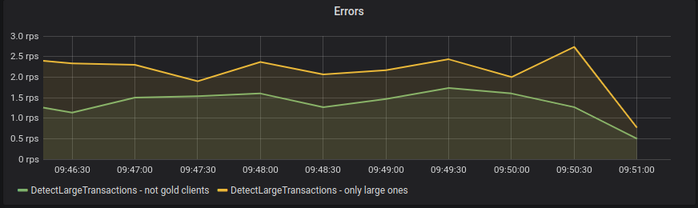

## Intended audience

This manual is intended mainly for those who are going to support Nussknacker deployments (especially production ones). We assume prior knowledge of Kafka, Flink, InfluxDB, Kubernetes

The parts describing scenario management and tuning should be accessible also for those authoring them with the Nussknacker Designer.


## Prerequisites

To better understand the documentation below one needs to grasp some concepts of metrics, etc. We won’t go into much detail here, only give references to worthy resources.

Some of them are external, but it also helps to read about important Nussknacker concepts in [glossary](../about/GLOSSARY) and [scenario authoring](../scenarios_authoring/Intro.md).

### Integration with Apache Kafka

The usual way to ingest and produce events in Nussknacker is via integration with Kafka. To understand and monitor the performance of the Kafka sources it's important to know Kafka consumer details. A good explanation is available at Confluent site:
[Kafka consumer](https://docs.confluent.io/platform/current/kafka/design.html#the-consumer)


### Metrics architecture

In the documentation we assume standard metrics setup (available in docker-compose and Helm chart):

* InfluxDB to store and query data
* Grafana to visualize metrics
* InfluxDB reporter with Telegraf relay to deliver metrics to InfluxDB


It’s possible to configure Nussknacker installation to use other metrics setup (e.g. using Prometheus), but then you’re on your own to figure out the details - using provided metrics reporter documentation it shouldn’t be too hard.


### Monitoring - metrics

#### Kafka cluster

Below we provide some valuable resources on how to monitor the Kafka cluster:

* [https://docs.confluent.io/platform/current/kafka/monitoring.html](https://docs.confluent.io/platform/current/kafka/monitoring.html)


### Upgrading to new versions

#### Upgrading Nussknacker

Since all scenarios are deployed to an execution engine, it's possible to first upgrade Nussknacker Designer and redeploy all scenarios with a new version in the next step.

Please see [Migration Guide](https://github.com/TouK/nussknacker/blob/staging/docs/MigrationGuide.md) before doing the upgrade - especially when using custom extensions.

### Nussknacker operations REST API

Nussknacker provides a few REST endpoints which may be helpful to check if everything is OK - e.g. can be used to implement health checks using standard monitoring tools.

Below we describe endpoints that return general information about the Nussknacker state. Please see Deployment REST API section for endpoints allowing for management of a single scenario.


* `/api/app/buildInfo GET` - returns basic information about deployed version of Nussknacker. Sample output looks like this:
```json 
{
  "name": "nussknacker-api",
  "gitCommit": "edcbd3b964e09271f54a7e5a8700c4a3e73d0275",
  "buildTime": "2022-02-01T09:42:30.748539",
  "version": "1.1.1",
  "processingType": {
    "streaming": {
      "name": "generic",
      "version": "1.1.1",
      "buildTime": "2022-02-01T09:42:30.748539",
      "gitCommit": "edcbd3b964e09271f54a7e5a8700c4a3e73d0275"
    }
  }
} 
```  

* `/api/app/healthCheck GET 200` - use to check if Nussknacker Designer is up
* `/api/app/healthCheck/process/deployment GET`
  * 200 - if all deployed scenarios are running
  * 500 - basic information about deployed scenarios that are not running (e.g. failed, restarting etc.)
* `/api/app/healthCheck/process/validation GET`
  * 200 - if all scenarios are valid
  * 500 - list of not-valid scenarios
* `/api/app/config GET` (requires admin permissions) - serialized configuration of Nussknacker Designer and components (NOTE: configuration returned by this endpoint does not have all [substitutions](https://github.com/lightbend/config/blob/master/HOCON.md#substitutions) resolved, e.g. some environmental variables will not be returned)
* `/api/app/processingtype/reload POST` (requires admin permissions) - reload [Model](../configuration/model/ModelConfiguration.md) configuration. Used mostly if you use custom components which have dynamic configuration (e.g. list of components depend on external registry, like MLFlow or OpenAPI)

#### Deployment REST API

Endpoints under “admin”

* `/api/processManagement/deploy/{scenarioName} POST` - deploy scenario with given name passed as a `scenarioName`
* `/api/processManagement/cancel/{scenarioName} POST` - cancel scenario with given name passed as a `scenarioName`. Savepoint won't be saved
* `/api/adminProcessManagement/snapshot/{scenarioName}?savepointDir={path} POST` - make a savepoint of current scenario's state. Returns path where savepoint was saved as a plain string
  e.g. `hdfs:///flink/savepoints/savepoint-71a39f-b2078dc48f16`. Can be used in `deploy` endpoint as a `savepointPath` parameter
* `/api/adminProcessManagement/stop/{scenarioName}?savepointDir={path} POST` - stop scenario and make a savepoint.  Returns path where savepoint was saved as a plain string
  e.g. `hdfs:///flink/savepoints/savepoint-71a39f-b2078dc48f16`. Can be used in `deploy` endpoint as a `savepointPath` parameter
* `/api/adminProcessManagement/deploy/{scenarioName}?savepointPath={path} POST` - deploy scenario from given savepoint. Example savepoint path: `hdfs:///flink/savepoints/savepoint-71a39f-b2078dc48f16`

## Scenarios - monitoring and troubleshooting

Each scenario has its own performance characteristics and considerations. This section describes common ways to monitor the health of a running scenario and how to handle common problems. Most of the sections are aimed not only at operations people but also at (especially advanced) editors of Nussknacker scenarios.

### Nussknacker metrics

One of the crucial aspects of running production workloads is monitoring. In this section we'll explain how the Nussknacker scenario running on the execution engine gives rise to certain metrics, how to process them and display them in Grafana.

#### Metric types

Below we describe common

| Name        | Fields reported (with InfluxDB)                              | Description                                                                                                            |
|-------------|--------------------------------------------------------------|------------------------------------------------------------------------------------------------------------------------|
| counter     | count                                                        |                                                                                                                        |
| histogram   | count, max, mean, min, p50, p75, p95, p98, p99, p999, stddev | mainly used for measuring invocation times                                                                             |
| gauge       | value                                                        | value in given point in time                                                                                           |
| instantRate | value                                                        | special gauge for measuring throughput in given moment (standard meter has only mean throughput in 1, 5 or 15 minutes) |

#### Common metrics

| Measurement             | Additional tags | Metric type             | Notes                                                   |
|-------------------------|-----------------|-------------------------|---------------------------------------------------------|
| nodeCount               | nodeId          | counter                 | used e.g. by count functionality                        |
| error.instantRate       | -               | instantRate             |                                                         |
| error.instantRateByNode | nodeId          | instantRate             | nodeId is `unknown` if we fail to detect exact place    |
| service.OK              | serviceName     | histogram + instantRate | histogram of successful invocation times                |
| service.FAIL            | serviceName     | histogram + instantRate | histogram of successful invocation times                |

#### Streaming metrics

| Measurement                 | Additional tags | Metric type           | Description                                                                    |
|-----------------------------|-----------------|-----------------------|--------------------------------------------------------------------------------|
| source                      | nodeId          | instantRate + counter |                                                                                |
| eventtimedelay.histogram    | nodeId          | histogram             | only for sources with eventTime, measures delay from event time to system time |
| eventtimedelay.minimalDelay | nodeId          | gauge                 | time from last event (eventTime) to system time                                |
| end                         | nodeId          | instantRate + counter | for sinks and end processors                                                   |
| dead_end                    | nodeId          | instantRate + counter | for event filtered out on filters, choices etc.                                |


Each of these metrics comes with the tags specific for execution engine:

Nussknacker comes with a Grafana dashboard; you can use it or extend/modify according to your needs.


### Monitoring - is my scenario doing well?

The two most important things that should be monitored after deployment of a scenario are:

* Error rates - are there any problems with execution?
* Performance - is scenario processing events fast enough?

#### Error rates 

When you see errors in monitoring, like on screen below:





it means that there were failures during scenario execution - most often they are caused by errors during SpeL expression evaluation, which couldn't be detected during scenario authoring.

#### Checking source lag

There are two types of metrics that can give useful information about potential Kafka lags

* How large is lag on Kafka source partitions
* How much time has passed since the last processed event

Please note that:

* Kafka lag is reported with some delay (offsets are not committed immediately). It’s normal to have temporary spikes.
* Large differences between slots in lag may point to data skew or e.g. problematic data for some keys

### Logs

If errors occur, their details can be found in one or more logs:
* engine log which contains **stdout** of the engine process
* in the streaming processing mode a [dedicated Kafka topic](../integration/KafkaIntegration.md#exception-handling) can be configured where additional error details will be written. 
* if Flink engine is used, [additional logging mechanisms can be configured](../configuration/model/Flink.md#configuring-exception-handling) - the logs will be viewable via Flink console. 


None of these logs is viewable via Nussknacker Designer - please consult your IT operations personnel on how to access the above mentioned logs.   

#### Log examples


* Engine log


```
2021-06-24 07:43:32,071 INFO  pl.touk.nussknacker.engine.spel.SpelExpression               [] - Expression evaluation failed. Original #client.status != "GOLD", ctxId: DetectLargeTransactions-kafka-registry-typed-json-1-3847, message: EL1021E: A problem occurred whilst attempting to access the property 'status': 'Cannot invoke method/property status on null object'
```


* Contents of configured errors' topic on Kafka:

```
{
  "processName": "DetectLargeTransactions",
  "nodeId": "only large ones",
  "message": "Expression [20 / (#input.amount % 4) > 0] evaluation failed, message: / by zero",
  "exceptionInput": "20 / (#input.amount % 4) > 0",
  "inputEvent": null,
  "stackTrace": "pl.touk.nussknacker.engine.spel.SpelExpressionEvaluationException:... 34 more",
  "timestamp": 1624863781881,
  "host": "0bda71c51449",
  "additionalData": {}
}
```
NOTE: processName means scenario name in the above configuration. 


### Handling typical scenario errors

The most common problems are:
* NullPointerException - please see SpEL documentation [link Safe Navigation] to see how to check if some value is null
* Conversion errors - e.g. #NUMBER.toNumber - this usually indicates problem with the source data
* Avro serialization - see next section for more details


#### Avro serialization problem
Common problem is when your Avro data encoding not correspond with the one Nussknacker expects. You will find then `Unknown magic byte!` error indicating that data you produced to the topic are not serialized properly.
```
2022-03-30 14:12:28.034 [worker-DetectLargeTransactions-1] INFO  p.t.n.e.u.e.DefaultWithExceptionExtractor - Unknown exception IllegalArgumentException:Unknown magic byte! for DetectLargeTransactions-kafka-avro-127
```
Check [Schema Registry + Avro serialization
](../integration/KafkaIntegration.md#schema-registry---connection) part for explanation.

## General production readiness checklist

### Nussknacker configuration

* Configure restart strategy and error handler
  * By default, scenarios are not restarted, so that errors do not go unnoticed
  * [Kafka exception handler](../integration/KafkaIntegration.md#exception-handling) should be used in production - configure error topic, with long enough retention
* Check if Nussknacker has access to all needed services:
  * Flink REST API
  * K8s REST API
  * Savepoints location
  * Schema registry - to detect data types
  * Kafka cluster - to be able to generate test data
  * InfluxDB - to have access to counts data
* Test correctness of the configuration
  * Perform  a few test scenario deployments, try  also redeployment to check if savepoints are accessible
  * Generate test data from some Kafka topic
  * Check if counts can be accessed
  * See if metrics links are working properly
* Make sure to configure RocksDB properly (e.g. `rocksdb.enable`) - in case of Flink execution engine

##### Setup metrics/alerting

* Prepare dashboards/alerts for monitoring cluster health, according to your needs.
* Setup healthchecks, based on Nussknacker API
