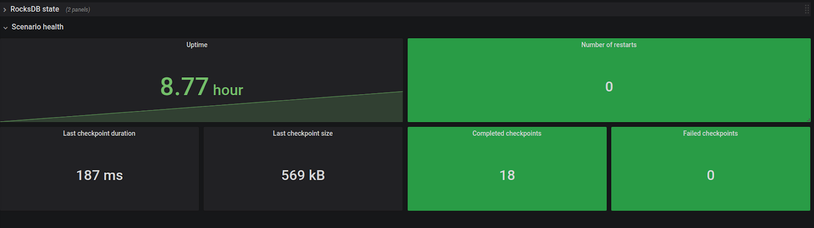

## Prerequisites

### Working with Flink state

Being able to handle large state efficiently and correctly is one of the biggest advantages of Flink. While Nussknacker hides much of the complexity from the user, for understanding performance considerations it’s crucial to have basic knowledge of how Flink handles state under the hood. Please refer to Flink documentation:

[https://ci.apache.org/projects/flink/flink-docs-stable/docs/concepts/stateful-stream-processing/](https://ci.apache.org/projects/flink/flink-docs-stable/docs/concepts/stateful-stream-processing/).

Pay special attention to the concept of keys and partitions, as they are vital to correct event processing.


### Handling time in Flink

In order to understand various metrics dealing with the concept of time (e.g. delays), it’s vital to have a basic knowledge of how Flink defines those concepts.

Flink reference [documentation on time concepts](https://ci.apache.org/projects/flink/flink-docs-stable/docs/concepts/time/)
 is a good starting point.

Pay special attention to the concept of event time and watermarks, see also [documentation](../scenarios_authoring/DataSourcesAndSinks.md#notion-of-time--flink-engine-only) to understand how Nussknacker deals with them.


### Integration with Apache Kafka

Nussknacker uses [Kafka connector](https://nightlies.apache.org/flink/flink-docs-stable/docs/connectors/datastream/kafka/) 
for integration with kafka. It's especially important to understand Kafka fault tolerance which you can read about in
[this section of Kafka connector documentation](https://nightlies.apache.org/flink/flink-docs-stable/docs/connectors/datastream/kafka/#fault-tolerance).

In particular, one must not forget that the Flink connector (when checkpoints are enabled):
* Commits the offsets to Kafka only during checkpoint - so offsets returned by Kafka almost always will not be correct.
* Ignore offsets in Kafka when it’s started with the checkpointed state - topic offsets are also saved in the checkpointed state.

#### End-to-end Exactly-once event processing

Nussknacker allows you to process events in the Exactly-once Semantics. This feature is provided by Flink.
An important note is that we guarantee that the message is delivered once and only once via kafka sink in the scenario.
If a fault occurs between checkpoints and after an operation that performs some side effects, such as enrichment,
it possible that this action could be repeated.
To read more about it see: [Flink blog post](https://flink.apache.org/2018/02/28/an-overview-of-end-to-end-exactly-once-processing-in-apache-flink-with-apache-kafka-too/) and 
[Flink fault tolerance](https://nightlies.apache.org/flink/flink-docs-release-1.18/docs/learn-flink/fault_tolerance/#exactly-once-guarantees).
More information about certain connectors can be found here: [section with fault tolerance for connectors](https://nightlies.apache.org/flink/flink-docs-release-1.18/docs/connectors/datastream/guarantees/).
Kafka connector specific information is provided at: [this section of Kafka connector documentation](https://nightlies.apache.org/flink/flink-docs-release-1.18/docs/connectors/datastream/kafka/#fault-tolerance).

In order to achieve End-to-end Exactly-once event processing, you need to check multiple places of configuration:
- Flink cluster configuration:
  - Configure checkpointing.
    A Prerequisite is to have persistent storage for the state, and you should make sure that this is configured.
    In Exactly-once events are committed during checkpoint and consequently the output events will be visible within 
    the time range specified by the checkpoint interval. It's essential to configure proper interval in a range of 
    1-10 seconds (interval should be configured in nussknacker - `Configure the checkpointing interval` section).
    Such a short interval has large overhead on Flink, and you should consider configuring:
    - Incremental checkpoints: [Flink docs](https://nightlies.apache.org/flink/flink-docs-release-1.18/docs/dev/datastream/fault-tolerance/checkpointing/#state-backend-incremental).
    - Unaligned checkpoints: [Flink docs](https://nightlies.apache.org/flink/flink-docs-release-1.18/docs/ops/state/checkpointing_under_backpressure/#unaligned-checkpoints).
    Additionally you have to ensure that checkpointing mode is set to `EXACTLY_ONCE` [Flink docs](https://nightlies.apache.org/flink/flink-docs-release-1.18/docs/deployment/config/#execution-checkpointing-mode).
  - Ensure task failure recovery is configured.
    [Configuring restart strategies](../configuration/model/Flink.md#configuring-restart-strategies).
    The main purpose of Exactly-once is to don't miss any events and don't have duplicated events during failures. 
    If the task failure recovery is not configured, after failure task will not be running and has failed state. 
    As a result, there is no opportunity to use Exactly-once mechanism.
- Nussknacker configuration:
  - Configure the property `components.kafka.config.deliveryGuarantee` to: "EXACTLY_ONCE", e.g.
    ```
    kafkaConfig {
      kafkaProperties {
        "bootstrap.servers": ${?KAFKA_ADDRESS}
        "schema.registry.url": ${?SCHEMA_REGISTRY_URL}
        "auto.offset.reset": ${?KAFKA_AUTO_OFFSET_RESET}
        "isolation.level": "read_committed"
      }
      sinkDeliveryGuarantee: "EXACTLY_ONCE"
    }
    ```
  - Configure the checkpointing interval:
    Default value for the interval is 10 minutes which is not acceptable for Exactly-once.
    Therefore, it needs to be configured to appropriate value.
    - Interval can be configured globally for all scenarios via: 
      [Flink model configuration](../configuration/model/Flink.md).
    - You can override global interval in a scenario by setting `Checkpoint interval in seconds` in a scenario 
      properties on UI.
  - Configure Flink Kafka producer `transaction.timeout.ms` to be equal to: "maximum checkpoint duration + maximum
    restart duration" in property `kafkaProperties."transaction.timeout.ms"`
    ([kafkaConfig](../integration/KafkaIntegration.md#available-configuration-options)) or data loss may happen when
    Kafka expires an uncommitted transaction.
  - Ensure Flink Kafka consumer `isolation.level` is set to `read_committed`
    ([kafkaConfig](../integration/KafkaIntegration.md#available-configuration-options)) if you plan consuming events 
    from transactional source.
- Kafka cluster configuration:
  - Ensure your Kafka version supports transactions.
  - Ensure that Kafka broker `transaction.max.timeout.ms` 
    [Kafka docs](https://kafka.apache.org/documentation/#brokerconfigs_transaction.max.timeout.ms) is greater than 
    producer `transaction.timeout.ms`.
  - Ensure that your Kafka broker cluster has at least three brokers
    [Kafka docs](https://kafka.apache.org/documentation/#producerconfigs_transactional.id).
  - According to: [current presentation](https://www.confluent.io/events/current/2023/3-flink-mistakes-we-made-so-you-wont-have-to/)
    you should also consider configuring `transactional.id.expiration.ms` due to the fact that every transactionId
    metadata is stored on kafka on every checkpoint. The metadata weights around 300 bytes so accumulated size could be
    big. As a result we should configure a policy which will expire transactionId.
- Application consuming Nussknacker's messages configuration:
    - Ensure your consumer has `isolation.level` set to: `read_committed`.

## Nussknacker and Flink cluster


### Common Flink configuration issues

Nussknacker assumes that the Flink Session Cluster is used (it should be possible to write own, custom `DeploymentManager` to deploy with Job/Application mode, 
but this is out of scope of this guide).

It usually happens (especially for large deployments) that the Flink cluster used with Nussknacker has quite a lot of jobs (each representing one scenario), many of them are quite small in terms of needed resources - this is different to usual Flink setup, where a cluster has one or few jobs.

Below we give a few tips on how to configure your cluster. Some of the configuration options are given as an example in our demo config, but you always should adjust them to the parameters of your machines and to typical workloads.


#### Memory parameters

Flink's memory configuration is pretty complex, [https://ci.apache.org/projects/flink/flink-docs-stable/docs/deployment/memory/mem_setup/](https://ci.apache.org/projects/flink/flink-docs-master/docs/deployment/memory/mem_setup/) - please see the official documentation for the details. Nussknacker-specific settings:


* Metaspace size should be fairly large both on jobmanagers and taskmanagers - for typical deployments with around 20-30 scenarios value around 1 GB should be enough.
* Heap size on jobmanagers should also be larger than typical Flink deployment


#### RocksDB configuration

Detailed documentation on the configuration of RocksDB can be found in:

* [https://ci.apache.org/projects/flink/flink-docs-stable/docs/ops/state/state_backends/](https://ci.apache.org/projects/flink/flink-docs-stable/docs/ops/state/state_backends/)
* [https://flink.apache.org/2021/01/18/rocksdb.html](https://flink.apache.org/2021/01/18/rocksdb.html)

For Nussknacker there are additional tips/things to consider:


* `state.backend.rocksdb.memory.managed: false` - in some deployments we’ve found that a large number of jobs causes some problems with automatic memory management
* `state.backend.rocksdb.writebuffer.size - `consider increasing if you have many write-heavy aggregations

                 
#### Other

* `cluster.evenly-spread-out-slots: true` - this setting is important, because with many jobs deployed on cluster it may happen that nodes (taskmanagers) will be unevenly loaded, which can lead to performance degradation. If this happens, sometimes the easiest solution is to restart jobmanager, so that all the jobs will be partitioned again (this usually happens after restarts of some of the taskmanagers).
* `akka.framesize` - consider increasing the value if you experience frequent timeouts on deployment (for large scenario and complex components > 100 MB can be necessary)
* `classloader.resolve-order` - Nussknacker has some problems with child-first classloading, it can happen especially when 
  using custom components. Sometimes it can be necessary to set this setting to `parent-first` (see [Flink documentation](https://ci.apache.org/projects/flink/flink-docs-stable/docs/ops/debugging/debugging_classloading/#inverted-class-loading-and-classloader-resolution-order) for in-depth explanation)

### Monitoring - metrics

#### Flink cluster

Flink provides various metrics describing its health and performance, see:

[https://ci.apache.org/projects/flink/flink-docs-stable/docs/ops/metrics/#system-metrics](https://ci.apache.org/projects/flink/flink-docs-stable/docs/ops/metrics/#system-metrics)

Flink blog post: [https://flink.apache.org/news/2019/02/25/monitoring-best-practices.html](https://flink.apache.org/news/2019/02/25/monitoring-best-practices.html) is also a valuable reference.

Recommended Nussknacker setup (i.e., the one provided with Docker based demo) uses InfluxDB + Telegraf, 
but you can also easily access metrics on demand using e.g. JMX + Jolokia. To do this you have to:
- enable jolokia - download Jolokia JVM agent, pass `-javaagent:{path_to_jar}/jolokia-jvm-agent.jar=port=9972,host=localhost,agentId=flink-taskmanager-demo` to Flink VM options (either via `FLINK_ENV_JAVA_OPTS`/`FLINK_ENV_JAVA_OPTS_JM` variable or `env.java.opts.(task/job)manager` configuration option)
- enable [JMX reporter](https://ci.apache.org/projects/flink/flink-docs-stable/docs/deployment/metric_reporters/#jmx)
With Jolokia, you can also pass VM metrics to InfluxDB via [telegraf plugin](https://github.com/influxdata/telegraf/tree/master/plugins/inputs/jolokia2)

System metrics that should be monitored:
* VM memory:
  * Heap
  * Metaspace (Jobmanager + Taskmanager)
* VM CPU
* HealthChecks for JM/TM


#### Host monitoring

Don’t forget about monitoring general host metrics (or use the ones provided by your platform)

* Network usage
* Disk usage

### Upgrading to new versions

##### Upgrading Flink

For patch version changes (e.g. 1.11.1 to 1.11.2) upgrade usually goes without problems - it’s enough to replace Flink with new version with rolling upgrade on cluster.

For minor release changes (e.g. 1.11 to 1.12) it’s a bit more involved, the safest way is the following:

* Perform savepoints of all running jobs
* Stop all running jobs
* Upgrade cluster
* Restore all jobs from savepoints

See Nussknacker management REST API [documentation](../operations_guide/Common.md#deployment-rest-api) for performing savepoints and restoring from them.

### Common problems with Flink cluster

| Problem                                                                                                                                                                                                                                                                                                                                                                         | Possible causes                                                                                                                                                                                                                                                                                                                                                                                                                                                                                                                                                                                                                                                                                                                                                                                                                                                                                  |
|---------------------------------------------------------------------------------------------------------------------------------------------------------------------------------------------------------------------------------------------------------------------------------------------------------------------------------------------------------------------------------|--------------------------------------------------------------------------------------------------------------------------------------------------------------------------------------------------------------------------------------------------------------------------------------------------------------------------------------------------------------------------------------------------------------------------------------------------------------------------------------------------------------------------------------------------------------------------------------------------------------------------------------------------------------------------------------------------------------------------------------------------------------------------------------------------------------------------------------------------------------------------------------------------|
| Jobmanager / taskmanager keeps restarting with `java.lang.OutOfMemoryError: Metaspace` in logs                                                                                                                                                                                                                                                                                  | Observe metaspace usage metrics. <br/> If metaspace grows together with the number of running Flink jobs - adding metaspace may help (see [config docs](https://ci.apache.org/projects/flink/flink-docs-stable/docs/deployment/config/#memory-configuration) e.g. `taskmanager/jobmanager.memory.jvm-metaspace.size`).<br/> If the metaspace usage grows after redeployments/restart of one job - it’s probably a classloading leak. Possible root cause can be JDBC driver lib in model classpath (please check [SQL component docs](../integration/Sql.md#handling-typical-errors) how to configure them properly, [Flink documentation](https://ci.apache.org/projects/flink/flink-docs-stable/docs/ops/debugging/debugging_classloading/#unloading-of-dynamically-loaded-classes-in-user-code) also provides some references, this error usually has to be resolved by fixing configuration) |
| Jobmanager does not start, in JobManager logs lines similar to: <code>2021-06-29 12:40:19,666 ERROR org.apache.flink.util.FlinkRuntimeException: Could not recover job with job id 874e811511becea2e085f57cdb12c1c1.<br/>...<br/>Caused by: java.io.FileNotFoundException: /opt/flink/data/storage/nussknacker/submittedJobGraph7f8076051052 (No such file or directory)</code> | In HA config, Flink stores job info both in ZooKeeper and on a filesystem. This error usually means that they are out of sync. Usually it’s necessary to remove nodes in Zookeeper manually (connect to Zookeeper, e.g. run zkClient, check `high-availability.zookeeper.path.root` config setting to find exact location)                                                                                                                                                                                                                                                                                                                                                                                                                                                                                                                                                                       |

### Failure recovery

Detailed description about Flink failure recovery can be found [here](https://nightlies.apache.org/flink/flink-docs-release-1.13/docs/dev/execution/task_failure_recovery/)

## Scenarios - monitoring and troubleshooting

Each scenario has its own performance characteristics and considerations. This section describes common ways to monitor the health of a running scenario and how to handle common problems. Most of the sections are aimed not only at operations people but also at (especially advanced) editors of Nussknacker scenarios.


###  Managing lifecycle of scenario

State of the scenario can be viewed in the scenario list, in the scenario details view or via API. Possible states can be grouped in the following categories:

* Not running
  * _NotDeployed_ (initial status before first deploy)
  * _Canceled_
  * _Finished_ (for finite sources, e.g. batch)
* Running without problems
  * Running
* Temporary states
  * _DuringDeploy_
  * _Restarting_ - (after an unexpected exception, check Flink console for the details)
* Problem
  * _Failed_ - the scenario ended with an error, the configured restart strategy prevents from running further
  * _Error_ - any of the following (in all cases jobmanager logs should be checked, this situation should be resolved manually):
    * Scenario was deployed, but cannot find job on the Flink cluster
    * Scenario is running on Flink, but in a different version then saved in Nussknacker, probably some deployment error occurred
  * _Warning_ - any of the following (in all cases jobmanager logs should be checked, this situation should be resolved manually):
    * The scenario was stopped in Nussknacker, but is still running on Flink
  * _FailedToGet_ -cannot obtain the state of the Flink job from the cluster. This usually indicates that connection problems or problems with the cluster
  * _MultipleJobsRunning_ indicates that there are multiple Flink jobs running for one scenario. This should not happen, usually it happens after some deployment problems (restart during deployment, timeouts). This should be resolved manually, by cancelling Flink jobs.
  * _Unknown_ should not happen, check the logs and consult Nussknacker team
  
#### UI Actions

##### Deployment

Deploy the newest version of the scenario.

* When the scenario is not running, it starts running with a clean state. Reading from Kafka sources starts either from current offsets (if e.g. scenario was running before) or from latest/earliest accessible offset (depending on the **[auto.offset.reset](https://kafka.apache.org/documentation/#consumerconfigs_auto.offset.reset)** setting of Kafka connector in Nussknacker)
* If the scenario is already running, the following steps are taken during deployment:
  * Savepoint of current state is taken
  * (optional) Verification of state compatibility is performed
  * New version of scenario is deployed, using savepoint taken in first step

Things to note:

* If the state is incompatible, or for some reason it’s not possible to create a savepoint or use it, the only way to proceed is to cancel the scenario and start from a clean state.
* Currently, it’s not possible to fix state incompatibilities via UI. Experienced users can try to take savepoint, fix it via Flink State API and restore using Nussknacker REST API (see below)

##### Cancel

Stop running scenario. Flink job is canceled, meaning the state is discarded.

This action is available also during some ‘Problem’ scenario states - the idea is to allow cleanup after some problematic states.

Please note that Kafka offsets that were committed during the latest checkpoint are not deleted, so after deploying scenario once more, Kafka consumers will start from those offsets.

Currently, it’s not possible to stop a scenario while it is saving state (i.e. doing snapshot), it is possible using Nussknacker REST API (see below)

### Common problems with scenarios

Diagnosing most of the problems below requires access to:


* Flink console
* Flink logs
                     
| Problem                                                                                     | What to do                                                                                                                                                                                              |
| --------                                                                                    | ----------                                                                                                                                                                                              |
| Scenario is restarting continuously after redeploy                                          | Check jobmanager logs and/or Flink console                                                                                                                                                              |
| Scenario is restarting continuously after first deploy                                      | Check jobmanager logs and/or Flink console                                                                                                                                                              |
| Checkpoints are failing                                                                     | Check jobmanager logs and/or Flink console                                                                                                                                                              |
| Redeploy of scenario times out                                                              | Check jobmanager logs and/or Flink console                                                                                                                                                              |
| `State is incompatible, please stop process and start again with clean state` during deploy | <ul><li>Check if Nussknacker has access to savepoints</li><li>Analyze if new state was added - if this is the case probably cancel before deploy is needed (to get rid of incompatible state)</li></ul> |
| Aggregate events are not emitted by aggregate in time windows nodes                         | Idle source (Kafka topic) or idle Kafka partition confuse Flink's watermark mechanism. To avoid this problem ensure that each Kafka source partition continually gets events. Alternatively change [idleTimeout](../integration/KafkaIntegration.md#configuration-for-flink-engine) configuration to ensure that idle source emits watermarks at acceptable intervals.  |

### Nussknacker metrics

One of the crucial aspects of running production streaming jobs is monitoring. In this section we'll explain how the Nussknacker scenario running on the Flink cluster gives rise to certain metrics, how to process them and display them in Grafana.

Flink exposes many metrics for each of the jobs, you can read about them in detail [here](https://ci.apache.org/projects/flink/flink-docs-release-1.13/docs/ops/metrics/#system-metrics).

Most of them are quite technical, and they do not show data from nodes of the Nussknacker scenario. Nussknacker adds a couple of its own metrics, described in the table below:

Each of metrics described in [common part](./Common.md) comes with the following tags:

* process
* slot (important for large parallelism)
* host
* nodeId
* env (so that one dashboard can be used by multiple Flink/Nussknacker installations)
* operator_name (used instead of nodeId in Flink internal metrics, important for e.g. RocksDB metrics)

Nussknacker comes with a Grafana dashboard; you can use it or extend/modify according to your needs.

#### Technical metrics

There are also some more technical metrics that should be looked at. While they are not directly connected to scenario performance or scenario errors, they can point to some problems with either scenario configuration, its performance or problems with the cluster itself.

They are presented in the “Scenario health” row in the scenario dashboard.





Things to watch out for (they are usually a sign of a problem):


* Low uptime metric with a high number of restarts
* Long checkpoint time (e.g. many minutes for checkpoint size lower than many GB)
* A non-zero number of failed checkpoints

### Tuning scenario performance

Nussknacker was created with the goal of being possibly as fast as Flink jobs written with code.

Below we collect various ways of improving scenario performance.


##### The order of filters, state transformations and enrichers

Nussknacker scenario definitions are executed exactly how they were defined - there is no automatic execution optimization (like e.g. in SQL databases) at the moment. Therefore, for workload-heavy scenarios it’s important to put nodes in the correct order.


* Simple filters should go first
* Complex filters, especially containing filtering or mapping should be placed on later stages of scenario (after simple filters)
* Enrichers or aggregations should be deferred to the last possible moment. Sometimes it’s better to duplicate particularly costly enrichment in two branches, if it means that they will be performed less frequently. Pay particular attention to:
  * Aggregations with long windows or large/complex aggregating values
  * Enrichers with long response time (see External services row in scenario dashboard for response time monitoring)


##### Choosing type of state

Nussknacker can be configured to store the state of Flink aggregations either in cluster memory or on disk (with RocksDB). By default, state on disk is configured - so that memory used by Flink does not grow in an uncontrollable manner.

If the scenario requires high throughput and has a small, predictable state (e.g. keyed by some dictionary, not by e.g. number of customers), set “Should spill state to disk” in scenario properties to `false`.


##### Reducing state size

Keep only what’s necessary in the scenario state (e.g. aggregate definitions). Use aggregates of variable size such as List or Set cautiously. If you only need to know the count or unique occurrences, consider using ‘Approximate cardinality’ aggregation - it should be sufficient in most cases.

You can check the size of state in Grafana, in the scenario dashboard (this is the size of data on TaskManagers, not directly related to checkpoint size - see [incremental checkpoint documentation](https://ci.apache.org/projects/flink/flink-docs-master/docs/ops/state/state_backends/#incremental-checkpoints) for details).


##### Tuning RocksDB and checkpoints

For specific scenarios it may be necessary to tune RocksDB global settings. Currently, Nussknacker does not allow for setting RocksDB configuration per scenario - you can only configure cluster-wide settings.

If checkpoints are taking a long time, increasing the checkpoint interval setting (in scenario properties) may help - checkpoints will be taken less frequently.


##### Improving serialization performance

Data serialization is one of the most costly operations in the Nussknacker/Flink scenario. It usually occurs in two cases:


* Data is reshuffled between nodes during groupBy operations (e.g. before aggregations)
* Data is serialized to disk during state processing (e.g. aggregations)

Nussknacker needs to know the exact type of processed data during compilation of scenario. Avoid using sources and expressions which do not provide such information.


##### Asynchronous execution

For scenarios with a large number of enrichments the “should use async interpretation” flag (in scenario properties) can be used. It will enable asynchronous execution of large parts of the scenario (using [Flink async I/O](https://ci.apache.org/projects/flink/flink-docs-master/docs/dev/datastream/operators/asyncio/)) which can significantly increase enricher throughput.

It causes some performance degradation of other parts of the scenario, so it’s not enabled by default - the rule of the thumb is to consider it if the total mean response time of external service invocations for one event exceeds average time between events (e.g. latency > 1ms for expected throughput 1000 events/s).


##### Increasing parallelism

Increasing scenario parallelism is often the first method tried by users. However, it should be considered as a last resort. Increased parallelism means more load on the Flink cluster - in terms of memory and CPU, as it means that more parallel tasks will process the events.

What’s more, increasing parallelism above the count of partitions of the Kafka source topic will often not bring expected performance improvements, since each partition can be read by only one thread. There are exceptions to this rule, as state transformers perform repartitioning by key, which can distribute data between more partitions.


## Production readiness  checklist


##### Flink configuration

* Make sure the Flink cluster is configured with appropriate HA services: [https://ci.apache.org/projects/flink/flink-docs-stable/docs/deployment/ha/overview/](https://ci.apache.org/projects/flink/flink-docs-stable/docs/deployment/ha/overview/)
* Configure state backend (especially RocksDB) - you can use the [quickstart](https://github.com/TouK/nussknacker-quickstart) as a good starting point. Make sure savepoint/checkpoints locations are accessible from all jobmanagers, taskmanagers and from Nussknacker itself

##### Backups, data retention

* Flink Savepoints/checkpoints path should have some retention mechanism configured (e.g. S3 has some retention configuration options) - savepoints are not deleted automatically, while checkpoints are not deleted in case of e.g. jobmanager failures
* Logs retention
* Nussknacker stores database files when using HSQL on filesystem (in /opt/nussknacker/storage for default Docker configuration) - make sure to configure appropriate backups/persistent volumes
* Make sure to configure proper backups/retention (please consult relevant tools documentation for information on how to back up) for
  * ZooKeeper
  * Kafka
  * InfluxDB
  * Grafana
