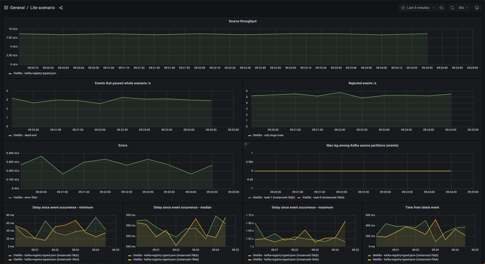

## Prerequisites

### Integration with Apache Kafka

Lite engine in Streaming processing mode uses [kafka-clients](https://docs.confluent.io/platform/current/clients/index.html) to read from and
write to Kafka. In most cases the default configuration options apply. The most important of them are:

- `partition.assignment.strategy` - `[RangeAssignor, CooperativeStickyAssignor]`

However, a few are set differently:

- `enable.auto.commit` - `false`
- `isolation.level` - `READ_COMMITTED`

:::caution

If you want to read events from output topics in transactional manner your Kafka client needs to set `isolation.level`
to `READ_COMMITED`, by default Kafka sets `READ_UNCOMMITED` option - more details
in [Kafka documentation](https://kafka.apache.org/33/documentation.html).

:::

## Nussknacker and K8s cluster

### Runtime container

Nussknacker scenario is deployed as
a K8s [deployment](https://kubernetes.io/docs/concepts/workloads/controllers/deployment/).
By default, it creates [nussknacker-lite-runtime-app](https://hub.docker.com/r/touk/nussknacker-lite-runtime-app)
runtime container with scenario's JSON representation passed as config map.
Runtime container executes an infinite loop responsible for polling events from Kafka topic.

### Startup probes

Nussknacker configures HTTP readiness and liveness healtcheck probes for runtime container.

Readiness probe is used at first and has and impact for container being treated as ready.
It's configuration should include e.g how many partition Kafka topic has, what kind of metric provider is used
By default, is checks if container is ready every second for 60 times.

| Probe          | Type             | Default value |
|----------------|------------------|---------------|
| readinessProbe | periodSeconds    | 1s            |
| readinessProbe | failureThreshold | 60 times      |
| livenessProbe  | periodSeconds    | 3s            |
| livenessProbe  | failureThreshold | 10 times      |

### Parallelism

Tuning parallelism one can impact how many independent consumers are reading from Kafka topic.

It's worth noticing that in general number of replicas count should not exceed number of Kafka partitions because in
such a case exceeding replica will stay idle due to Kafka assignment strategies.

### Deployment strategy

#### Streaming

Nu uses `Recreate` deployment strategy together with `READ_COMMITED` `isolation.level` property to ensure transactional
manner of processing events and to avoid
situation in which different deployments both reads events from the same topic.

#### Request-Response

For this processing mode we use `RollingUpdate` deployment strategy to ensure HA.

### Failure recovery

In case of an unexpected errors e.g. network issue between Kafka cluster and runtime Nussknacker will try to reconnect
after `waitAfterFailureDelay`

### Other

Other values different to K8s defaults

- `minReadySeconds` - 10 - specifies the minimum number of seconds for which a newly created Pod should be ready without
  any of its containers crashing, for it to be considered available
- `progressDeadlineSeconds` - 600 - specifies the number of seconds you want to wait for your Deployment to progress
  before the system reports back that the Deployment has failed progressing

## Scenarios - monitoring and troubleshooting

Each scenario has its own performance characteristics and considerations. This section describes common ways to monitor
the health of a running scenario and how to handle common problems. Most of the sections are aimed not only at
operations people but also at (especially advanced) editors of Nussknacker scenarios.

### Metrics

Each K8s pod representing runtime container is visible in metrics tab as separate instanceId.

### Logging level

Runtime container logging level can be specified by setting env variable

- `NUSSKNACKER_LOG_LEVEL` - logging level of console STDOUT appender

If you need more fine-grained control over logging in specific scenario deployment you can modify `logback.xml` config
file which is being used by it, by overriding config map linked to your runtime container under `logback.xml` key.
Please be aware, that modifications made to this config map are transient - every (re)deploy of scenario, creates config
map from scratch with default (or configured in DeploymentManager -
see [docs](../configuration/ScenarioDeploymentConfiguration.md#configuring-runtime-logging) ) content.

### Managing lifecycle of scenario

State of the scenario can be viewed in the scenario list, in the scenario details view or via API. Possible states can
be grouped in the following categories:

* Not running
    * _NotDeployed_ (initial status before first deploy)
    * _Canceled_
* Running without problems
    * _Running_ - all replicas passed readiness probe and Kafka clients connected to partitions
    * _Restarting_ - (after an unexpected exception)
* Temporary states
    * _DuringDeploy_ - some replicas not spawned or still connecting to Kafka partitions
* Problem
    * _Failed_ - the scenario ended with an error
    * _Unknown_ should not happen, check the logs and consult Nussknacker team
