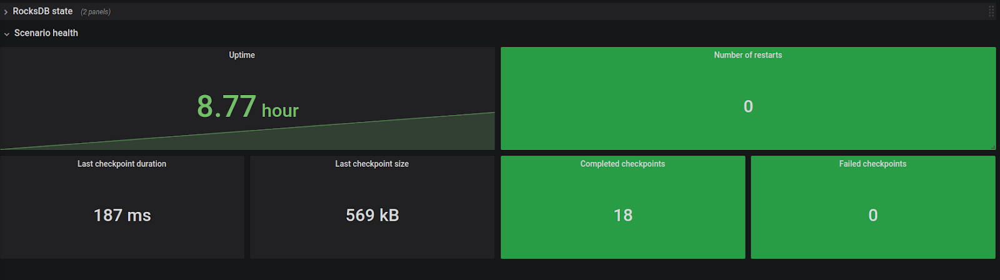

## Intended audience

This manual is intended mainly for those who are going to support Nussknacker deployments (especially production ones). We assume prior knowledge of Kafka, Flink, InfluxDB.

The parts describing scenario management and tuning should be accessible also for those authoring them with the Nussknacker Designer.


## Prerequisites

To better understand the documentation below one needs to grasp some of the concepts of Flink, metrics, etc. We won’t go into much detail here, only references to worthy resources.

Some of them are external, but it also helps to read about important Nussknacker concepts in [link]...


### Working with Flink state

Being able to handle large state efficiently and correctly is one of the biggest advantages of Flink. While Nussknacker hides much of the complexity from the user, for understanding performance considerations it’s crucial to have basic knowledge of how Flink handles state under the hood. Please refer to Flink documentation:

[https://ci.apache.org/projects/flink/flink-docs-stable/docs/concepts/stateful-stream-processing/](https://ci.apache.org/projects/flink/flink-docs-stable/docs/concepts/stateful-stream-processing/).

Pay special attention to the concept of keys and partitions, as they are vital to correct event processing.


### Handling time in Flink

In order to understand various metrics dealing with the concept of time (e.g. delays), it’s vital to have a basic knowledge of how Flink defines those concepts.

Flink reference documentation is a good starting point:

[https://ci.apache.org/projects/flink/flink-docs-release-1.13/docs/concepts/time/](https://ci.apache.org/projects/flink/flink-docs-release-1.13/docs/concepts/time/)

Pay special attention to the concept of event time and watermarks, see also [link] to understand how Nussknacker deals with them.


### Integration with Apache Kafka

The usual way to ingest and produce events in Nussknacker is via integration with Kafka. To understand and monitor the performance of the Kafka sources it’s important to know how it works. A good explanation is available at Confluent site:

[https://docs.confluent.io/platform/current/kafka/design.html#the-consumer](https://docs.confluent.io/platform/current/kafka/design.html#the-consumer)

There is also important information in the documentation of Flink Kafka connector (which is used internally by all Nussknacker Kafka sources and sinks): [https://ci.apache.org/projects/flink/flink-docs-release-1.13/docs/connectors/datastream/kafka/#kafka-consumers-and-fault-tolerance](https://ci.apache.org/projects/flink/flink-docs-release-1.13/docs/connectors/datastream/kafka/#kafka-consumers-and-fault-tolerance).

In particular, one must not forget that the Flink connector (when checkpoints are enabled):


* Commits offsets to Kafka only during checkpoint - so offsets returned by Kafka almost always will not be correct .
* Ignores offsets in Kafka when it’s started with the checkpointed state - topic offsets are also saved in the checkpointed state.


### Metrics architecture

In the documentation we assume standard metrics setup (available in docker-compose and Helm chart):


* InfluxDB to store and query data
* Grafana to visualize metrics
* Flink InfluxDB reporter with Telegraf relay to deliver metrics to InfluxDB

It’s good to have an understanding of core InfluxDB concepts, such as tag or data series:

[https://docs.influxdata.com/influxdb/v1.8/concepts/key_concepts/](https://docs.influxdata.com/influxdb/v1.8/concepts/key_concepts/)


It’s possible to configure Nussknacker installation to use other metrics setup (e.g. using Prometheus), but then you’re on your own to figure out the details - using Flink metrics reporter documentation it shouldn’t be too hard.


## Nussknacker and Flink cluster


### Common Flink configuration issues

Nussknacker assumes that the Flink Session Cluster is used.

It usually happens (especially for large deployments) that the Flink cluster used with Nusssknacker has quite a lot of jobs (each representing one scenario), many of them are quite small in terms of needed resources - this is different to usual Flink setup, where a cluster has one or few jobs.

Below we give a few tips on how to configure your cluster. Some of the configuration options are given as an example in our demo config, but you always should adjust them to the parameters of your machines and to typical workloads.


#### Memory parameters

Flink memory configuration is pretty complex, [https://ci.apache.org/projects/flink/flink-docs-master/docs/deployment/memory/mem_setup/](https://ci.apache.org/projects/flink/flink-docs-master/docs/deployment/memory/mem_setup/) - please see the official documentation for the details. Nussknacker-specific settings:


* Metaspace size should be fairly large both on jobmanagers and taskmanagers - for typical deployments with around 20-30 scenarios value around 1GB should be enough.
* Heap size on jobmanagers should also be larger than typical Flink deployment


#### Configuration of RocksDB

Detailed documentation on the configuration of RocksDB can be found in:


* [https://ci.apache.org/projects/flink/flink-docs-stable/docs/ops/state/state_backends/](https://ci.apache.org/projects/flink/flink-docs-stable/docs/ops/state/state_backends/)
* [https://flink.apache.org/2021/01/18/rocksdb.html](https://flink.apache.org/2021/01/18/rocksdb.html)

For Nussknacker there are additional tips/things to consider:


* `state.backend.rocksdb.memory.managed: false` - in some deployments we’ve found that large number of jobs cause some problems with automatic memory management
* `state.backend.rocksdb.writebuffer.size - `consider increasing if you have many write-heavy aggregations


#### Other


* classloader.resolve-order: parent-first - Nussknacker has some problems with child-first classloading
* cluster.evenly-spread-out-slots: true - this setting is important, because with many jobs deployed on cluster it may happen that nodes (taskmanagers) will be unevenly loaded, which can lead to performance degradation. If this happens, sometimes the easiest solution is to restart jobmanager, so that all the jobs will be partitioned again (this usually happens after restarts of some of the taskmanagers).
* `akka.framesize` - consider increasing the value if you experience frequent timeouts on deployment


### Monitoring - metrics


#### Flink cluster

Flink provides various metrics on its health and performance, see:

[https://ci.apache.org/projects/flink/flink-docs-stable/docs/ops/metrics/#system-metrics](https://ci.apache.org/projects/flink/flink-docs-stable/docs/ops/metrics/#system-metrics)

Flink blog post: [https://flink.apache.org/news/2019/02/25/monitoring-best-practices.html](https://flink.apache.org/news/2019/02/25/monitoring-best-practices.html) is also a valuable reference.

Default Nussknacker setup uses InfluxDB + Telegraf, but you can also easily access metrics on demand using JMX + Jolokia


* VM memory:
  * Heap
  * Metaspace (Jobmanager + Taskmanager)
* VM CPU
* HealthChecks for JM/TM


#### Host monitoring

Don’t forget about monitoring general host metrics (or use the ones provided by your platform)


* Network usage
* Disk usage


#### Kafka cluster

Below we provide some valuable resources on how to monitor the Kafka cluster:


* [https://docs.confluent.io/platform/current/kafka/monitoring.html](https://docs.confluent.io/platform/current/kafka/monitoring.html)


### Upgrading to new versions


##### Upgrading Flink

For patch version changes (e.g. 1.11.1 to 1.11.2) upgrade usually goes without problems - it’s enough to replace Flink with new version with rolling upgrade on cluster.

For major release changes (e.g. 1.11 to 1.12) it’s a bit more involved, the safest way is the following:


* Perform savepoints of all running jobs
* Stop all running jobs
* Upgrade cluster
* Restore all jobs from savepoints

See Nussknacker operations REST API part for REST endpoints [link] for performing savepoints and restoring from them.


##### Upgrading Nussknacker

Since all scenarios are deployed as separate Flink jobs, it's possible to first upgrade Nussknacker Designer and redeploy all scenarios with a new version in the next step.

Please see [Migration Guide](https://github.com/TouK/nussknacker/blob/staging/docs/MigrationGuide.md) before doing the upgrade - especially when using custom extensions.


### Nussknacker operations REST API

Nussknacker provides a few REST endpoints which may be helpful to check if everything is OK - e.g. can be used to implement health checks using standard monitoring tools.

Below we describe endpoints that return general information about the Nussknacker state. Please see Deployment REST API section for endpoints allowing for management of a single scenario.


* /api/app/buildInfo GET - returns basic information about deployed version of Nussknacker
* /api/app/healthCheck GET 200 - use to check if Nussknacker Designer is up
* /api/app/healthCheck/process/deployment GET
  * 200 - if all deployed scenarios are running
  * 500 - basic information about deployed scenarios that are not running (e.g. failed, restarting etc.)
* /api/app/healthCheck/process/validation GET
  * 200 - if all scenarios are valid
  * 500 - list of not-valid scenarios
* /api/app/config GET (requires admin permissions) - serialized configuration of Nussknacker Designer and components (NOTE: configuration returned by this endpoint does not have all [substitutions](https://github.com/lightbend/config/blob/master/HOCON.md#substitutions) resolved, e.g. some some environmental variables will not be returned)
* /api/app/processingtype/reload POST (requires admin permissions) - reload configuration of models. Used mostly if you use custom components which have dynamic configuration (e.g. list of components depend on external registry, like MLFlow or OpenAPI)


### Common problems with Flink cluster


<table>
  <tr>
   <td><strong>Problem</strong>
   </td>
   <td><strong>Possible causes</strong>
   </td>
  </tr>
  <tr>
   <td>Jobmanager / taskmanager keeps restarting with “java.lang.OutOfMemoryError: Metaspace” in logs
   </td>
   <td>Observe metaspace usage metrics. 
<p>
If metaspace grows together with the number of running Flink jobs - adding metaspace may help (see [link] e.g. taskmanager/jobmanager.memory.jvm-metaspace.size) 
</p>
If the metaspace usage grows after redeploymens/restart of one job - it’s probably a classloading leak. Possible root cause can be JDBC driver lib in model classpath (please check [link] how to configure them properly, <a href="https://ci.apache.org/projects/flink/flink-docs-stable/docs/ops/debugging/debugging_classloading/#unloading-of-dynamically-loaded-classes-in-user-code">Flink documentation</a> also provides some references, this error usually has to be resolved by fixing configuration)
   </td>
  </tr>
  <tr>
   <td>Jobmanager does not start, in JobManager logs lines similar to:
<p>
<code>2021-06-29 12:40:19,666 ERROR org.apache.flink.util.FlinkRuntimeException: Could not <strong>recover</strong> job with job id 874e811511becea2e085f57cdb12c1c1.</code>
…
</p>
<code>Caused by: java.io.FileNotFoundException: /<strong>opt</strong>/flink/data/storage/nussknacker/submittedJobGraph7f8076051052 (No such <strong>file</strong> or directory)</code>
   </td>
   <td>In HA config, Flink stores job info both in ZooKeeper and on a filesystem. This error usually means that they are out of sync. Usually it’s necessary to remove nodes in Zookeeper manually (connect to Zookeeper, e.g. run zkClient, check high-availability.zookeeper.path.root config setting to find exact location)
   </td>
  </tr>
</table>


## Scenarios - monitoring and troubleshooting

Each scenario has its own performance characteristics and considerations. This section describes common ways to monitor the health of a running scenario and how to handle common problems. Most of the sections are aimed not only at operations people but also at (especially advanced) editors of Nussknacker scenarios.


### Managing lifecycle of scenario

State of the scenario can be viewed in the scenario list, in the scenario details view or v . Possible states can be grouped in the following categories:


* Not running
  * _NotDeployed _(initial status before first deploy)
  * _Canceled_
  * _Finished _(for finite sources, e.g. batch)
* Running without problems
  * Running
* Temporary states
  * _DuringDeploy_
  * _Restarting -_ (after an unexpected exception, check Flink console for the details)
* Problem
  * _Failed - _the scenario ended with an error, the configured restart strategy prevents from running further
  * _Error - _any of the following (in all cases jobmanager logs should be checked, this situation should be resolved manually):
    * Scenario was deployed, but cannot find job on the Flink cluster
    * Scenario is running on Flink, but in a different version then saved in Nussknacker, probably some deployment error occurred
  * _Warning - _any of the following (in all cases jobmanager logs should be checked, this situation should be resolved manually):
    * The scenario was stopped in Nussknacker, but is still running on Flink
  * _FailedToGet - _cannot obtain the state of the Flink job from the cluster. This usually indicates that connection problems or problems with the cluster
  * _MultipleJobsRunning - _indicates that there are multiple Flink jobs running for one scenario. This should not happen, usually it happens after some deployment problems (restart during deployment, timeouts). This should be resolved manually, by cancelling Flink jobs.
  * _Unknown - _should not happen, check the logs and consult Nussknacker team


#### UI Actions


##### Deployment

Deploy the newest version of the scenario.


* When the scenario is not running, it starts running with a clean state. Reading from Kafka sources starts either from current offsets (if e.g. scenario was running before) or from latest/earliest accessible offset (depending on the **[auto.offset.reset](https://kafka.apache.org/documentation/#consumerconfigs_auto.offset.reset)** setting of Kafka connector in Nussknacker)
* If the scenario is already running, the following steps are taken during deployment:
  * Savepoint of current state is taken
  * (optional) Verification of state compatibility is performed
  * New version of scenario is deployed, using savepoint taken in first step

Things to note:


* If the state is incompatible, or for some reason it’s not possible to create a savepoint or use it, the only way to proceed is to cancel the scenario and start from a clean state.
* Currently it’s not possible to fix state incompatibilities via UI. Experienced users can try to take savepoint, fix it via Flink State API and restore using Nussknacker REST API (see below)


##### Cancel

Stop running scenario. Flink job is canceled, meaning the state is discarded.

This action is available also during some of the ‘Problem’ scenario states - the idea is to allow cleanup after some problematic states.

Please note that Kafka offsets that were committed during the latest checkpoint are not deleted, so after deploying scenario once more, Kafka consumers will start from those offsets.

Currently it’s not possible to stop a scenario while it is saving state (i.e. doing snapshot), it is possible using Nussknacker REST API (see below)


#### Deployment REST API

Endpoints under “admin”


* /api/processManagement/deploy/{processId} POST
* /api/processManagement/cancel/{processId} POST
* /api/adminProcessManagement/snapshot/{processId}?savepointDir={} POST
* /api/adminProcessManagement/stop/{processId}?savepointDir={} POST
* /api/adminProcessManagement/deploy/{processId}/{savepointPath} POST


### Common problems with scenarios

Diagnosing most of the problems below requires access to:


* Flink console
* Flink logs

<table>
  <tr>
   <td>
<strong>Problem</strong>
   </td>
   <td><strong>What to do?</strong>
   </td>
  </tr>
  <tr>
   <td>Scenario is restarting continuously after redeploy
   </td>
   <td>Check jobmanager logs and/or Flink console
   </td>
  </tr>
  <tr>
   <td>Scenario is restarting continuously after first deploy
   </td>
   <td>Check jobmanager logs and/or Flink console
   </td>
  </tr>
  <tr>
   <td>Checkpoints are failing
   </td>
   <td>Check jobmanager logs and/or Flink console
   </td>
  </tr>
  <tr>
   <td>Redeploy of scenario times out
   </td>
   <td>Check jobmanager logs and/or Flink console
   </td>
  </tr>
  <tr>
   <td><code>"State is incompatible, please stop process and start again with clean state" during deploy"</code>
   </td>
   <td>
<ul>

<li>Check if Nussknacker has access to savepoints</li>

<li>Analyze if new state was added - if this is the case probably cancel before deploy is needed (to get rid of incompatible state)
</li>
</ul></td></tr>

</table>


### Nussknacker metrics

One of the crucial aspects of running production streaming processes is monitoring. In this section we'll explain how the Nussknacker scenario running on the Flink cluster gives rise to certain metrics, how to process them and display them in Grafana.

Flink exposes many metrics for each of the jobs, you can read about them in detail [here](https://ci.apache.org/projects/flink/flink-docs-release-1.13/docs/ops/metrics/#system-metrics).


Most of them are quite technical and they do not show data from nodes of the Nussknacker scenario. Nussknacker adds a couple of its own metrics, described in the table below:


[https://github.com/TouK/nussknacker/blob/staging/docs/Metrics.md#common-metrics](https://github.com/TouK/nussknacker/blob/staging/docs/Metrics.md#common-metrics) - tabelka

[https://github.com/TouK/nussknacker/blob/staging/docs/Metrics.md#metrics-in-streaming-flink-mode](https://github.com/TouK/nussknacker/blob/staging/docs/Metrics.md#metrics-in-streaming-flink-mode) - tabelka

Each of these metrics comes with the following tags:


* process
* slot (important for large parallelism)
* host
* nodeId
* env (so that one dashboard can be used by multiple Flink/Nussknacker installations)
* operator_name (used instead of nodeId in Flink internal metrics, important for e.g. RocksDB metrics)

Nussknacker comes with a Grafana dashboard; you can use it or extend/modify according to your needs.


### Monitoring - is my scenario doing well?

The two most important things that should be monitored after deployment of a scenario are:


* Performance - is scenario processing events fast enough?
* Error rates - are there any problems with execution


##### Checking source lag

There are two types of metrics that can give useful information about potential Kafka lags


* How large is lag on Kafka source partitions
* How much time has passed since the last processed event

Please note that:


* Kafka lag is reported with some delay (offsets are not committed immediately). It’s normal to have temporary spikes.
* Large differences between slots in lag may point to data skew or e.g. problematic data for some keys


#### Technical metrics

There are also some more technical metrics that should be looked at. While they are not directly connected to scenario performance or scenario errors, they can point to some problems with either scenario configuration, its performance or problems with the cluster itself.

They are presented in the “Scenario health” row in the scenario dashboard.





Things to watch out for (they are usually a sign of a problem):


* Low uptime metric with a high number of restarts
* Long checkpoint time (e.g. many minutes for checkpoint size lower than many GB)
* A non-zero number of failed checkpoints


### Handling typical scenario errors

When you see errors in monitoring, like on screen below:


it means that there were failures during scenario execution - most often they are caused by errors during SpeL expression evaluation, which couldn’t be detected during validation.

The most common problems are:


* NullPointerException - please see SpEL documentation [link Safe Navigation] to see how to check if some value is null
* Conversion errors - e.g. #NUMBER.toNumber - this usually indicates problem with the source data

To see the exact error you can look at (depending on the configuration of the Exception handler):


* Logs of TaskManager (be sure to check all of them - e.g. using ELK):


```
2021-06-24 07:43:32,071 INFO  pl.touk.nussknacker.engine.spel.SpelExpression               [] - Expression evaluation failed. Original #client.status != "GOLD", ctxId: DetectLargeTransactions-kafka-registry-typed-json-1-3847, message: EL1021E: A problem occurred whilst attempting to access the property 'status': 'Cannot invoke method/property status on null object'

```


* Contents of configured errors topic on Kafka:


```
{
  "processName": "DetectLargeTransactions",
  "nodeId": "only large ones",
  "message": "Expression [20 / (#input.amount % 4) > 0] evaluation failed, message: / by zero",
  "exceptionInput": "20 / (#input.amount % 4) > 0",
  "inputEvent": null,
  "stackTrace": "pl.touk.nussknacker.engine.spel.SpelExpressionEvaluationException:... 34 more",
  "timestamp": 1624863781881,
  "host": "0bda71c51449",
  "additionalData": {}
}
```


### Tuning scenario performance

Nussknacker was created with the goal of being possibly as fast as Flink jobs written with code.

Below we collect various ways of improving scenario performance.


##### The order of filters, state transformations and enrichers

Nussknacker scenario definitions are executed exactly how they were defined - there is no automatic execution optimization (like e.g. in SQL databases) at the moment. Therefore, for workload-heavy scenarios it’s important to put nodes in the correct order.


* Simple filters should go first
* Complex filters, especially containing filtering or mapping should be placed on later stages of scenario (after simple filters)
* Enrichers or aggregations should be deferred to the last possible moment. Sometimes it’s better to duplicate particularly costly enrichment in two branches, if it means that they will be performed less frequently. Pay particular attention to:
  * Aggregations with long windows or large/complex aggregating values
  * Enrichers with long response time (see External services row in scenario dashboard for response time monitoring)


##### Choosing type of state

Nussknacker can be configured to store the state of Flink aggregations either in cluster memory or on disk (with RocksDB). By default, state on disk is configured - so that memory used by Flink does not grow in an uncontrollable manner.

If the scenario requires high throughput and has a small, predictable state (e.g. keyed by some dictionary, not by e.g. number of customers), set “Should spill state to disk” in scenario properties to `false`.


##### Reducing state size

Keep only what’s necessary in the scenario state (e.g. aggregate definitions). Use aggregates of variable size such as List or Set cautiously. If you only need to know the count or unique occurrences, consider using ‘Approximate cardinality’ aggregation - it should be sufficient in most cases.

You can check the size of state in Grafana, in the scenario dashboard (this is the size of data on TaskManagers, not directly related to checkpoint size - see [incremental checkpoint documentation](https://ci.apache.org/projects/flink/flink-docs-master/docs/ops/state/state_backends/#incremental-checkpoints) for details).


##### Tuning RocksDB and checkpoints

For specific scenarios it may be necessary to tune RocksDB global settings. Currently Nussknacker does not allow for setting RocksDB configuration per scenario - you can only configure cluster-wide settings.

If checkpoints are taking a long time, increasing the checkpoint interval setting (in scenario properties) may help - checkpoints will be taken less frequently.


##### Improving serialization performance

Data serialization is one of the most costly operations in the Nussknacker/Flink scenario. It usually occurs in two cases:


* Data is reshuffled between nodes during keyBy operations (e.g. before aggregations)
* Data is serialized to disk during state processing (e.g. aggregations)

Nussknacker needs to know the exact type of processed data during compilation of scenario. Avoid using sources and expressions which do not provide such information.


##### Asynchronous execution

For scenarios with a large number of enrichments the “should use async interpretation” flag (in scenario properties) can be used. It will enable asynchronous execution of large parts of the scenario (using [Flink async I/O](https://ci.apache.org/projects/flink/flink-docs-master/docs/dev/datastream/operators/asyncio/)) which can significantly increase enricher throughput.

It causes some performance degradation of other parts of the scenario, so it’s not enabled by default - the rule of the thumb is to consider it if the total mean response time of external service invocations for one event exceeds average time between events (e.g. latency > 1ms for expected throughput 1000 events/s).


##### Increasing parallelism

Increasing scenario parallelism is often the first method tried by users. However, it should be considered as a last resort. Increased parallelism means more load on the Flink cluster - in terms of memory and CPU, as it means that more parallel tasks will process the events.

What’s more, increasing parallelism above the count of partitions of the Kafka source topic will often not bring expected performance improvements, since each partition can be read by only one thread. There are exceptions to this rule, as state transformers perform repartitioning by key, which can distribute data between more partitions.


## Production readiness  checklist


##### Flink configuration


* Make sure the Flink cluster is configured with appropriate HA services: [https://ci.apache.org/projects/flink/flink-docs-stable/docs/deployment/ha/overview/](https://ci.apache.org/projects/flink/flink-docs-stable/docs/deployment/ha/overview/)
* Configure state backend (especially RocksDB) - you can use the demo [link] as a good starting point. Make sure savepoint/checkpoints locations are accessible from all jobmanagers, taskmanagers and from Nussknacker itself


##### Nussknacker configuration


* Make sure to configure RocksDB properly (e.g. checkpointDir)
* Configure restart strategy and error handler
  * By default scenarios are not restarted, so that errors do not go unnoticed
  * Kafka exception handler should be used in production - configure error topic, with long enough retention
* Check if Nussknacker has access to all needed services:
  * Flink REST API
  * Savepoints location
  * Schema registry - to detect data types
  * Kafka cluster - to be able to generate test data
  * InfluxDB - to have access to counts data
* Test correctness of the configuration
  * Perform  a few test scenario deployments, try  also redeployment to check if savepoints are accessible
  * Generate test data from some Kafka topic
  * Check if counts can be accessed
  * See if metrics links are working properly


##### Backups, data retention


* Flink Savepoints/checkpoints path should have some retention mechanism configured (e.g. S3 has some retention configuration options) - savepoints are not deleted automatically, while checkpoints are not deleted in case of e.g. jobmanager failures
* Logs retention
* Nussknacker stores following data on filesystem (in /opt/nussknacker/storage for default docker configuration) - make sure to configure appropriate backups/persistent volumes
  * Configured location of scenario attachments
  * Database files if using HSQL
* Make sure to configure proper backups/retention (please consult relevant tools documentation for information on how to back up) for
  * ZooKeeper
  * Kafka
  * InfluxDB
  * Grafana


##### Setup metrics/alerting


* Prepare dashboards/alerts for monitoring cluster health, according to your needs.
* Setup healthchecks, based on Nussknacker API
