# Aggregates in time windows

**(Flink engine only)**

## Concepts

Computations in different forms of time windows are the very essence of stream processing. Results of functions applied to all events which fall into the particular time window can bring valuable insights in fraud detection, IoT events, clickstream analysis, etc. A good introduction to aggregating events in streams can be found in this [article](https://ci.apache.org/projects/flink/flink-docs-master/docs/concepts/time/#windowing).

Nussknacker implements 3 types of time windows - tumbling, sliding and session windows. Our implementation of the sliding window is different from the way the sliding window is defined in Flink - so watch out for the differences. 

Regardless of the window type used, events are grouped into windows based on the event time. Therefore, it is important to understand where Nussknacker takes information about event time from, can event time info be accessed from SpEL and so on - you can find more info [here](../scenarios_authoring/DataSourcesAndSinks.md#notion-of-time--flink-engine-only).

Finally, understanding watermarks and problems caused by idle sources will clarify why in certain situations aggregate events or results of joins are not generated. A good description of the problem can be found [here](https://medium.com/@ipolyzos_/understanding-watermarks-in-apache-flink-c8793a50fbb8).


## Common behavior

The sliding, tumbling and session window components differ among themselves not only in the way the time window is defined. A second key aspect which differentiates these components is how they `transform' input events into aggregate. This transformation can be either creation of a new (aggregate) event or an enrichment of incoming events with the value of the aggregate.

The **incoming event is enriched** with the value of the aggregate in:
- a sliding-window, regardless of the `emitWhenEventLeft` configuration,
- a tumbling-window with `On each event` emit mode,
- a session-window in the `On each event` emit mode.
Because the events are enriched, the #input variable is available downstream. 

A **new aggregate event** is generated in:
- a tumbling-window in the `After window closes` emit mode,
- a session-window in the `After session ends` emit mode.
In the above cases the events which entered the aggregation node are 'terminated'. Consequently all the variables defined before the node (including `#input` and `#inputMeta`) will not be available downstream. 

Additionally to enriching events entering the aggregation node a new (aggregate) event is generated in:
- a sliding-window in its **non-default** configuration when parameter `emitWhenEventLeft` is set to `true`,

Two additional new variables will always be available 'downstream' of the aggregate node see [common parameters](#common-parameters) for details:
- a variable containing result of the aggregation
- `#key` variable

## Data used in the following examples

Our imaginary banking application emits several events per each transaction. The data stream contains the following events:

```json
{"subscriberId":1,"transactionId":11,"operation":"RECHARGE","amount":"500.00"}
{"subscriberId":2,"transactionId":12,"operation":"RECHARGE","amount":"200.00"}
{"subscriberId":1,"transactionId":13,"operation":"TRANSFER","amount":"5000.00"}
{"subscriberId":1,"transactionId":14,"operation":"TRANSFER","amount":"1000.00"}
```

Let’s assume that all the above events qualify to the time windows discussed below.


## Common parameters

Majority of parameters are shared among all the three window types implemented in Nussknacker. Parameters which are unique to a particular window type are described in the section specific for particular window type further down on this page.

Parameters taken by the nodes used to configure aggregates in time windows are easiest explained by the analogy to the SQL statement with a GROUP BY clause and an aggregating function:

```sql
SELECT AGGREGATOR_FUNCTION(COLUMN_A)
FROM TABLE T
GROUP BY COLUMN_B, COLUMN_C
```

The WHERE and HAVING clauses were omitted from the above statement as they have to be implemented separately using the Nussknacker Filter component.

Let’s map the above statement on the parameters of the Nussknacker Aggregate components:

**aggregator** - this is the AGGREGATOR_FUNCTION from the SQL statement. There are the following aggregate functions available in Nussknacker:

* First - returns first value which entered the window
* Last - returns the last value which entered the window
* Min - returns minimal value
* Max - computes maximal value
* Sum - computes sum of values
* List - returns list of inputs received by the aggregator; see aggregateBy to understand what is meant by inputs
* Set - the result is a set of inputs received by the aggregator. Can be very ineffective for large sets, try to use ApproximateSetCardinality in this case
* CountWhen - accepts boolean values, returns how many of them are true
* Average - computes average of values
* StddevPop - computes population standard deviation
* StddevSamp - computes sample standard deviation
* VarPop - computes population variance
* VarSamp - computes sample variance
* Median - computes median
* ApproximateSetCardinality - computes approximate cardinality of a set using [HyperLogLog](https://en.wikipedia.org/wiki/HyperLogLog) algorithm. Please note that this aggregator treats null as a unique value. If this is undesirable and the set passed to ApproximateSetCardinality aggregator contained null (this can be tested with safe navigation in [SpEL](./Spel.md#safe-navigation)), subtract 1 from the obtained result.

If you need to count events in a window, use the CountWhen aggregate function and aggregate by fixed `true` expression - see the table with examples below. Subsequent sections use the Count function on the diagrams as an example for the **aggregator** - it is the easiest function to use in the examples. Please note, however, that technically, we provide an indirect implementation of this aggregator.

**output** - name of the variable which will hold the result of the aggregator.

**groupBy** - equivalent of the GROUP BY in SQL; a result of the aggregator will be computed for each distinct groupBy value found by Nussknacker in the time window. Whenever an event with aggregate is emitted, the `#key` variable will be available containing value of this field.
The result of the `groupBy` expression must be of type String.

**aggregateBy** - this is an input to the aggregator; for each event  with the same groupBy value which qualifies to the time window, the aggregateBy expression will be evaluated, fed to the aggregator and the aggregate will be updated.

| groupBy               | aggregateBy                                          | aggregator | result*                                                                                                                                                          | #key                    |
|-----------------------|------------------------------------------------------|------------|------------------------------------------------------------------------------------------------------------------------------------------------------------------|-------------------------|
| `#input.subscriberId` | `#input.value`                                       | Sum        | <p>6000.0  </p> 200.0                                                                                               | <p> '1' </p> '2'|
| `#input.subscriberId` | `true`                                               | CountWhen  | <p>3 </p> 1                                     |  <p> '1' </p> '2'                                                                  | |
| `#input.subscriberId` | `{“tid”: #input.transactionId, “val”: #input.value}` | List       | <p>{{“tid”:11, “val”: 500.0},{“tid”:13, “val”: 5000.0},{“tid”:14, “val”: 1000.0}} </p> {{“tid”:12, “val”: 2000.0}} |  <p> '1' </p> '2'|
| `#input.subscriberId +'-'+ #input.operation` | `#input.value` | Max | <p> 500  </p> <p> 5000  </p> <p> 200  </p> | <p> '1-RECHARGE' </p> <p>  '1-TRANSFER' </p> <p> '2-RECHARGE' </p> 

*result is held in the variable configured in the `output` field.

## Tumbling-window

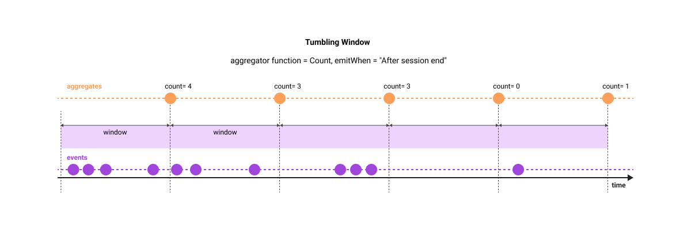


Parameters specific to the Tumbling-window:

**windowLength** - length of the tumbling window

**emitWhen** - determines when the event with the result of the aggregation will be emitted.

Possible values are:
- On each event
- After window closes
- After window closes, also when no event for key - we produce extra zero aggregate for each key when no data arrived

:::caution

Please bear in mind that late events (according to your watermark strategy) are dropped by this aggregate.

:::

In the example below, a sum of field `#input.transfer` will be computed  in the 7 day window separately for every subscriber (for every distinct value of subscriberId) and an event will be emitted after the 7 day window closes.

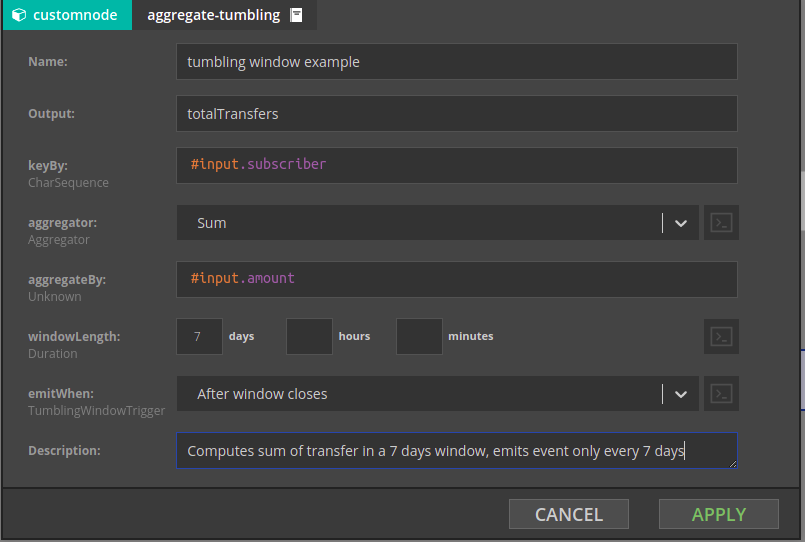

### Offset
Tumbling windows are aligned according to UTC time by default. It is possible to configure offset to change that, but please be aware that it is global configuration. For more details please see [docs](../configuration/model/Flink.md#configuring-offset-for-tumbling-aggregate-time-windows)

## Sliding-window

The sliding-window 'slides' the aggregation window over the events and emits an aggregate whenever a new event arrives ("enters the window"). This is different from the tumbling-window, where new window starts regardless of whether event arrived or not. 

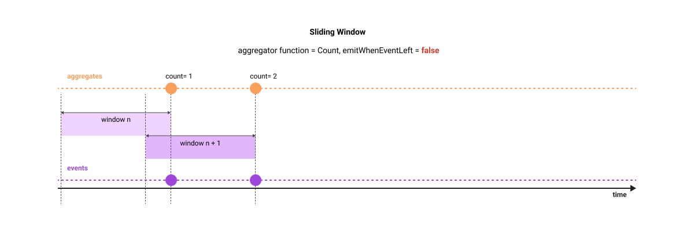

If you set `emitWhenEventLeft` window property to `true`, an additional aggregate event will be generated at the moment when the event which was 'seen' some time ago will no longer be in the currently active window (it *left* the window in other words). In this configuration, the computed aggregate is an equivalent of a function over a moving window which we commonly apply to time series events - like moving average or moving sum. 

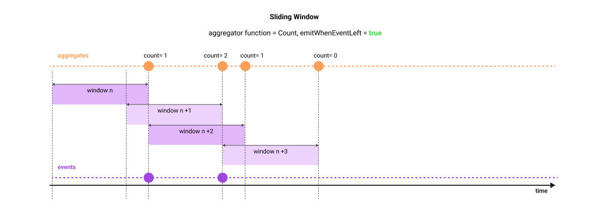

Let's use the following example in case the above explanation is not clear. Imagine that you stand on the flyover over a motorway tasked with counting Porsches in 1 hour sliding window - you are asked to give a separate aggregate for each Porsche color. For simplicity, we will focus only on red Porsches and assume that throughout the whole day only two red Porsches passed our observation point - at 9.25am and at 9.45am. The following table shows aggregates emitted by the sliding-window in each configuration option.

| Time when aggregate is emitted | Count (emitWhenEventLeft is `false`) | Count (emitWhenEventLeft is `true`) |
|--------------------------------|--------------------------------------|-------------------------------------|
| 9.25am                         | 1                                    | 1                                   |
| 9.45am                         | 2                                    | 2                                   |
| 10.25am                        | N/A                                  | 1                                   |
| 10.45am                        | N/A                                  | 0                                   |
&nbsp


## Session-window

Session-window does not have a predefined length. As the name suggests, it is used to compute aggregates for 'sessions' - a set of time related events, which may have or may have not an event signalling an end of a session. In a first case, an event signalling an end of the session is used to close the window. In the latter case, a session ends after the specified amount of inactivity time passes from the last event. 

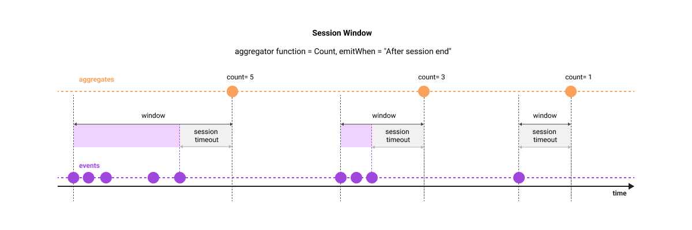

Parameters specific to the session-window:

**endSessionCondition** - the session-window can close not only on timeout; it will also close when the expression entered in this field will evaluate to true. Set it to `false` if the only way to close the window is through session timeout.

**sessionTimeout**- session-window will close after this time since the last event.

**emitWhen** - determines when the event with the result of the aggregation will be emitted.

Possible values are:
- `On each event` - Window won't be emitted on session end, but after each event. This would be useful e.g. when we want to know values of aggregations while session is in progress, but we're not interested in specific event ending the session.
- `After session end`

## A bit more complex aggregation example

In all examples above there was only one field which was passed to the aggregator function. What if one needs to pass multiple fields to different aggregator functions? The example below shows the configuration in such a case.

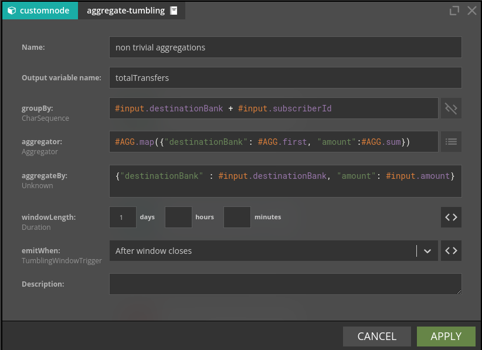

There are two fields `destinationBank` and `amount` passed to the respective aggregator functions. Note use of the #AGG helper in the definition of the aggregations. The aggregated values will be available as `#totalTransfers.destinationBank` and `#totalTransfers.amount`.

A frequent requirement is to access a field from the groupBy clause downstream the aggregation node. Let's imagine that we need the value of the `subscriberId` for the emitted aggregate. One could extract `subscriberId` using the `#key` variable by applying a set of string manipulation functions. While this is doable even in complex cases (variable string lengths for each of the fields forming the composite groupBy expression) there is an easier way shown below:

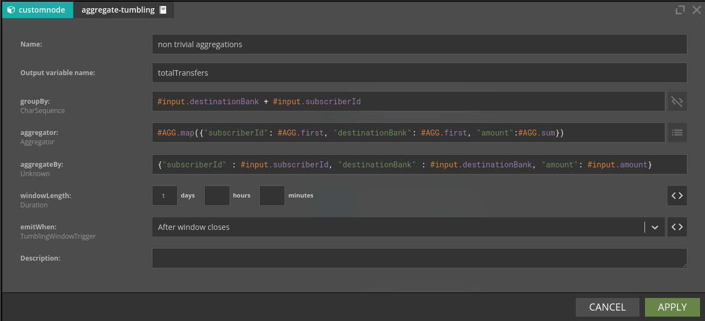

The `subscriberId` will be available in a `#totalTransfers.subscriberId` variable.

## Single-side-join

Single-side-join component is conceptually similar to components computing aggregates in time windows, so it is convenient to discuss it here. Conceptually Single-side-join is an equivalent of the [left (or right) join](https://www.w3schools.com/sql/sql_join.asp) . In SQL case, the left join returns all records from the left table, and the matched records from the right table. In Nussknacker's case the Single-side-join will join two ‘branches’ of a scenario - the Main branch and the Joined branch and will **return exactly as many events as there were in the Main branch**. Even if no events will be matched in the Joined branch, an event will be emitted, with the value corresponding to the aggregator selected - null for List and Set, 0 for Sum, null for Min and Max. **The time window boundaries will be determined by the event coming from the main branch** and will be in the range of \[main-branch-event-event-time, main-branch-event-event-time + windowLength\].

Under the hood single-side-join uses sliding-window on the JOINED branch to deliver events to the MAIN branch. You can choose which aggregate function to use on the JOINED branch; yet `Last` is probably the most natural choice if you want the most recent value seen in the JOINED branch. 

Single-side-join can be an attractive and very fast alternative to database lookup's if you have enough memory to stream your whole lookup table and (if needed) you are able to stream changes of the look up table records. To use single-side-join as a very fast lookup, configure the topic containing the lookup table values as a **JOINED** branch. Make sure that you set window length to value high enough to ensure that there are always events which qualify to the window in the JOINED branch.

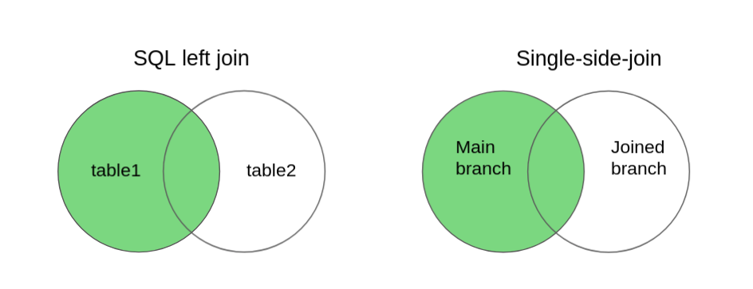


Because there are no tables and table names to refer to, Nussknacker will derive names of the branches to join from the names of nodes taking part in the Single-side-join. Let’s consider an example where there is a topic containing alerts about subscribers; for every alert generated for the subscriber we want to track all events generated by this subscriber in the next 24 hours. The Nussknacker scenario would look like in the picture below.

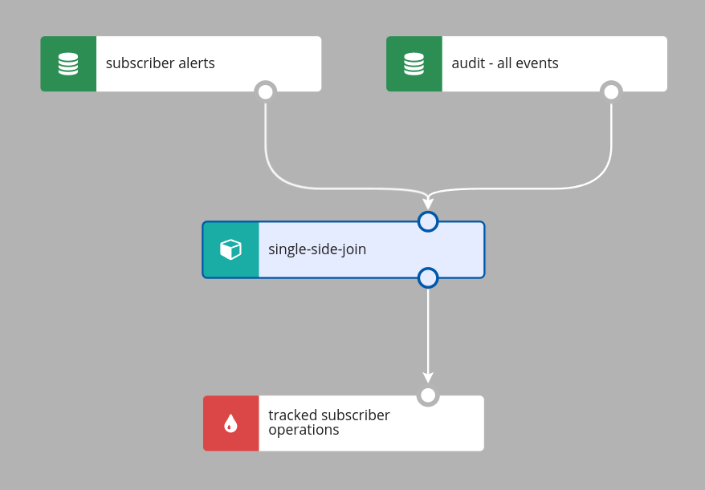


The configuration of the Single-side-join would be as in the picture below; note how Nussknacker Designer helps you to decide which branch is which.


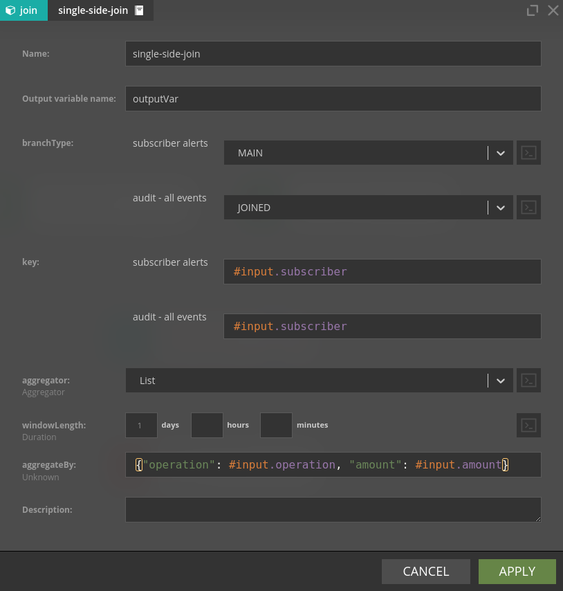

There are couple fine points to make here:

* The time window (of 1 day in our case) will be started upon arrival of the (first) event with the given `#input.subscriber` value.
* The `#input` variable used in the aggregateBy field holds the content of the event “arriving” from the Joined branch. This variable will be available downstream.
* The `#outputVar` will be available downstream of the outer-join aggregate


## Full-outer-join

Full-outer-join is Nussknacker's version of SQLs full outer join. It works much like single-side-join,
but it has aggregates for both branches and emits a new event for every event it receives. Every time
a new event is received, it is matched with events with the same key, then the aggregate for the appropriate
branch is updated, and values of aggregates for both branches are returned. If an event cannot be matched,
then a new event is still emitted, but some aggregates have a value of zero.

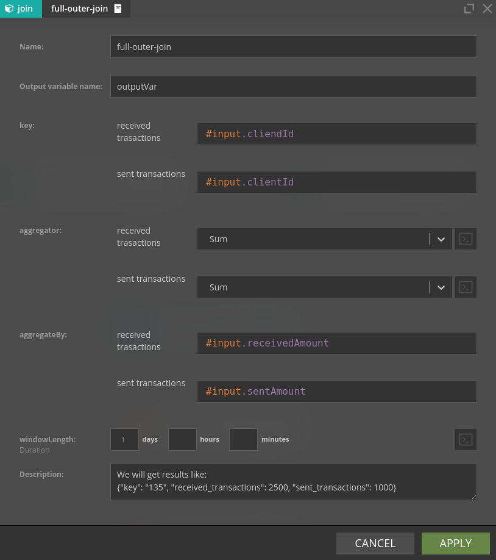

Some additional notes:

* Unlike single-side-join, full-outer-join can have more than two input branches
* The `#input` variable will not be available downstream. Output variable can be used to get the key of the event that entered full-outer-join - see description field in the picture above.
* Names of returned aggregates are generated based on the names of input nodes.

## Some closing fine points

To reduce resources consumption Sliding-window, Session-window and Single-side-join precompute aggregates in slices. [This video](https://www.youtube.com/watch?v=2bVC7sS1HVc) explains the concept of slices; please bear in mind that our implementation is slightly different. There are two implications of using slices:
* The slice length is the compromise between precision and resource requirements; in Nussknacker it is set to 1 minute
* If the event with the aggregate is emitted because a new event arrived to the aggregate node and the window length is set to M minutes, the actual window length will be somewhere in the range of (M-1, M] minutes, depending on when exactly the event arrived.

Short slices cost more - in our case more memory and disk usage by RocksDB whereas longer slices do not give proper insight into what's happening.
In Nussknacker we chose 60 seconds slice length since it's good tradeoff between performance and cost.

| aggregationType | slice length |
|-----------------|--------------|
| sliding         | 60 seconds   |
| session         | 60 seconds   |
| join            | 60 seconds   |
| tumbling        | windowLength |
