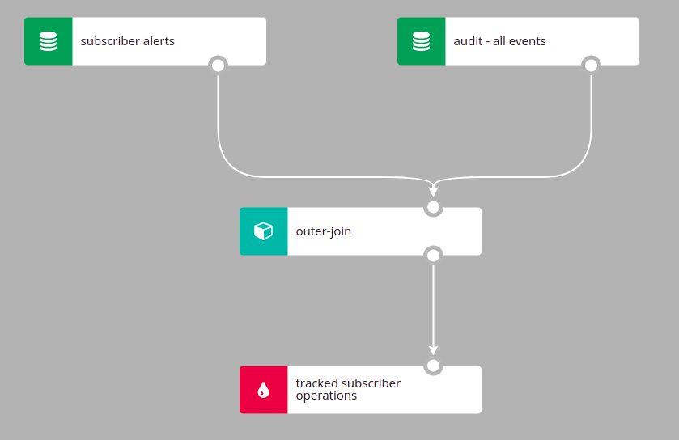
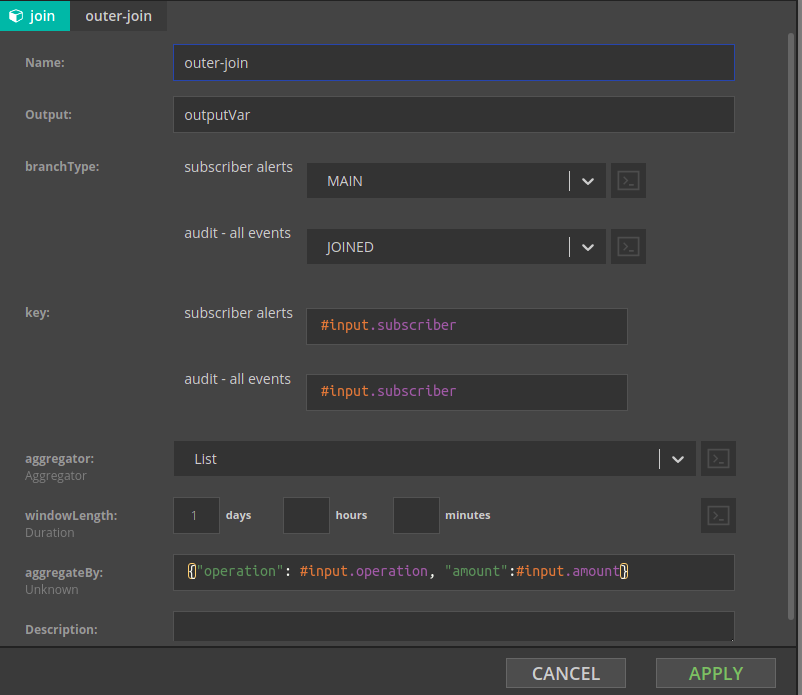

# Aggregates in time windows

## Concepts

Computations in different forms of time windows are the very essence of stream processing. Results of functions applied to all events which fall into the particular time window can bring valuable insights in fraud detection, IoT events, clickstream analysis, etc. A good introduction to aggregating events in streams can be found in this [article](https://ci.apache.org/projects/flink/flink-docs-master/docs/concepts/time/#windowing).

Regardless of the window type used, events are grouped into windows based on the event time. Therefore, it is important to understand where Nussknacker takes information about event time from, can event time info be accessed from SpEL and so on - you can find this info in [Introduction page](Intro#notion-of-time). 

Nussknacker implements 3 types of time windows - tumbling, sliding and session windows. Our implementation of the sliding window is different from the way the sliding window is defined in Flink - so bare in mind the differences. This [blog post](https://dev.to/frosnerd/window-functions-in-stream-analytics-1m6c)) has a nice explanation and visualization of time windows; the sliding window described in this blog post is close to our implementation of the sliding window.

While explaining how to use Nussknacker components performing computations in time windows, we will focus on Nussknacker features rather than explanation of differences between windows types.

## Data used in the following examples

Our imaginary banking application emits several events per each transaction. The data stream contains the following events:

`{"subscriberId":1,"transactionId":11,"operation":"RECHARGE","amount":"500.00"}`
`{"subscriberId":2,"transactionId":12,"operation":"RECHARGE","amount":"200.00"}`
`{"subscriberId":1,"transactionId":13,"operation":"TRANSFER","amount":"5000.00"}`
`{"subscriberId":1,"transactionId":14,"operation":"TRANSFER","amount":"1000.00"}`

Let’s assume that all the above events qualify to the time windows discussed below.

## Common parameters

Majority of parameters are shared among all the three window types implemented in Nussknacker. Parameters which are unique to a particular window type are described in the section specific for particular window type further down on this page. 

Parameters taken by the nodes used to configure aggregates in time windows are easiest explained by the analogy to the SQL statement with a GROUP BY clause and an aggregating function: 

SELECT AGGREGATOR_FUNCTION(COLUMN_A)

FROM TABLE T

GROUP BY COLUMN_B, COLUMN_C

The WHERE and HAVING clauses were omitted from the above statement as they have to be implemented separately using the Nussknacker Filter component.  

Let’s map the above statement on the parameters of the Nussknacker Aggregate components:

**aggregator** - this is the AGGREGATOR_FUNCTION from the SQL statement. There are the following aggregate functions available in Nussknacker:

* First - returns first value which entered the window
* Last - returns the last value which entered the window
* Min - returns minimal value
* Max - computes maximal value
* Sum - computes sum of values
* List - returns list of inputs received by the aggregator; see aggregateBy to understand what is meant by inputs
* Set - the result is a set of inputs received by the aggregator. Can be very ineffective for large sets, try to use ApproximateSetCardinality in this case
* ApproximateSetCardinality - computes approximate cardinality of set using [HyperLogLog](https://en.wikipedia.org/wiki/HyperLogLog) algorithm.

**output** - name of the variable which will hold the result of the aggregator.

**keyBy** - equivalent of the GROUP BY in SQL; a result of the aggregator will be computed for each distinct keyBy value found by Nussknacker in the time window. 

**aggregateBy** - this is an input to the aggregator; for each event  with the same keyBy value which qualiffies to the time window, the aggregateBy expression will be evaluated, fed to the aggregator and the aggregate will be updated

| keyBy | aggregateBy  | aggregator | result*  |
|-------|--------------|------------|----------------------------------------------------------|
|`#input.subscriberId` |`#input.value`| Sum | 
`6000.0` for subscriberId = 1 
 `200.0` for subscriberId = 2 |
|`#input.subscriberId` |`1L`| Sum | 
`3` for subscriberId = 1 
 `1` for subscriberId = 2 |
|`#input.subscriberId` |`{“tid”: #input.transactionId, “val”: #input.value}`| List |
`{{“tid”:11, “val”: 500.0},{“tid”:13, “val”: 5000.0},{“tid”:14, “val”: 1000.0}}` for subscriberId = 1 
 `{{“tid”:12, “val”: 2000.0}}` for subscriberId = 2 |

\*result is held in the variable configured in the `output` field.

## Tumbling-window

Parameters specific to the Tumbling-window:

**windowLength **- just length of the tumbling window

**emitWhen **- determines when the event with the result of the aggregation will be emitted. 

In the example below, a sum of field `#input.transfer` will be computed  in the 7 day window separately for every subscriber (for every distinct value of subscriberId) and an event will be emitted after the 7 day window closes.

It is important to note that when the tumbling window closes, a new event is generated. Its timestamp is equal to the time of the timer that generated it, not system time of the moment when it happened. In other words the timestammp of the newly generated event which contains the aggregate will continue to use the notion of time used by events which  Tumbling-window saw. As none of the events which entered the Tumbling-window will be passed downstream, the variable containing data of the events which entered Tumbling-window will not be availabe downstream. For example, if these were Kafka events which were an input to the Tumbling-Window, the #input variable will not be available downstream of the Tumbling-window node. 

## Sliding-window

In our implementation of the sliding window the aggregation computation is triggered only when an event enters the window. This means that whenever an avent arrives to the Sliding-window for evaluation, Nussknacker computes the aggregate taking into account all the *preceding* events which qualify into the sliding window. 

Parameters specific to the Sliding window:

**windowLength **- just length of the sliding window

**emitWhenEventLeft **- the aggregate computation can be also triggered when an event leaves the window. This means that the aggregate is computed taking into account all the *subsequent* events which qualify into the sliding window. 

## Session-window

Parameters specific to the session window:

**endSessionCondition **- the session window  can close not only on timeout; it will also close when the expression entered in this field will evaluate to true. Set it to `false` if the only way to close the window is through session timeout.

**sessionTimeout **- session window will close after this time from the last event 

**emitWhen** - determines when the event with the result of the aggregation will be emitted. 

## One-side-join

> We have decided to change some terms we use to refer to concepts or parts of Nussknacker. One of the changes we made is to change the name of the Outer-join component to One-side-join. Because the Nussknacker Designer GUI has not been updated yet, the old name of the component is shown on the picture. Once we refactor Nussknacker Designer, we will update this page accordingly.

One-side-join component is conceptually similar to components computing aggregates in time windows, so it is convenient to discuss it here. Conceptually One-side-join is an equivalent of the [left (or right) join](https://www.w3schools.com/sql/sql_join.asp) . In SQL case, the left join returns all records from the left table, and the matched records from the right table. In Nussknacker's case the One-side-join will join two ‘branches’ of a scenario - the Main branch and the Joined branch and will **return exactly as many events as there were in the Main branch**. Even if no events will be matched in the Joined branch, an event will be emitted, with the value corresponding to the aggregator selected - null for List and Set, 0 for Sum, null for Min and Max. **The time window boundaries will be determined by the event coming from the main branch** and will be in the range of \[main-branch-event-event-time, main-branch-event-event-time + windowLength\].

Because there are no tables and table names to refer to, Nussknacker will derive names of the branches to join from the names of nodes taking part in the One-join. Let’s consider an example where there is a topic containing alerts about subscribers; for every alert generated for the subscriber we want to track all events generated by this subscriber in the next 24 hours. The Nussknacker scenario would look like in the picture below. 

The configuration of the One-sde-join would be as in the picture below; note how Nussknacker Designer helps you to decide which branch is which.

There are couple fine points to make here:

* The time window (of 1 day in our case) will be started upon arrival of the (first) event with the given `#input.subscriber` value.
* The `#input` variable used in the aggregateBy field holds the content of the event “arriving” from the Joined branch.