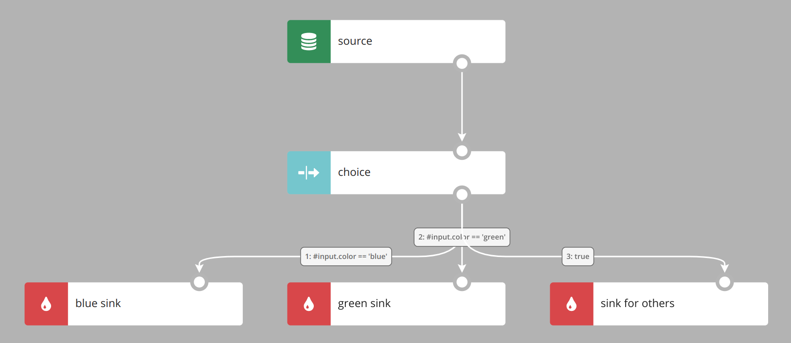
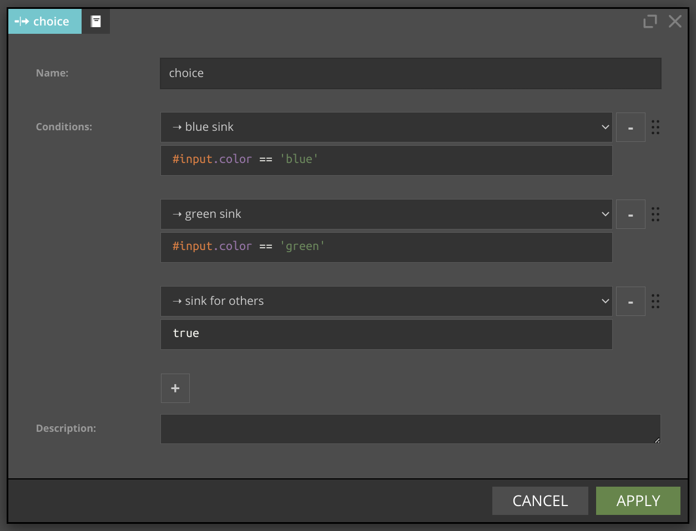
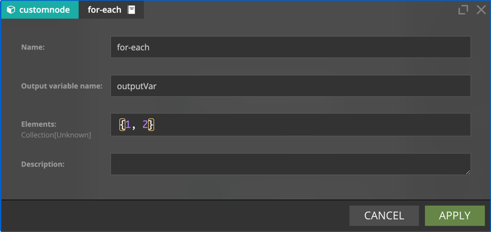

# Basic Components

Nodes work with a data records. They can produce, fetch, send, collect data or organize data flow. Each node has at least two parameters: `Name` and `Description`. Name has to be unique in a scenario. Description is a narrative of your choice.  

Most of the nodes, with source and sink nodes being notable exceptions, have both input and at least one output flow.

Sinks and filters can be disabled by selecting `Disable` checkbox. 

&nbsp;
## Variable 

A Variable component is used to declare a new variable; in the simplest form a variable declaration looks like in the example  below. As the event was read from the Kafka topic, the `#input` variable stores its content and  its value is assigned to a newly declared `myFirstVariable` variable. 

As you can see in the `variable` configuration form below, Nussknacker inferred the data type of the `#input` variable from the information already available to Nussknacker. 

In the next example `#input` variable is used to create an expression returning a boolean value. If the input Kafka topic contains json objects and they contain `operation` field, the value of this field can be obtained in the following way: 

`#input.operation` 

Note that internally Nussknacker converts JSON’s object into SpEL’s map. 

&nbsp;
## MapVariable 

The specialized `mapVariable` component can be used to declare a map variable (object in JSON)

The same can be achieved using a plain `Variable` component, just make sure to write a valid SpEL expression. 

&nbsp;
## Filter

Filter passes records which satisfy the filtering condition to `true sink`.

You can additionally define `false sink`. Records from the `source` which meet the filter's condition go to the `true sink`, and others go to the `false sink`.

The Expression field should contain the SpEL expression for the filtering conditions and should produce a boolean value.

&nbsp;
## Choice

Choice is more advanced variant of filter component - instead of one filtering condition, you can define multiple conditions in some defined order.
It distributes incoming records among output branches in accordance with the filtering conditions configured for those branches.

Each record from the `source` is tested against the condition defined for outgoing node. If `#input.color` is `blue` record goes to the `blue sink`.  
If `#input.color` is `green` record goes to the `green sink`. For every other value record goes to the `sink for others` because condition `true` is always true.
Order of evaluation of conditions is the same as visible in form. You can modify the order using drag & drop functionality.
Order is also visible on graph in edges description as a number. Be aware that layout button can change displayed order of nodes, but it has no influence on order of evaluation.

&nbsp;
## Split 
 
Split node logically splits processing into two or more parallel branches. Each branch receives all records and processes them independently. 

Every record from the `source` goes to `sink 1` and `sink 2`. Split node doesn't have additional parameters.

&nbsp;
## ForEach

`for-each` transforms the stream so that subsequent nodes are executed once for every value (possibly multiple times).
This node has two parameters:
- Elements - list of values over which to loop. It can contain both fixed values and expressions evaluated during execution.
- Output Variable Name - the name of the variable to which element value will be assigned.

For example, when 
- Elements is `{#input.value1, #input.value2}`
- Output Variable Name is `outputVar`

then nodes that follow `for-each` will be executed twice and the value of current element can be referenced as `#outputVar`. 

&nbsp;
## Union

Union merges multiple branches into one branch. Events from the incoming branches are passed to the output branch without an attempt to combine or match them. 
The #input variable will be no longer available downstream the union node; a new variable will be available instead, which is defined in the union node.

Branch names visible in the node configuration form are derived from node names preceding the union node.

Example:

Entry fields:
- Output Variable Name - the name of the variable containing results of the merge (replacing previously defined variables, in particular #input).
- Output Expression - there is one expression for each of the input branches. When there is an incoming event from a particular input branch, the expression defined for that branch is evaluated and passed to the output branch.

Please note, that the #input variable used in the Output expression field refers to the content of the respective incoming branch.

