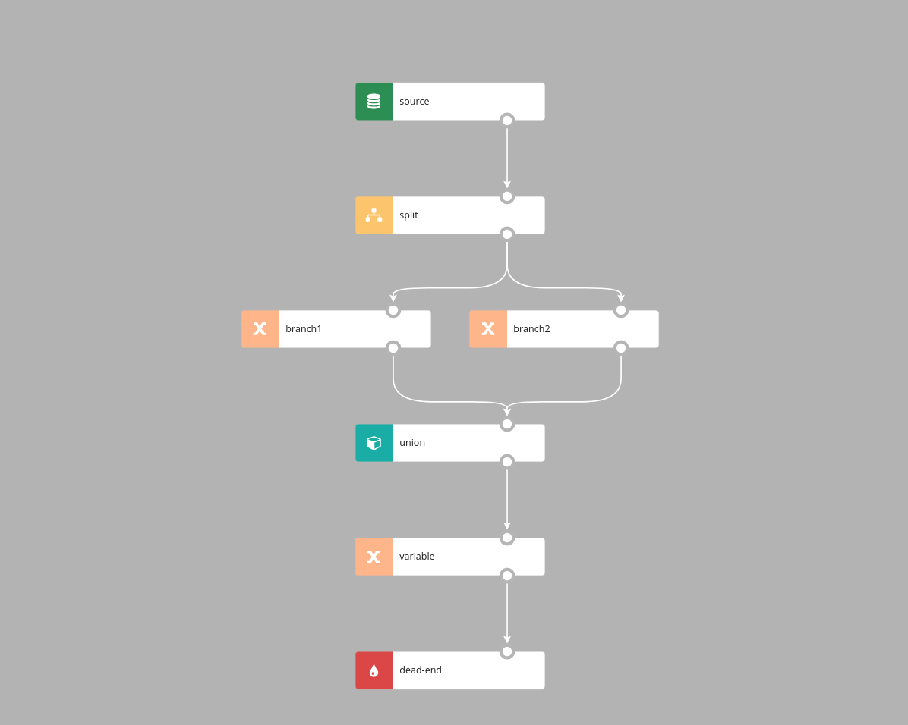

# Basic Nodes

Nodes work with a data stream. They can produce, fetch, send, collect data or organize data flow. Each node has at least two parameters: `Name` and `Description`. Name has to be unique in a scenario. Description is a narrative of your choice.  

Most of the nodes, with source and sink nodes being notable exceptions, have input and at least one output flow.

Sinks and filters can be disabled by selecting `Disable` checkbox. 


## Variable component

A Variable component is used to declare a new variable; in the simplest form a variable declaration looks like in the example  below. As the event was read from the Kafka topic, the `#input` variable stores its content and  its value is assigned to a newly declared `myFirstVariable` variable. 


As you can see in the `variable` configuration form below, Nussknacker inferred the data type of the `#input` variable from the information already available to Nussknacker. 


In the next example `#input` variable is used to create an expression returning a boolean value. If the input Kafka topic contains json objects and they contain `operation` field, the value of this field can be obtained in the following way: 


`#input.operation` 

Note that internally Nussknacker converts JSON’s object into SpEL’s map. 


## mapVariable 

The specialized `mapVariable` component can be used to declare a map variable (object in JSON)


The same can be achieved using a plain `Variable` component, just make sure to write a valid SpEL expression. 


## Filter 
   
Filter passes records which satisfies filtering condition. It can have one or two outputs. 


Records from the `source` which meet filter's condition go to the `true sink`, and others go to the `false sink`. 


Records from the `source` which meets condition go to the `blue sink`, and others are filtered out. 


The Expression field should contain the SpEL expression for the filtering conditiona and should produce a boolean value

## Split 
 
Split node logically splits processing into two or more parallel branches. Each branch receives all records and processes them independently. 


Every record from the `source` gos to `sink 1` and `sink 2`. Split node doesn't have additional parameters.


## Switch
   
Switch distributes incoming records among output branches in accordance with the filtering criteria configured in those branches.
 


Each record form the `source` is tested against condition defined on the edge. If `#color` is `blue` record goes to the `blue sink`.  If `#color` is `green` record goes to the `green sink`. For every other value record goes to the `sink for others`.


The Switch node takes two parameters: `Expression` and `exprVal`. `Expression` contains expression which is evaluated for each record; result is assigned to the variable configured in `exprVal` entry field - `#color` in the example above.
 


Eeach edge outgoing from `Switch` node has a boolean expression attached to it; if the expression evaluates to true the record is allowed to pass through this edge. Record go to the first output with matching condition. *Order of matching outgoing edges is not guaranteed.*


There can be at most one edge of type `Default`, and it gets all records that don't match any `Condition` edge. 


## Union



Union merges multiple branches into one stream. For each incoming branch two parameters are configured:
- key - it's value should be of type `String`, definex how elements from branches will be matched together
- value - this is the output value which will be put the field with name the same as branch id

Union node defines new stream which is union of all branches. In this new stream there is only one variable; it's name is defined by 'Output' parameter; it's value is: 
```$json
{
  "key": `value of key expression for given event`,
  "branch1": `value expression when event comes from branch1, otherwise null`,
  "branch2": `value expression when event comes from branch2, otherwise null`,
  ...
}
```  
Currently branches are identified by id of last node in this branch before union.
   
     
## UnionMemo

Works exactly like Union, but also memoize values for each branches. Memoized state will be cleared when there was no
subsequent events from any branch during `stateTimeout`. Produced object has values from all branches.


## PreviousValue


`previousValue` stores arbitrary value for the given key. This element has two parameters:
- groupBy - expression defining key for which we compute aggregate, e.g. `#input.userId`
- value - stored value

For example, given stream of events which contain users with their current location, when we set 
- groupBy is `#input.userId`
- value is `#input.location`

then the value of output variable is the previous location for current user. If this is the first appearance of this user, **current** location will be returned.


## Delay

Holds event in the node until 
  *event time* + `delay` >= max (*event time* ever seen by the delay node). 

The `key` parameter will be removed in the future release of Nussknacker. For the time being configure it to any data field present in the input; the Kafka topic partitioning key being the best candidate. 