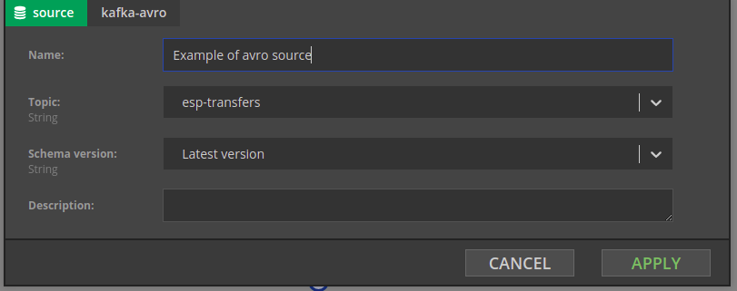
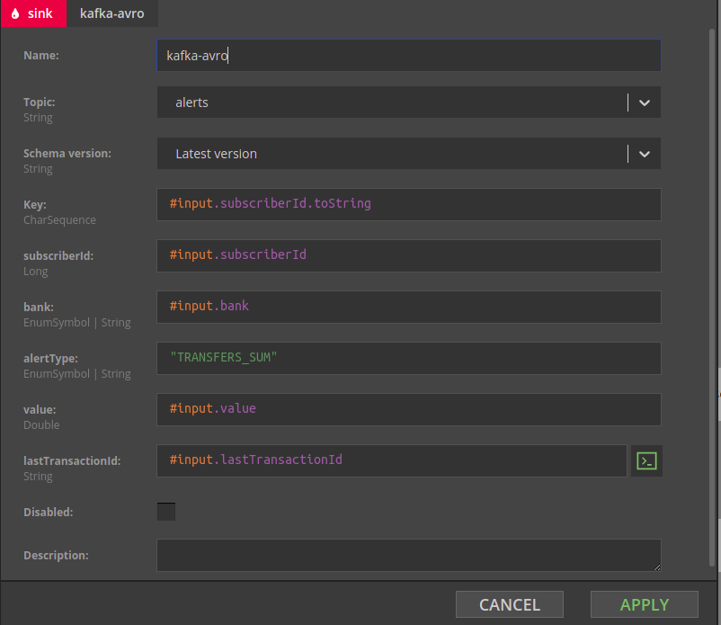
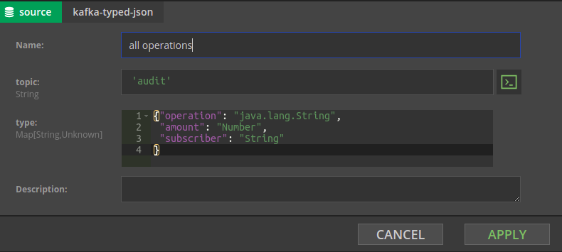

# Data sources and sinks

## Kafka topics as input and output to Nussknacker scenarios


### Prerequisites

* [Role of Schema Registry](/about/TypicalImplementation)
* [Confluent Schema Registry](https://docs.confluent.io/platform/current/schema-registry/index.html)
* [Kafka topic key](https://kafka.apache.org/intro)
* [Flink keyed state](https://ci.apache.org/projects/flink/flink-docs-master/docs/concepts/stateful-stream-processing/#keyed-state)


### Concepts

Kafka topics are native streaming data input to Nussknacker and the native output where results of Nussknacker scenarios processing are placed. In Nussknacker terminology input topics are called _sources_, output topics are called _sinks_. This section discusses Kafka based  source and sink components. There are a couple different types of source and sinks components available in Nussknacker, the main difference is in how the information on the data schema is provided to Nussnacker. 

It is not uncommon that  programs that write events to Kafka topics  (“producers”) and programs that read events from Kafka topics (“consumers”) are implemented by different people. If consumers are to understand what producers put into the topic, in one way or another  they need to agree between themselves the data schema - the format and data types of the data transported over Kafka topics. Depending on the method used to share data schema definition, Nussknacker will or will not be able to determine what data is in the event and help (or not) with field names and data type related validation of SpEL expressions. Each method of sharing data schema definitions has related sink and source components in Nussknacker.

Another aspect differentiating source and sink components is data serialization. Data serialization determines how data fields of input JSON objects are physically encoded in the “series of bytes” that are put into the Kafka topic as event data. Two main methods are used:


* Avro serialization
* JSON serialization

Therefore it is important to understand how the data in the incoming Kafka topic are serialized; similarly, how data should be serialized in the result (output) Kafka topic. Serialization is relevant only for source and sink components. 

Below, source and sink components are presented in groups with identical approaches to data typing and serialization. The table summarizing different types of source and sink components is at the end of this page. 


### Schema Registry + Avro serialization

AVRO is a recommended  way to define and share data schema. Data schemas are stored and managed by Confluent Schema Registry; it is [bundled with Nussknacker](/about/TypicalImplementation) in all deployment versions. Schemas can be registered in Schema Registry by means of REST API based CLI or using AKHQ, an open source GUI for Apache Kafka and Confluent Schema Registry. AKHQ is bundled with Nussknacker in all deployment versions. 

There are three source and sink components in this group: 


* Kafka-avro source 
* Kafka-avro sink
* kafka-avro-raw sink 


#### Kafka-avro source

Nussknacker will connect to Schema Registry to get the list of available schemas and will pre-populate the `Topic name `drop down of the kafka-avro component with the list of available topic names. Nussknacker assumes that for the topic `topic-name `a schema `topic-name-value` and optionally `topic-name-key` (for the Kafka topic key) will be defined in the Schema Registry. In the example below this means that `esp-alerts-value` schema should be registered in the Schema Registry. 

As in this case Nussknacker Designer knows what data to expect in the Kafka event, it will hint field names and will perform additional validations on SpEL expressions involving data from the selected topic. 




#### Kafka-avro sink

The kafka-avro sink configuration form will show a list of fields defined in Schema Registry for the given topic. The result of the expression entered in the `Key` field will be used as a partitioning key by Flink. 




The above kafka-avro sink configuration form above was automatically generated by Nussknacker based on the following pair of definitions (subjects) in the Schema Registry.

Subject alerts-value:


```
{
    "type" : "record",
    "namespace" : "user-manual.nussknacker.touk.pl",
    "name" : "alert",
    "fields" : [
      { "name" : "subscriberId", "type" : "long"},
      { "name" : "bank" , "type" : {"type": "enum", "name" : "application", 
        "symbols" : ["MULTIPLE", "BANK_A", "BANK_B", "BANK_C"]}},
      { "name" : "alertType", "type": {"type": "enum", "name" : "event", 
        "symbols" : ["TRANSFERS_SUM", "RECHARGES_SUM", "PIN_FAILURES", "PIN_CHANGES"]}},
      { "name" : "value", "type": "double"},  
      { "name" : "lastTransactionId", "type": "string"}
    ]
 }
```


Subject alerts-key:


```
{
  "type": "record",
  "name": "subscriberKey",
  "namespace": "user-manual.nussknacker.touk.pl",
  "fields": [
    {
      "name": "subscriberId",
      "type": "long"
    }
  ]
}
```

More details on how to create schema definitions can be found on [Avro specification](https://avro.apache.org/docs/current/spec.html) page.

#### Kafka-avro-raw sink

Kafka-avro-raw sink is a (run time) functional equivalent of Kafka-avro sink; instead of the autogenerated list of separate fields it has just one input field for the expression containing value to be written to the Kafka topic.


### Schema Registry + JSON serialization

This group of source and sink components  is very similar to components from the previous group. The only difference is that rather than AVRO, JSON is used as a serialization system. There are three  components in this group:


* Kafka-registry-typed-json source
* Kafka-registry-typed-json sink
* Kafka-registry-typed-json-raw sink


### Manually typed + JSON serialization

There is only one component in this group - Kafka-typed-json source. It is an alternative to Kafka-registry-typed-json source which does not require usage of the Schema Registry. The names of fields and the data types for values need to be declared in the Kafka-typed-json component using - not surprisingly - JSON notation.





All JSON data types are allowed ; `java.lang.String, Number` refer to Java classes responsible for handling the given data type. The `java.lang` prefix is optional. 

Similarly to Kafka-avro source, Nussknacker Designer knows in this case what data to expect in the Kafka events: it will hint field names and will perform additional validations on SpEL expressions involving data from `audit` topic.

The disadvantage of using Kafka-typed-json as a data source is that whenever the `audit` topic will be used in the Kafka-typed-json source, its schema will have to be defined. This works well if there is only one occurrence of an audit topic in all Nussknacker scenarios; it may become difficult to maintain otherwise. 


### No type information + JSON serialization

There is only one component in this group -  Kafka-json sourVRce. The content of the JSON formatted Kafka event does not need to be declared in Nussknacker Designer. The values of the JSON object can still be accessed using the `#input.field-name `notation, however no hints will be available and no validations related to field names and their data types will be performed. 


### Summary and comparison

| Nussknacker source / sink component | Schema description | Data serialization format | Data types supported| Limitations   | Advantages                | 
|-------------------------------------|--------------------|--------------------------|---------------------|----------------|---------------------------|  
| Schema Registry + Avro serialization | Avro in Confluent Schema Registry | Avro |Avro supported | Slightly more involving initially because of Schema Registry| <p> Hints and data type related validations </p> Maintainability  |  
| Schema Registry + JSON serialization| Avro in Confluent Schema Registry|JSON |Avro supported |  Slightly more involving initially because of Schema Registry| <p> Hints and data type related validations </p> Maintainability | 
| Manually typed + JSON serialization  | Declared inside  Kafka-typed-json component | JSON | Common between Java and JSON| <p> May become difficult to maintain </p> No validation of input data at runtime |Hints during authoring |  
| No type information + JSON serialization| none | JSON | Common between Java and JSON | No hints and data type related validations | Good for JSON objects whose structure is not known at design time |  

 

