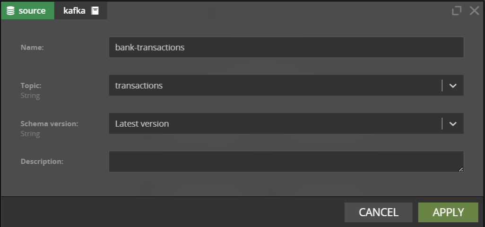
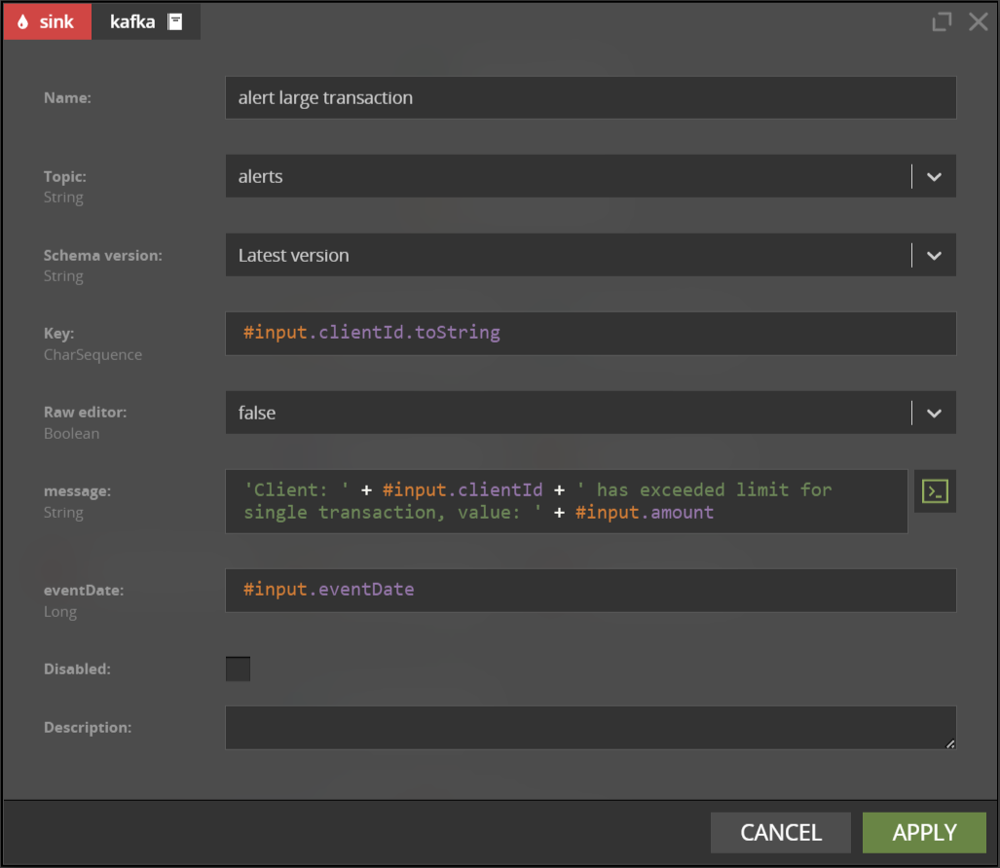
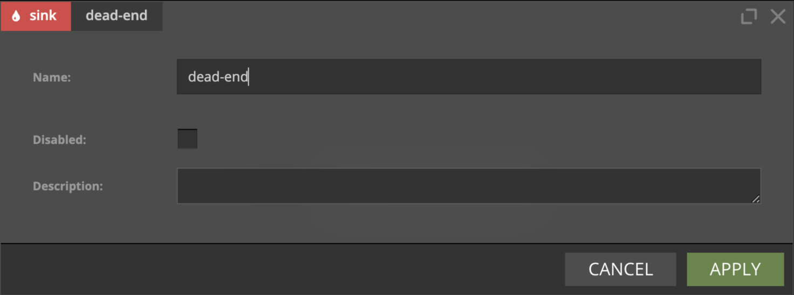
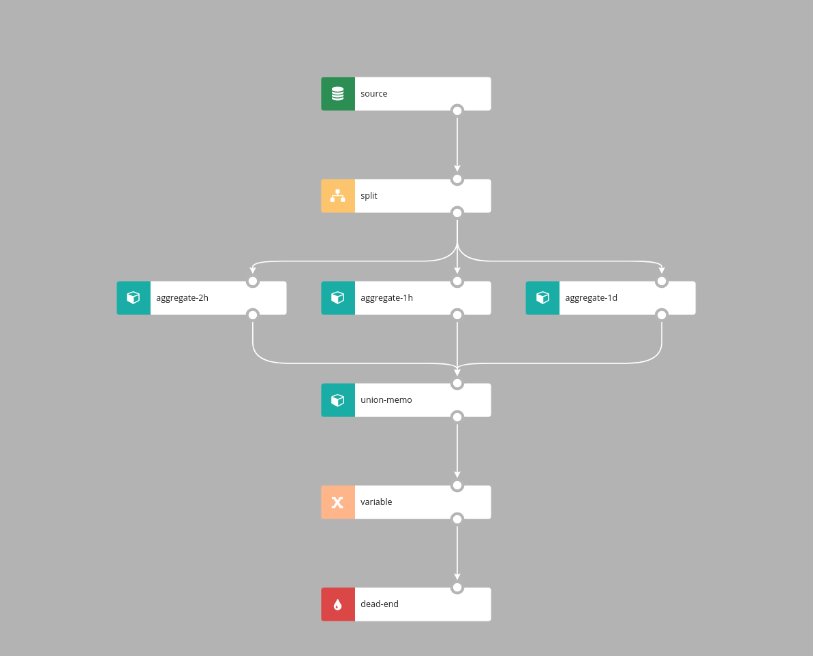
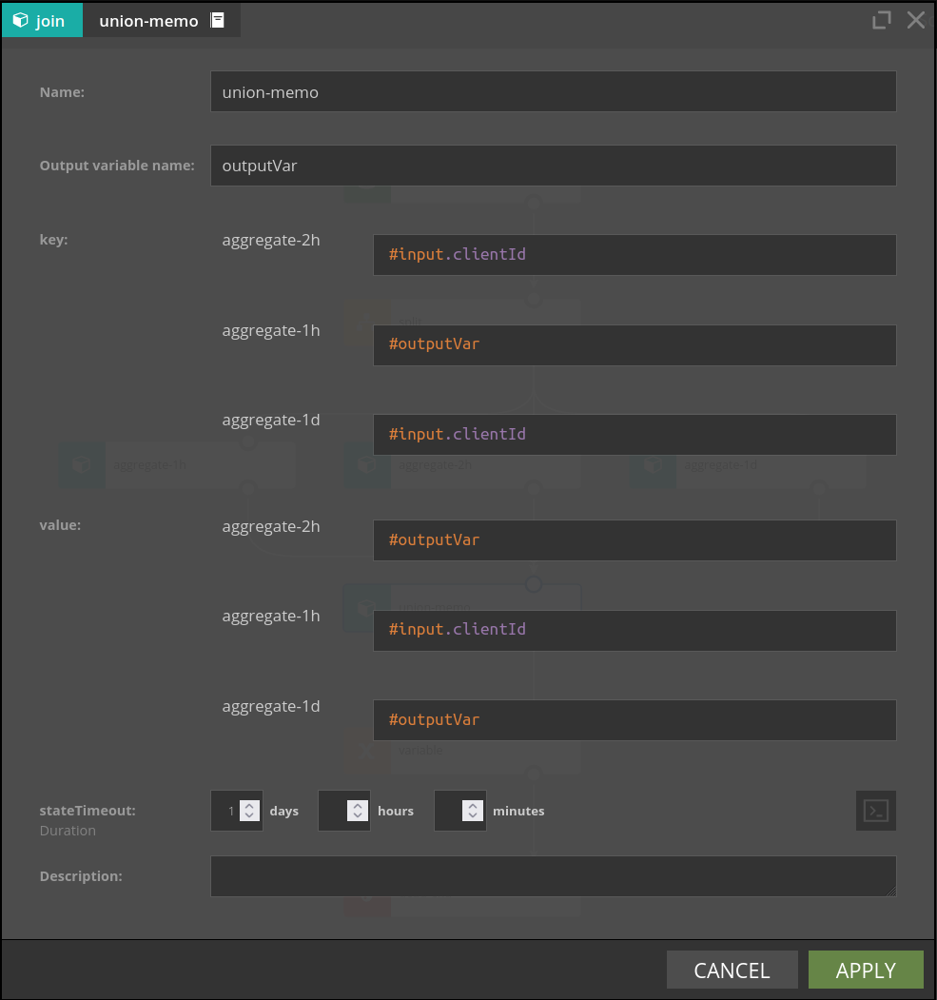
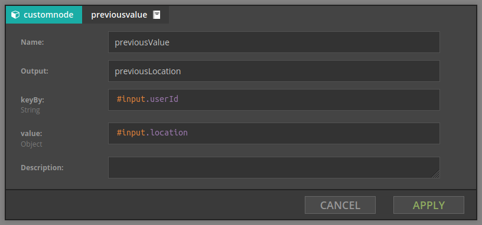
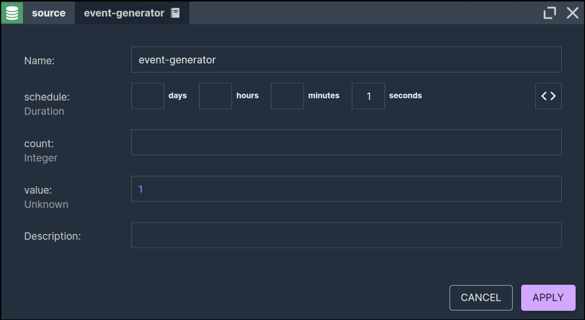

# Streaming


This page covers topics specific to the Streaming processing mode. Please read the [common introduction](Intro.md) 
before proceeding. The components which implement aggregates in the time windows (Flink engine only) are 
covered [here](AggregatesInTimeWindows.md).


In the Streaming processing mode the scenario processes events. They are read from Kafka topics and processed by
the [engine](../about/engines/Engines.md) of choice: Flink or Lite. At the end of the scenario, events which represent results 
or decisions are written to Kafka topic(s).

&nbsp;
## Prerequisites

To fully understand how Nussknacker works with Kafka topics, it's best to read the following first:
* [Kafka topic key](https://kafka.apache.org/intro)

If you want to use Flink engine, this is also recommended:
* [Flink keyed state](https://ci.apache.org/projects/flink/flink-docs-master/docs/concepts/stateful-stream-processing/#keyed-state)

&nbsp;
## Concepts

Kafka topics are native streaming data input to Nussknacker and the native output where results of Nussknacker 
scenarios processing are placed. In Nussknacker terminology input topics are called _sources_, output topics are 
called _sinks_. This section discusses Kafka based  source and sink components. 

It is not uncommon that  programs that write events to Kafka topics (“producers”) and programs that read events from
Kafka topics (“consumers”) are implemented by different people. If consumers are to understand what producers put 
into the topic, they need to agree between themselves the data schema - the format and data types of the data 
transported over Kafka topics. This “contract” is kept in what is called a Schema Registry. Nussknacker is able to 
read it and use to determine what data is in the event and help with field names and data type related validation 
of SpEL expressions. You can find some more details on schemas [here](../integration/KafkaIntegration.md#schemas); 
sample schemas can be found in the
[Quickstart](https://github.com/TouK/nussknacker-quickstart/tree/main/quickstart-setup/setup/schema-registry/schemas). 

&nbsp;

### Notion of time | Flink engine only

Notion of passing time is very important in dealing with real time events processing. 
Please see following excellent references to learn about basic concepts:
* [Notion of time in Flink](https://ci.apache.org/projects/flink/flink-docs-stable/docs/concepts/time/)
* [Streaming 101: The world beyond batch by O'Reilly](https://www.oreilly.com/radar/the-world-beyond-batch-streaming-101/)

For Flink engine Flink documentation applies. Certain Nussknacker components make assumptions and have predefined 
settings, so that the end users don't have to configure all by themselves.

&nbsp;
#### Sources and Sinks - Kafka

In general following rules apply:
* We use _event time_ in scenarios to handle notion of passing time
* Kafka record timestamps are used to assign event time to Flink events
* Kafka records produced by Nussknacker sinks have timestamp of event (in the sense of _event time_) that generated them
* We use *bound of order watermark generator*, with configurable amount of lateness 
  (see [kafka.kafkaEspProperties.defaultMaxOutOfOrdernessMillis property in Configuration](../integration/KafkaIntegration.md#available-configuration-options) for details). 

&nbsp;
#### Aggregations, window processing 

If a new event is triggered by e.g. tumbling time window, its timestamp is equal to the time of the timer that 
generated it, not system time of the moment when it happened. See [Aggregates in Time Windows](AggregatesInTimeWindows.md#tumbling-window) 
for more details.

&nbsp;
### Notion of time | Lite engine only

Lite engine is stateless, so many concepts important for windows or aggregations do not apply, but following rules 
apply for Kafka sources and sinks:
* Kafka record timestamps are used to determine time of the event
* Kafka records produced by Nussknacker sinks have timestamp of event that generated them

&nbsp;

## Streaming specific components

Components which perform stateful computations in time windows (Flink engine only) are covered 
[here](./AggregatesInTimeWindows.md). The UnionMemo, PreviousValue, Delay components which are also specific to Flink 
engine are covered in this document. 

&nbsp;
### Kafka source

Nussknacker will connect to Schema Registry to get the list of available schemas and will pre-populate the `Topic name` 
drop down of the `kafka` source component with the list of available topic names.

Nussknacker knows what data to expect in the Kafka event, so it will hint field names and will perform additional 
validations on SpEL expressions involving data from the selected topic. You can select the schema version which 
should be used for that.



_&nbsp;
### Kafka sink_

The `kafka` sink configuration form will show a list of fields defined in Schema Registry for the given topic. 
The result of the expression entered in the `Key` field will be used as a partitioning key when sending the 
record to Kafka. 



If, instead of filling separate autogenerated fields, you prefer to define the whole output event as one expression
containing value to be written to the Kafka topic, you can do that by switching `Raw editor` to `true`.

When using the Raw editor, you can choose the [validation mode](../integration/DataTypingAndSchemasHandling.md#validation-and-encoding):
* _strict_ - requires providing all fields, including optional fields, without redundant fields;
* _lax_ - requires providing only required fields, you can skip optional fields and add redundant fields.

&nbsp;


### DeadEnd



`dead-end` is a special type of sink that sends your data into the void. 
It is handy when you want to end your scenario without specifying exact data sink at the moment. 

&nbsp;
### UnionMemo

**(Flink engine only)**



Similarly to Union, UnionMemo node merges branches into one branch, events are emitted on every incoming event 
and event time is inherited from the incoming event.

There are however important differences in the way UnionMemo works:
- events from the incoming branches are matched together based on some key value
- data that arrived from any of the incoming branches will be memoized by the UnionMemo node for time duration 
  defined in stateTimeout. If new event arrives before stateTimeout, the stateTimeout timer is reset

Example:


UnionMemo merges multiple branches into one stream. For each incoming branch two parameters are configured:
- key - it's value should be of type `String`, defines how elements from branches will be matched together
- value - the value of this expression will be put in the output variable with the name the same as branch id

#input variable is no longer available downstream the UnionMemo, a new variable whose name is defined by "Output 
variable name" parameter will be present instead:
```$json
{
  "key": `value of key expression for given event`,
  "branch1": `value of output expression if memoized, otherwise null`,
  "branch2": `value of output expression if memoized, otherwise null`,
  "branch3": `value of output expression if memoized, otherwise null`,
  ...
}
```
&nbsp;
### PreviousValue

**(Flink engine only)**



`previousValue` stores arbitrary value for the given key. This element has two parameters:
- groupBy - expression defining key for which we compute aggregate, e.g. `#input.userId`
- value - stored value

For example, given stream of events which contain users with their current location, when we set 
- groupBy is `#input.userId`
- value is `#input.location`

then the value of the output variable is the previous location for the current user. If this is the first appearance 
of this user, the **current** location will be returned.

&nbsp;
### Delay

**(Flink engine only)**

Holds event in the node until 
  *event time* + `delay` >= max (*event time* ever seen by the delay node). 

The `key` parameter will be removed in the future release of Nussknacker, for the time being, configure it to `#inputMeta.key`.

&nbsp;
### Event generator

**(Flink engine only)**



This source generates events at a user-defined schedule.

There are two primary use cases for this component:

- Generating a stream of data (typically for testing): The `#input` variable, available downstream, will be populated
  with the data generated by this component. Use the `#RANDOM` helper to produce random values.
- Periodically generating a trigger event: This enables your scenario to run periodically, unlocking additional use
  cases beyond the traditional stream processing.

Parameters:

- schedule - specifies how often events will be sent
- count - specifies number of events that will be generated at every run
- value - specifies data that event will hold. Expression will be evaluated for every generated event

&nbsp;
