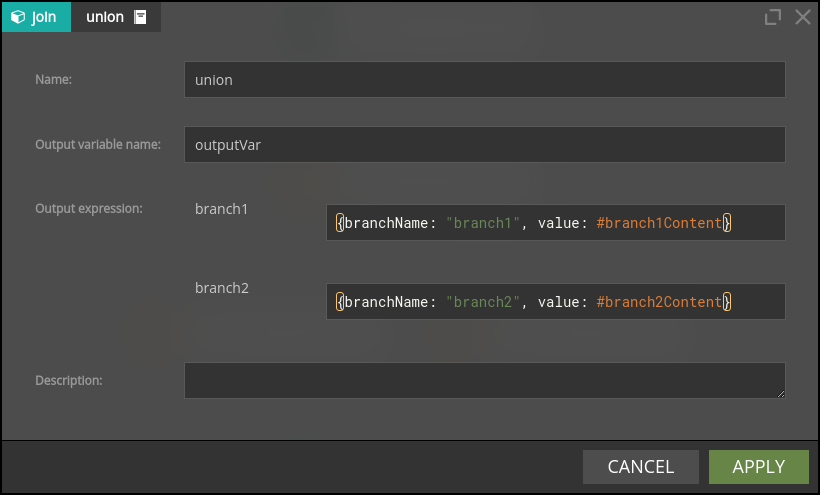

# Tips and Tricks

## Designer 

While Designer GUI in most cases is self-explanatory and forgiving, there are a few features which may be not so obvious to guess:

* **Scenario name change** - click Properties icon in the scenario panel, enter the name, click OK, click Save icon to save the scenario.
* **Selecting nodes** - use Shift button and left mouse button to select nodes. If you expand the selection area rightward, you need to fully mark node icons; alternatively you can mark node icons partially if you expand the selection area leftward.
* **Copy & paste** - you can copy and paste selected nodes; just ensure that your browser has access to the clipboard for the Nussknacker site you use.
* **Tab navigation** - you can navigate inside node details with TAB button.
* **Panels in the Designer** - there are several panels on the left and right side of the scenario authoring canvass. You can move these panels and collapse them. You can always restore default layout using "reset" button in the View panel.
* **Scenario versioning** - whenever a scenario is s-aved, a new version is created. You can revert to the older version of the scenario (see Versions panel). Adding comments when saving a scenario may help to find the right version.
* **Deleting a scenario** - scenarios can be archived and unarchived, they are never completely deleted. 
* **Inserting a node into the flow** - you can drop a node on the edge connecting nodes and Designer will fit it into the flow.

&nbsp;
## SpEL

### Common errors and misunderstandings

- Unlike JSON, SpEL uses curly brackets to denote the start and end of a list, e.g.:  `{1, 2, 3, 4}`. To make things more confusing, in the code hints and the debugger Nussknacker shows lists using JSON notation for lists. So, stay alert.
- `{:}` stands for the empty record (map). `{}` denotes an empty list.  

### Handling data types problems

Sometimes the Nussknacker’s data typing subsystem, on which hints and validations are built, is too restrictive and complains about a data type mismatch. In such a case, you can use the `#CONV.toAny()` helper function to trick Nussknacker’s data typing system into thinking that the data type of the entered expression is valid. You can see an example of how to use `#CONV.toAny` in the 'Handling enums' [section](#handling-enums). 
Note, that the `#CONV.toAny()` is quite brutal in its working - it effectively disables all the type checking during the scenario authoring. Unless you [monitor logs and scenario metrics](./../operations_guide/Common.md#handling-typical-scenario-errors), you may not notice runtime validation errors concealed during scenario authoring by using `#CONV.toAny()`. 

### Handling enums
Both AVRO and JSON schema specification allow you to define an enumeration value, defined as a constant list of values (strings) this enum can hold. For example, let’s consider this AVRO DeliveryStatus type:

```
{
  "type": "enum",
  "name": "status",
  "symbols" : ["ORDERED", "READY", "DELIVERED"]
}
```
Suppose we want to define some kind of logic dependent on delivery status. If we use field of this type in a filter/choice node, we will discover that it is of type EnumSymbol (a generic Java type representing the enum) and cannot be compared with plain String - even if it contains one of the allowed values.


What is the EnumSymbol? It is a generic Java type representing the enum. Currently, the workaround is to convert it to String before the comparison is done, as on the screenshot below. 


Now, imagine that we got one of the above enum values in a variable of type string. If you try to make the comparison, the Nussknacker typing system will complain:


The workaround here is to use the #CONV.toAny() helper to trick the typing subsystem into thinking that it is a valid enum symbol:


### Non-trivial operations on JSON records and lists

The `!` operator is truly powerful; one can achieve a lot of magic with it. A few examples.

**Convert record to a list**

Suppose one wants to convert a JSON record to a list containing records with fieldName and fieldValue fields. 

The example input record (referred to as `#myInputRecord` later) look like this:

`{"fieldA": "124.60", "fieldB": "123"}`

and the expected result list is below.  

```
[
  {
    "fieldName": "fieldA",
    "numValue": 124.6
  },
  {
    "fieldName": "fieldB",
    "numValue": 123
  }
]
```

The expression to use is as follows:

`#myRecord.![{"fieldName":  #this.key, "numValue": #this.value.toDouble}]`

&nbsp;
**Not trivial list transformations**

In this example, a `{1,2,3,4,5}` list is transformed to a list of records in two steps.

Expression:

`{1,2,3,4,5}.![{#this, #this mod 2}].![{"value" : #this[0], "odd?" : #this[1] == 1 ? true : false}]`

Result (in JSON notation) of the first step:

```
[
  {1,1},
  {2,0},
  {3,1},
  {4,0},
  {5,1}
]
```

Final result (JSON notation):

```
[
  {"value": 1, "odd?": true },
  {"value": 2, "odd?": false },
  {"value": 3, "odd?": true },
  {"value": 4, "odd?": false },
  {"value": 5, "odd?": true }
]
```
&nbsp;
## Scenario Authoring

### Passing the context after the Union node
A sequence of Split and Union nodes deletes all the variables other than those explicitly declared in the Union node. 



Additional steps must be taken to pass any context (values) that might otherwise be lost downstream the Split node. What makes things a bit (only a bit) more complicated is that the Union node expects that all the branches bring identical data structures to it. The way out is to declare a record variable before a Split node which will contain all the context needed to be available downstream of the Union node. This record variable should be part of every branch output that is 'joined' by the Union branch. Even if it looks a bit redundant, this will do the job. 

In the example above, assuming that the variable which holds all the context needed to be passed downstream the Union node is called `context`, then the branch1 and branch2 outputs would be defined as:

```
{“branchName: “branch1”, “value”: #branch1Content, “context”: #context}
{“branchName: “branch2”, “value”: #branch2Content, “context”: #context}
```
