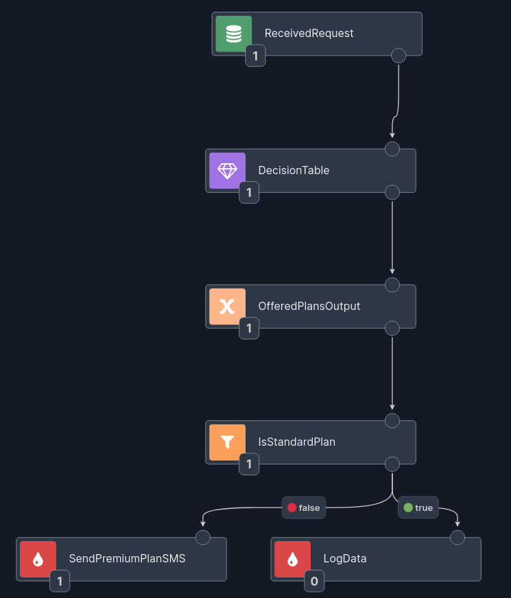

# Enrichers

## Overview

Usually not all required data are in the data record - some data may reside in an external database or may be served by an external service. For this purpose Nussknacker provides enrichers - specialized components which allow to get data from sources other than Kafka streams.


## Concepts

Please check [Glossary](/about/GLOSSARY) to understand difference between component and the node (and between configuration of a component and configuration of a node). Understanding the role of [SpEL](/docs/scenarios_authoring/Intro#spel) will greatly accelerate your first steps with Nussknacker. 


Enricher components need to be added to the Model configuration first; once they are added they will become available in the Designer's components toolbox. Check [configuration areas](/docs/installation_configuration_guide/ModelConfiguration/#components-configuration) for the overview of the configuration and [configuration of extra components](../integration/OpenAPI.md) for details of how to configure enricher components.


## SQL enricher

There are two components of this type, they both allow to access data from JDBC compliant data sources. All major relational databases support JDBC. As there are also some JDBC compliant data sources which are not relational databases, the final pool of possible data sources is wider than just relational databases. 

### DatabaseQueryEnricher

The more generic databaseQueryEnricher component allows to execute any SQL SELECT statement against the target data provider. 


If parameter(s) need to be passed to the SQL query, use "?" as a placeholder for a parameter value; Nussknacker will dynamically adjust the node configuration window to include the entry field for the parameter(s). 
   

If a query returns more than just one record and you need just one, you can set result strategy option to "single result" - this will ensure that only one db record will be used to populate the variable which holds output from this node. 


TTL (Time to Live) determines how long returned result is held in the cache of the running scenario. 

### DatabaseLookupEnricher

DatabaseLookupEnricher is a specialized look-up component; it returns all columns of a looked up record. In the example below the city table is looked up based on the id field. 


### Decision Table
 
This component allows the user to match input to a pre-defined result. Please be wary that this component works a bit 
different than [a classical decision table](https://en.wikipedia.org/wiki/Decision_table). It consists of the fields:

- **_Decision Table_**: 

  A user-defined tabular data. The user has control over the number of columns and the type of data in a specific column. 
  The values are validated upon input and an empty cell is treated as null. See the example below.
- **_Match condition_**: 
 
  A `Boolean` SpEL expression that matches input to table rows. In this field, users can use a `#ROW` variable, which is 
  a representation of a single table row. It can be used to match the defined decision table to the input. See 
  the example below.
- **_Output_**: 

  A name of the output variable that will hold the data generated by the component. The output data is a `List` of matching 
  rows. The rows themselves are records so the output is of form `List[Record[...]]`.

#### Usage example

We will demonstrate the use of the component with a simple business example. Consider a telecom that wants to send offers 
based on the data of a specific customer.

First let's look at our input. It's a customer record which has a "name", "age" and "gender". We also define a `Boolean` 
field "isBigSpender" to better filter offers for the customer.
 
Now we have to define a fixed-value decision table. We use two `MinAge` and `MaxAge` columns to define the age intervals 
for our customers. Then we add the values for the rest and appropriate data plans. 


We want search best offer for a given customer. The offers are different depending on customer's age, gender, or the 
fact if they are big spender or not. Let's assume the customer has the following fields: "name", "age", "gender", "isBigSpender".

Now, we have to define condition which allows to match customer with the table's row.
First we want to change if a given user's age match the specified age interval. We can do it as follows:
```
(#ROW.MinAge != null ? #input.age > #ROW.MinAge : true) && 
(#ROW.MaxAge != null ? #input.age <= #ROW.MaxAge : true)
```

Next, we have to match their gender:
```
(#ROW.Gender != null ? #input.gender == #ROW.Gender : true)
```
Note, that if the gender is not specified, we DO match the row (see the `null` checking).

The same we do in case of the checking if the customer is a big spender:
```
(#ROW.IsBigSpender != null ? #input.isBigSpender == #ROW.IsBigSpender : true)
``` 

The whole expression looks like this:
```
(#ROW.MinAge != null ? #input.age > #ROW.MinAge : true) && 
(#ROW.MaxAge != null ? #input.age <= #ROW.MaxAge : true) && 
(#ROW.Gender != null ? #input.gender == #ROW.Gender : true) && 
(#ROW.IsBigSpender != null ? #input.isBigSpender == #ROW.IsBigSpender : true)
```

The output from the component will be a list of matched *whole* rows (of type record). 
So, if the input is:
```json
{
  "name": "Andrzej Podolski",
  "age": 45,
  "gender": "Male",
  "isBigSpender": true
}
```

The output will be: 
```
[
  { 
    "MinAge": 30,
    "MaxAge": 50,
    "Gender": "Male",
    "IsBigSpender": true,
    "OfferedPlan": "Family Package"
  }
]
```

If you want to only get the _result columns_, then you need to transform the data afterwards with a different component.
A scenario in which the Decision Table component is used could look like this:



You can add as many input and result columns as you would like. The _Match condition_ is a fully functioning expression, 
so you can be quite flexible with it. You could omit some of the checks on the input rows. In our example, we could 
only check for age. It is also up to you which columns you define as input and which as output, you can treat them 
completely differently in two components that have the same table definition.

  
## OpenAPI enricher

[OpenAPI](https://swagger.io) is a specification for machine-readable interface files for describing, producing, 
consuming, and visualizing RESTful web services. Nussknacker can read definition of an OpenAPI interface and 
generate a component for the interaction with the given service.

Once an OpenAPI component is configured in the Model it will become available in the Designer. Because Nussknacker 
can determine the definition of the service input parameters, the node configuration form will contain entry fields 
for these parameters. In the example below customer_id field is the input parameter to the openAPI service. 


Similarly, information about field names and types returned by the OpenAPI service are known to Designer; as the result Designer will hint them when openAPIResultVar variable is used in the SpEL expression. 
     
   
## ML enricher
**(Enterprise only)**

Nussknacker can infer ML models using the Machine Learning enrichers. The ML enrichers are Enterprise components of Nussknacker and require a separate license. Please contact <info@nussknacker.io> for license terms and more details.

We support the inference of the following ML technologies:
- native Python models discovered using the [MLflow](https://mlflow.org/) model registry and executed with our ML runtime
- models exported in the [PMML](https://en.wikipedia.org/wiki/Predictive_Model_Markup_Language) format
- models exported in the [H2O](https://h2o.ai/) format

Similarly to SQL and OpenAPI enrichers, as ML model input and output are known to Designer, when you double-click the ML Enricher node in the scenario you will see entry fields required by the model; data type hints and syntax error checking functionality will be active.   

From the scenario author perspective, the ML Enricher is indistinguishable from OpenAPI enricher - it just takes some input parameters and returns a value. 


