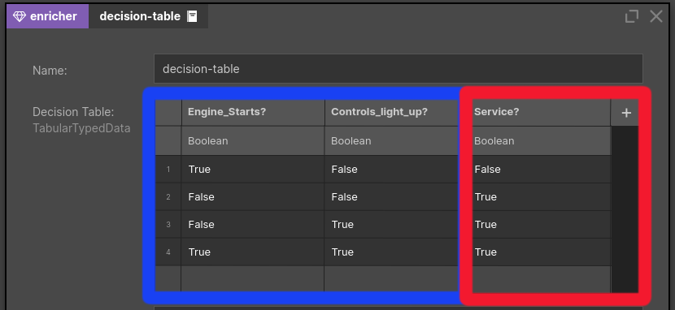
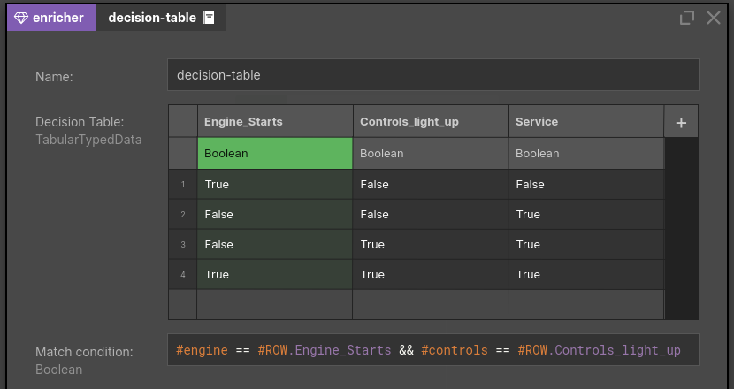

# Enrichers

## Overview

Usually not all required data are in the data record - some data may reside in an external database or may be served by an external service. For this purpose Nussknacker provides enrichers - specialized components which allow to get data from sources other than Kafka streams.

## Concepts

Please check [Glossary](/about/GLOSSARY) to understand difference between component and the node (and between configuration of a component and configuration of a node). Understanding the role of [SpEL](/docs/scenarios_authoring/Intro#spel) will greatly accelerate your first steps with Nussknacker. 

Enricher components need to be added to the Model configuration first; once they are added they will become available in the Designer's components toolbox. Check [configuration areas](/docs/installation_configuration_guide/ModelConfiguration/#components-configuration) for the overview of the configuration and [configuration of extra components](../integration/OpenAPI.md) for details of how to configure enricher components.

## SQL enricher

There are two components of this type, they both allow to access data from JDBC compliant data sources. All major relational databases support JDBC. As there are also some JDBC compliant data sources which are not relational databases, the final pool of possible data sources is wider than just relational databases. 

### DatabaseQueryEnricher

The more generic databaseQueryEnricher component allows to execute any SQL SELECT statement against the target data provider. 

If parameter(s) need to be passed to the SQL query, use "?" as a placeholder for a parameter value; Nussknacker will dynamically adjust the node configuration window to include the entry field for the parameter(s). 
   

If a query returns more than just one record and you need just one, you can set result strategy option to "single result" - this will ensure that only one db record will be used to populate the variable which holds output from this node. 

TTL (Time to Live) determines how long returned result is held in the cache of the running scenario. 

### DatabaseLookupEnricher

DatabaseLookupEnricher is a specialized look-up component; it returns all columns of a looked up record. In the example below the city table is looked up based on the id field. 

### DecisionTable enricher

This component allows the user to match input to a pre-defined result. Please be wary that this component works a bit different than a classical decision table([Decision tables in Wikipedia](https://en.wikipedia.org/wiki/Decision_table)). It consists of the fields:

- Decision Table: a user defined table. The user has control over the number of columns and the type of data in a specific column. The values are validated upon input and an empty cell is treated as null. For more info see example below.
- Match condition: a Boolean SpEL expression that matches input to table rows. This field gives the user #ROW variable. The variable is a representation of a single table row and can be used to match the defined decision table to the input. For more info see example below.
- Output: name of the output variable which will hold data generated by the component. The output data is a List of matching rows. The rows themselves are records so the output is of form List[Record[...]].

The component has two main elements: _Decision Table_ which is a user-defined table of values and _Match condition_ - a SpEL expression which Nu will use to match the input to the table values.

First let's look at our input: it's a simple model of car data that consists of engine status, controls status and car mileage and name.
 
Now we have to define a fixed-value decision table. We will use a simple car mechanic concept - a decision table that helps to define whether a car should be serviced. The blue columns represent our input values and the red one is our decision column.

We now need to define a condition that will match our input data with the table rows. In our case the input is a tuple (engine\_status, controls\_status, mileage, car\_id). We want to match when the boolean values are equal to the row values. We also decide we want the car mileage to be higher than the specific threshold. Remember that #Row variable in the expression allows us to interact with the defined table. The relevant expression is:

The output from the component will be a list of matched *whole* rows (of type record). So, in our case, if one of inputs is (True, True, 60, "myCar"), then the output would be a list consisting of a single recordList[(True, True, 50, True)]. If you want to only get the _result columns_, then you need to transform the data afterwards with a different component.

You can add as many input and result columns as you would like. The _Match condition_ is a fully functioning expression, so you can be quite flexible with it. You could omit some of the checks on the input rows. In our example, we could check for engine control only with *#engine = #ROW.Engine_starts*. It is also up to you which columns you define as input and which as output, you can treat them completely differently in two components that have the same table definition.

  
## OpenAPI enricher

[OpenAPI](https://swagger.io) is a specification for machine-readable interface files for describing, producing, consuming, and visualizing RESTful web services. Nussknacker can read definition of an OpenAPI interface and generate a component for the interaction with the given service.

Once an OpenAPI component is configured in the Model it will become available in the Designer. Because Nussknacker can determine the definition of the service input parameters, the node configuration form will contain entry fields for these parameters. In the example below customer_id field is the input parameter to the openAPI service. 

Similarly, information about field names and types returned by the OpenAPI service are known to Designer; as the result Designer will hint them when openAPIResultVar variable is used in the SpEL expression. 
     
   
## ML enricher
**(Enterprise only)**

Nussknacker can evaluate ML models using the Machine Learning Enricher. The ML Enricher is an Enterprise component of Nussknacker and requires a separate license; contact info@nussknacker.io for more information. 

Models can be either JPMML encoded or exported with H2O Mojo/Pojo. 
Model repository can be one of the following:
- file system
- MLFlow registry
- custom model registry

Similarly to SQL and OpenAPI enrichers, as ML model input and output are known to Designer, when you double-click the ML Enricher node in the scenario you will see entry fields required by the model; data type hints and syntax error checking functionality will be active.   

From the scenario author perspective, the ML Enricher is indistinguishable from OpenAPI enricher - it just takes some input parameters and returns a value. 

