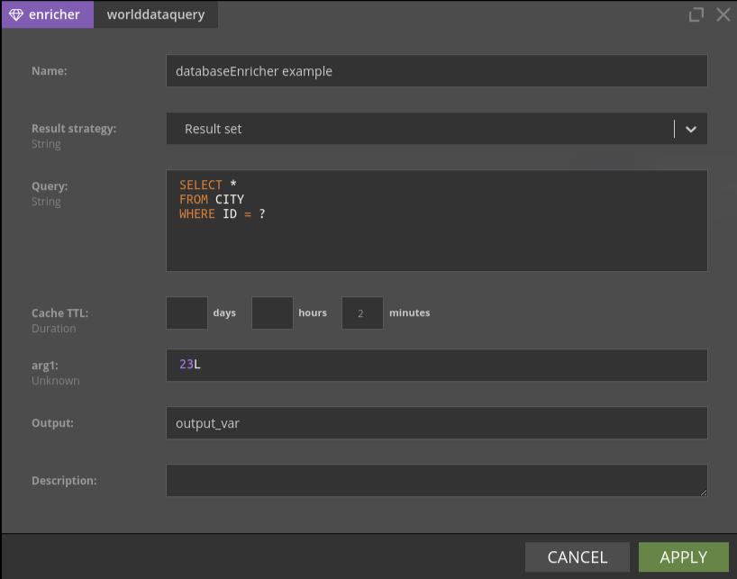
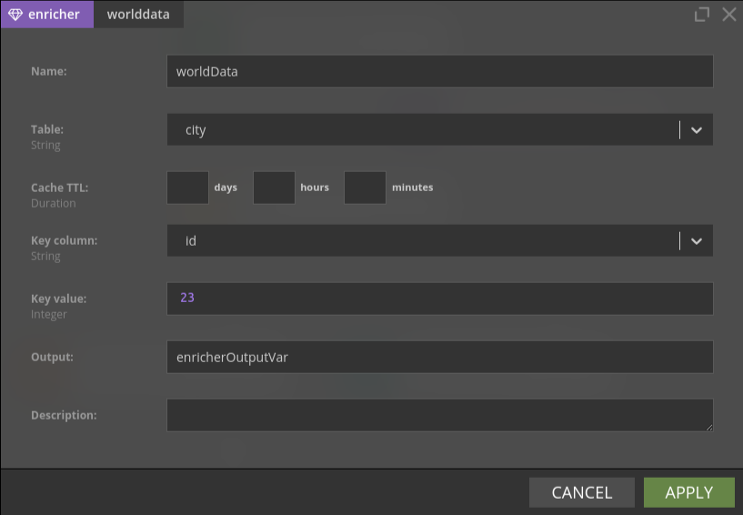
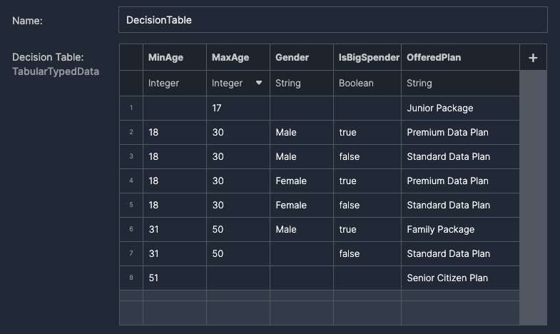
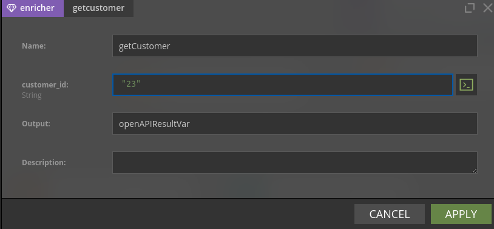
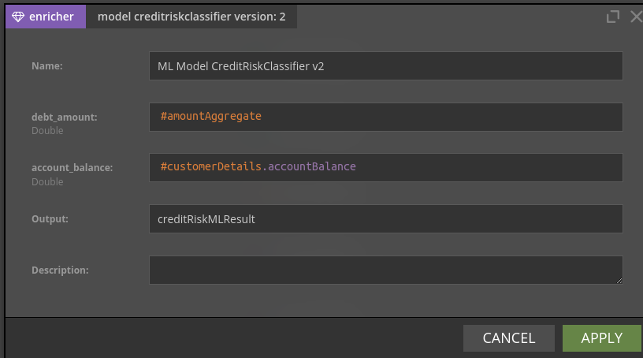

# Enrichers

## Overview

Usually not all required data are in the data record - some data may reside in an external database or may be served by an external service. For this purpose Nussknacker provides enrichers - specialized components which allow to get data from sources other than Kafka streams.


## Concepts

Please check [Glossary](../about/GLOSSARY.md) to understand difference between component and the node (and between configuration of a component and configuration of a node). Understanding the role of [SpEL](../scenarios_authoring/Intro.md#spel) will greatly accelerate your first steps with Nussknacker. 


Enricher components need to be added to the Model configuration first; once they are added they will become available in the Designer's components toolbox. Check [configuration areas](../configuration/index.mdx#configuration-areas) for the overview of the configuration and [configuration of extra components](../integration/OpenAPI.md) for details of how to configure enricher components.


## SQL enricher

There are two components of this type, they both allow to access data from JDBC compliant data sources. All major relational databases support JDBC. As there are also some JDBC compliant data sources which are not relational databases, the final pool of possible data sources is wider than just relational databases. 

### DatabaseQueryEnricher

The more generic databaseQueryEnricher component allows to execute any SQL SELECT statement against the target data provider. 



If parameter(s) need to be passed to the SQL query, use "?" as a placeholder for a parameter value; Nussknacker will dynamically adjust the node configuration window to include the entry field for the parameter(s). 
   

If a query returns more than just one record and you need just one, you can set result strategy option to "single result" - this will ensure that only one db record will be used to populate the variable which holds output from this node. 


TTL (Time to Live) determines how long returned result is held in the cache of the running scenario. 

### DatabaseLookupEnricher

DatabaseLookupEnricher is a specialized look-up component; it returns all columns of a looked up record. In the example below the city table is looked up based on the id field. 



## Decision Table

Some decision trees can't be easily modeled using filter/switch/split nodes or resulting tree can be huge/unreadable. In such cases user may try to use the Decision Table component. This can be helpful in situations like enriching data using static dictionary or matching business objects to specified segments based on multiple decision parameters.

Our implementation of the decision table is more generic than the one described in [Wikipedia](https://en.wikipedia.org/wiki/Decision_table). 
In our implementation, columns contain "decision parameters" and "decisions". 
Nussknacker does not distinguish these two types of columns; however, if you need the functionality of a decision table you probably will include one or more columns with decisions.  
To match one or more rows (as in a classic decision table) a **_match condition_** returning a boolean value has to be created. 
This expression can refer to the variables used in the scenario and values in the columns - hence the name for these columns - "decision parameters". 
The result will be a list of matched rows - the rows for which the **_match condition_** returned `true`.  
As we do not differentiate the "decision parameter" columns and "decision" columns, the whole matched rows will be returned.

### Configuration

- **_Decision Table_**: 

  A user-defined tabular data. The user has control over the number of columns and the type of data in a specific column. 
  The values are validated upon input and an empty cell is treated as null.
- **_Match condition_**: 
 
  A `Boolean` SpEL expression based on which one or more rows of the decision table will be selected. To create the expression you can refer to the variables used in the scenario and values in the decision table. Use `#ROW.columnName' notation to access a single cell value. 
  
- **_Output_**: 

  A name of the output variable that will hold a list of matched decision table rows. The rows themselves are records, so the output variable is of type `List[Record[...]]`.

#### Usage example

We will demonstrate the use of the decision table with a simple business example. Consider a telecom that wants to send offers 
based on the data of a specific customer.

Suppose that the `#input` variable contains customer data: "name", "age", "gender" and  `Boolean` field "isBigSpender".
 
The example decision table is shown below. We use two `MinAge` and `MaxAge` columns to define the age intervals 
for our customers.



The partial match predicates might look as below.

Age:
```
(#ROW.MinAge != null ? #input.age > #ROW.MinAge : true) && 
(#ROW.MaxAge != null ? #input.age <= #ROW.MaxAge : true)
```

Gender:
```
(#ROW.Gender != null ? #input.gender == #ROW.Gender : true)
```

IsBigSpender:
```
(#ROW.IsBigSpender != null ? #input.isBigSpender == #ROW.IsBigSpender : true)
``` 

The overall match expression would look like this:
```
(#ROW.MinAge != null ? #input.age > #ROW.MinAge : true) && 
(#ROW.MaxAge != null ? #input.age <= #ROW.MaxAge : true) && 
(#ROW.Gender != null ? #input.gender == #ROW.Gender : true) && 
(#ROW.IsBigSpender != null ? #input.isBigSpender == #ROW.IsBigSpender : true)
```

The decision's table output variable will contain a list of matched rows.


Assuming the `#input` is:
```json
{
  "name": "Andrzej Podolski",
  "age": 45,
  "gender": "Male",
  "isBigSpender": true
}
```

The result will be (JSON notation):
```
[
  { 
    "MinAge": 30,
    "MaxAge": 50,
    "Gender": "Male",
    "IsBigSpender": true,
    "OfferedPlan": "Family Package"
  }
]
```

If you want to get the _decision columns_ only, you need to transform the resulting list in an additional node as shown [here](Spel.md#transforming-lists). 

  
## OpenAPI enricher

[OpenAPI](https://swagger.io) is a specification for machine-readable interface files for describing, producing, 
consuming, and visualizing RESTful web services. Nussknacker can read definition of an OpenAPI interface and 
generate a component for the interaction with the given service.

Once an OpenAPI component is configured in the Model it will become available in the Designer. Because Nussknacker 
can determine the definition of the service input parameters, the node configuration form will contain entry fields 
for these parameters. In the example below customer_id field is the input parameter to the openAPI service. 



Similarly, information about field names and types returned by the OpenAPI service are known to Designer; as the result Designer will hint them when openAPIResultVar variable is used in the SpEL expression. 
     
   
## ML enricher
**(Enterprise only)**

Nussknacker can infer ML models using the Machine Learning enrichers. The ML enrichers are Enterprise components of Nussknacker and require a separate license. Please contact <info@nussknacker.io> for license terms and more details.

We support the inference of the following ML technologies:
- native Python models discovered using the [MLflow](https://mlflow.org/) model registry and executed with our ML runtime
- models exported in the [PMML](https://en.wikipedia.org/wiki/Predictive_Model_Markup_Language) format
- models exported in the [H2O](https://h2o.ai/) format

Similarly to SQL and OpenAPI enrichers, as ML model input and output are known to Designer, when you double-click the ML Enricher node in the scenario you will see entry fields required by the model; data type hints and syntax error checking functionality will be active.   

From the scenario author perspective, the ML Enricher is indistinguishable from OpenAPI enricher - it just takes some input parameters and returns a value. 


