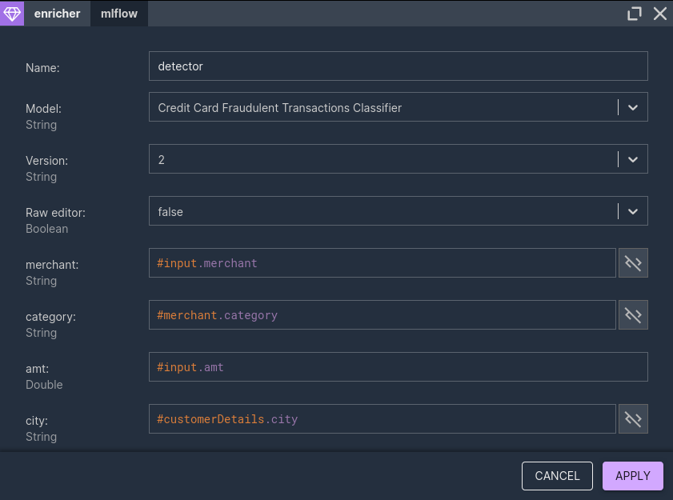

# Enrichers

## Overview

Usually not all required data are in the Kafka event streams - some data may reside in an external database or may be served by an external service. For this purpose Nussknacker provides enrichers - specialized components which allow to get data from sources other than Kafka streams.

## Concepts

Please check [Glossary](/about/GLOSSARY) to understand difference between component and the node (and between configuration of a component and configuration of a node). Understanding the role of [SpEL](../scenarios_authoring/Intro#spel) will greatly accelerate your first steps with Nussknacker. 

Enricher components need to be added to the Model configuration first; once they are added they will become available in the Designer's components toolbox. Check [configuration areas](../installation_configuration_guide/Configuration.md) for the overview of the configuration and [configuration of extra components](../components/OpenAPI.md) for details of how to configure enricher components.

## SQL enricher

There are two components of this type, they both allow to access data from JDBC compliant datasources. All major relational databases support JDBC. As there are also some JDBC compliant data sources which are not relational databases, the final pool of possible data sources is wider than just relational databases. 

**DatabaseQueryEnricher**

The more generic databaseQueryEnricher component allows to execute any SQL SELECT statement against the target data provider. 

If parameter(s) need to be passed to the SQL query, use "?" as a placeholder for a parameter value; Nussknacker will dynamically adjust the node configuration window to include the entry field for the paramer(s). 
   

If a query returns more than just one record and you need just one, you can set result strategy option to "single result" - this will ensure that only one db record will be used to populate the variable which holds output from this node. 

TTL (Time to Live) determines how long returned result is held in the cache of the running scenario. 

**DatabaseLookupEnricher**

DatabaseLookupEnricher is a specialized look up component; it returns all columns of a looked up record. In the example below the city table is looked up based on the id field. 

  
## OpenAPI enricher

[OpenAPI](https://swagger.io) is a specification for machine-readable interface files for describing, producing, consuming, and visualizing RESTful web services. Nussknacker can read definition of an OpenAPI interface and generate a component for the interaction with the given service.

Once an OpenAPI component is configured in the Model it will become available in the Designer. Because Nussknacker can determine the definition of the service input parameters, the node configuration form will contain entry fields for these parameters. In the example below customer_id field is the input parameter to the openAPI service. 

Similarly, information about field names and types returned by the OpenAPI service are known to Designer; as the result Designer will hint them when openAPIResultVar variable is used in the SpEL expression. 
     
   
## ML enricher

Nussknacker can evaluate ML models using the Machine Learning Enricher. Internally, the ML Enricher uses  [JPMML-Evaluator library ](https://github.com/jpmml/jpmml-evaluator) to evaluate ML models. The ML Enricher is an Enterprise component of Nussknacker and requires a separate license; contact info@nussknacker.io for more information. 

Models can be either JPMML encoded or exported with H2O Mojo/Pojo. 
Model repository can be one of the following:
- file system
- MLFlow registry
- custom model registry

Similarly to SQL and OpenAPI enrichers, as ML model input and output are knownn to Designer, when you double click the ML Enricher node in the scenario you will see entry fields required by the model; data type hints and syntax error checking functionality will be active.   

You can see the ML Enricher live in the [Nussknacker demo](https://demo.nussknacker.io/visualization/MachineLearning-credit-card-dispute-risk).

From the scenario author perspective, the ML Enricher is indistinguishable from OpenAPI enricher - it just takes some input parameters and returns a value. 

