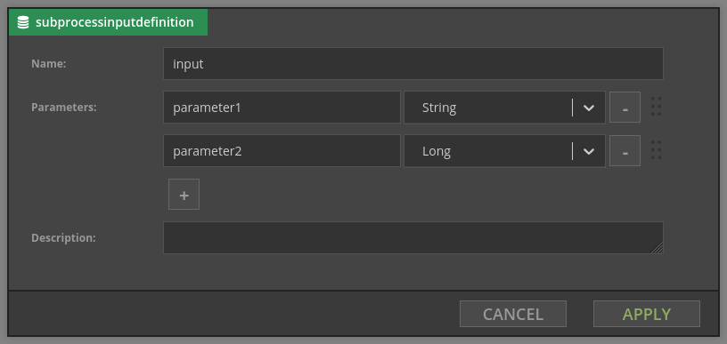

# Fragments

Fragments are a way to share processing logic - if many scenarios require identically configured chains of components, fragments provide a method to avoid repetition of these chains across multiple scenarios. Fragments are a design time concept; the logic of a fragment will be executed (included into the scenario and associated Flink job) as many times as there are references to the given fragment in the deployed scenarios.

Once a fragment is created using Designer (see Fragments tab) it can be used in other scenarios in the same category.

## Inputs
Fragment can have one input. You can define parameters of a fragment:

## Outputs
Fragment can define zero, one or more outputs. Each of them has a name (which should be unique), main scenario can then choose appropriate output. Below you can see fragment with two outputs:

## Limitations of fragments
- They cannot access variables from the main scenario if they are not passed as parameters.
- They cannot be nested (i.e. fragment cannot invoke other fragment).
- They cannot pass output variables to the main scenario. This may change in the future.
- When inputs/outputs of fragment change, scenarios using it have to be corrected manually.
- If fragment use some component which clears context, context will be also cleared in the main scenario.
