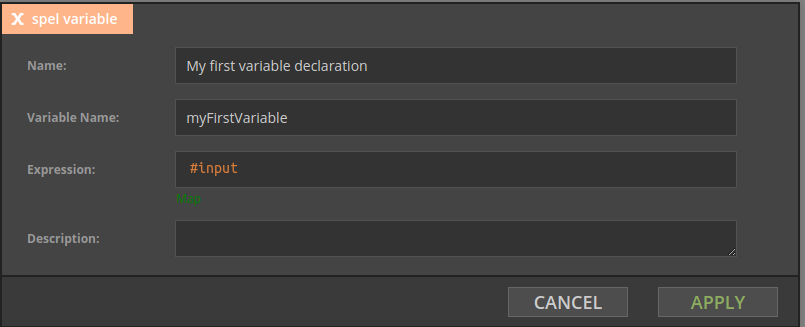
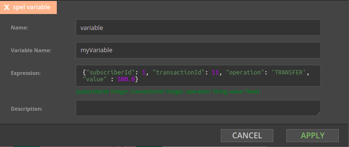

# Introduction

## Intended audience

This document is intended for those who will use Nussknacker Designer to configure processing scenarios. Nussknacker is a low-code platform; prior knowledge of SQL, JSON and concepts like variables and data types will help to master authoring of the stream processing scenarios in Nussknacker. 

**Please try [Quickstart](/quickstart/demo) to quickly understand how to move around Nussknacker Designer, create a simple scenario and see SpEL in action.**

## Events 
Nussknacker nodes process events; once the node finishes processing of the event it hands it over to the next node in the flow for processing. Filter, Split, Switch nodes behave exactly like this. 
Typically events processed by Nussknacker come from Kafka topics;  Knussknacker source components are used to read events from Kafka topic and inject them into Knussknacker scenarios. 
There are cases though when a node can produce a new event, a Tumbling-window component being a good example. 

## Notion of time

Notion of passing time is very important in dealing with real time events processing. 
Please see following excellent references to learn about basic concepts:
* [Notion of time in Flink](https://ci.apache.org/projects/flink/flink-docs-stable/docs/concepts/time/)
* [Streaming 101: The world beyond batch by O'Reilly](https://www.oreilly.com/radar/the-world-beyond-batch-streaming-101/)

Nussknacker uses Flink, so in general, Flink documentation applies. Certain Nussknacker components make assumptions and have predefined settings, so that the end users don't have to configure all by themselves.

### Sources and Sinks - Kafka
In general following rules apply:
* We use _event time_ in scenarios to handle notion of passing time
* Kafka record timestamps are used to assign _event time_ to Flink events
Kafka records produced by Nussknacker sinks have timestamp of event (in the sense of _event time)_ that generated them
* We use bound of order watermark generator, with configurable amount of lateness (see [configuration] for details) 

### Aggregations, window processing 
A Tumbling-window is an interesting case, because when the aggregate is emitted, it is emitted as a new event. Its timestamp is equal to the time of the timer that generated it, not system time of the moment when it happened. See [Aggregates in Time Windows](AggregatesInTimeWindows#tumbling-window) or more details.

## SpEL

Configuring Nussknacker nodes to a large degree is about using SpEL; knowledge of how to write valid expressions in SpEL is an important part of using Nussknacker.

SpEL [Spring Expression Language](https://docs.spring.io/spring-framework/docs/3.2.x/spring-framework-reference/html/expressions.html) is a powerful expression language that supports querying and manipulating data objects. What exactly does the term _expression _mean and why SpEL is an _expression language_? In programming language terminology, an _expression_ is a combination of values and functions that are combined to create a new value. SpEL allows to write expressions only; therefore it is an expression language. Couple examples:

| Expression  |	Result | Type   |
| ------------|--------|--------|
| 'Hello World' | "Hello World" |	String |
| true 	      |true	   | Boolean |
| {1,2,3,4}     |  a list of integers from 1 to 4	| List[Integer] |
| {john:300, alex:400}  |a map (name-value collection) | Map[String, Integer] |
|  2 > 1  | true	| boolean |
|  2 > 1 ? 'a' : 'b'  |	"a"	| String |
|  42 + 2       | 44     | Integer|
|  'AA' + 'BB'  | "AABB" | String |

SpEL is used in Nussknacker to access data processed by a node and expand node's configuration capabilities. Some examples:

* create boolean expression (for example in filters) based on logical or relational (equal, greater than, etc) operators
* access, query and manipulate fields of the incoming data record
* format records (events) written to data sinks
* provide helper functions like date and time, access to system variables
* and many more.

The [SpEL Cheat Sheet page](Spel)  provides an exhaustive list of examples of how to write expressions with SpEL.

## Data Types

Every SpEL expression returns a value of one of the predefined SpEL data types, like integer, double or boolean, map, etc. Data types in Nussknacker can be a confusing aspect at the beginning, as depending on the context in which data are processed or displayed, different data type schemes are in use - please refer to the [SpEL Cheat Sheet page](Spel#data-types-and-structures) for more information. 

In some contexts data type conversions may be necessary - conversion functions are described [here](Spel#type-conversions).

## Variables

Nussknacer uses variables as containers for data; they can be referred to in SpEL expressions. Variables have to be declared; a `variable` or `mapVariable` component is used for this. Once declared, a hash sign `"#"` is used to refer to a variable.

There are three predefined variables: `#input`, `#inputMeta` and `#meta`. If the event which arrived to some node originally came from the Kafka topic, the data carried in the event record are accessible in the `#input` variable. The `#inputMeta `and `#meta` variables are discussed further down in this document, 

### Variable component

A Variable component is used to declare a new variable; in the simplest form a variable declaration looks like in the example  below. As the event was read from the Kafka topic, the `#input` variable stores its content and  its value is assigned to a newly declared `myFirstVariable` variable. 

As you can see in the `variable` configuration form below, Nussknacker inferred the data type of the `#input` variable from the information already available to Nussknacker. 

In the next example `#input` variable is used to create an expression returning a boolean value. If the input Kafka topic contains json objects and they contain `operation` field, the value of this field can be obtained in the following way: 

`#input.operation` 

Note that internally Nussknacker converts JSON’s object into SpEL’s map. 

### mapVariable 

The specialized `mapVariable` component can be used to declare a map variable (object in JSON)

The same can be achieved using a plain `Variable` component, just make sure to write a valid SpEL expression. 

## #inputMeta and #meta variables

#inputMeta and #meta variables are predefined variables which carry meta information about event and the scenario:

**#inputMeta **- carries meta information about the currently processed event. Consult Kafka [documentation](https://kafka.apache.org/24/javadoc/org/apache/kafka/clients/consumer/ConsumerRecord.html) for the exact meaning of those elements. The following meta information elements are available in #inputMeta:

* headers 
* key
* leaderEpoch
* offset
* partition
* timestamp 
* timestampType 
* topic. 

**#meta** - carries meta information about the currently executed scenario. The following meta information elements are available:

* processName -name of the Nussknacker scenario
* properties  

 
