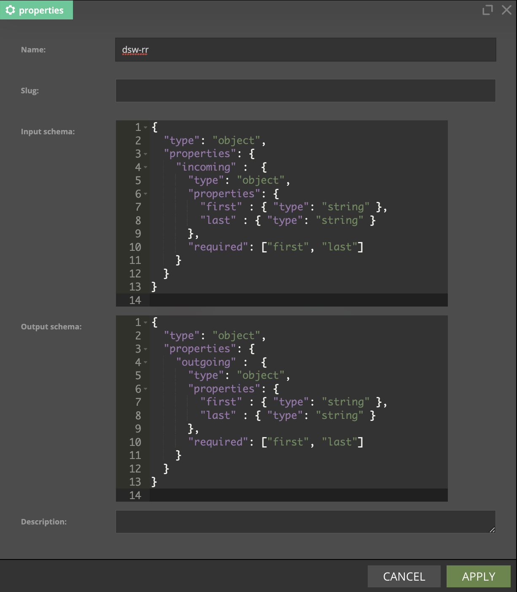
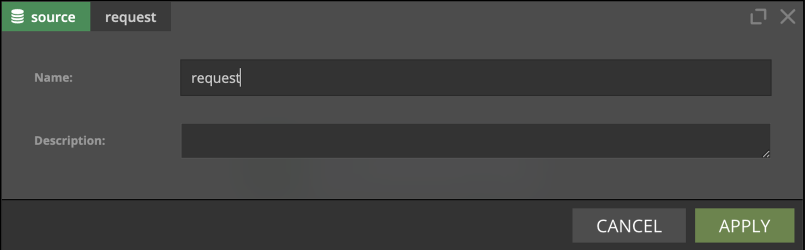
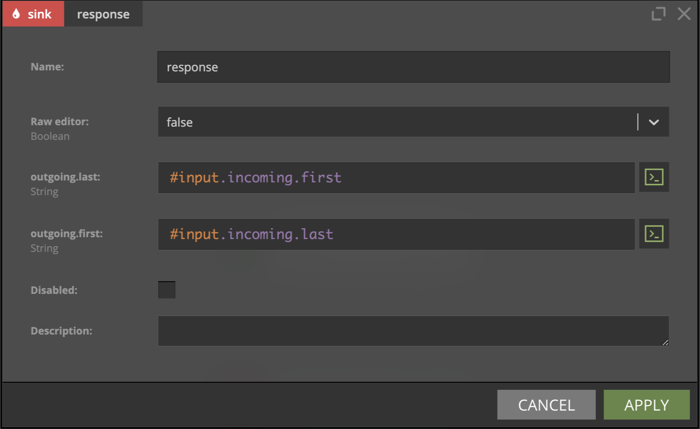
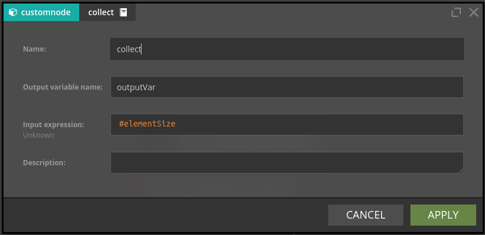

# Request-Response

This page covers topics specific to the Request-Response processing mode. Please read
the [common introduction](Intro.md) before proceeding.

## Concepts

### Slug
In Request-Response processing mode scenario deployment creates a [resource](../integration/RequestResponse.mdx) which can be used to communicate with a scenario.
With `slug` property author can configure what is a path of that resource.

### Schemas

Unlike in the Streaming processing mode, there is no Schema Registry which would store data schemas - request and
response schemas in our case. Still, the schema of the request and response ("input" and "output") need to be declared
to Nussknacker; they are defined alongside the scenario (as the scenario property). The "language" used to define
schemas is called [JSON Schema](https://json-schema.org/). Nussknacker uses those schemas to understand how the request
and response should look like, assist you with hints and validate expressions you write.

Click Properties icon on the right panel of the scenario to define input and output schemas.

### Scenario response in scenarios with split and for-each nodes

If parallel branches end with response nodes and more than one response is generated (e.g there is no filtering after
split), the only response which is returned is the one which was chronologically generated first. There is no way to
determine which one will be generated first. If all responses are important to you, you need to take additional
measures - use [union](./BasicNodes.md#union) node to merge branches and [collect](#collect) node to collect data
records coming from individual branches into a list. 

If you use for-each node and need to collect all the results into a list of values, use [collect](#collect) node.

Finally, if no response is generated (e.g. after filtering), an error is returned (in the future this behavior may
change).

## Request - Response Specific Components

### Source

The `request` source does not take any parameters - just drag it onto the scenario authoring canvas.

### Sink

The `response` sink configuration form shows a list of fields defined in the [output schema](#schemas).

If, instead of filling separate autogenerated fields, you prefer to define the whole response as one expression
containing value of the scenario response, you can do that by switching `Raw editor` to `true`.

When using the Raw editor, you can choose
the [validation mode](../integration/DataTypingAndSchemasHandling.md#validation-and-encoding).
If you prefer to define the whole scenario response as one expression instead of filling individual fields, you can do
that by setting `Raw editor` to `true`.

### Collect

As described in the [Concepts section](#concepts), there are cases when during single invocation of the request -
response scenario, multiple data records start to "flow" through the scenario. Just to reiterate, this situation happens
in the following cases:

- as the result of the execution of the [for-each](./BasicNodes.md#foreach) node,
- if [split](./BasicNodes.md#split) node is used

In such cases, the `collect` node provides a convenient way of collecting all these records into a list. If data records
are in parallel branches, a [union](./BasicNodes.md#union) node should be used to merge the branches first.

Collect node takes two parameters:

- Input expression - this expression will be evaluated for all data "records" which "flow" through the scenario and will
  be collected into a list.
- Output variable name - name of the variable which will store the above-mentioned list.

Example:

- For-each node executes on a list `{"one", "two", "three"}`, the output variable is `Element`.
- The subsequent variable node defines `elementSize` variable; `#Element.length` (returns length of the string) is an
  expression defining this variable. Because this node is "after" the for-each node, it will execute as many times as
  there are elements in the list on which for-each node executed, producing 3 #elementSize records.
- Collect node collects all occurrences of `#elementSize` record into a list.

The output from collect node will be a list: `{3, 3, 5}`.

_Collect is designed to be used in simple collect cases, it might not work as expected in nested structures (like
for-each inside for-each)_
