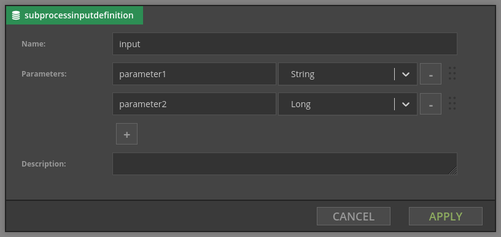

# Subprocesses

Subprocesses are a way to share fragments of logic. 

Subprocess first has to be designed (you can access subprocesses via Subprocesses tab) and then it can be used in other processes in same category

## Inputs
Subprocess can have one input. You can define parameters of a subprocess:

Currently they have to be given as fully qualified Java type e.g. `java.lang.String`, `java.lang.Long`

##Outputs
Subprocess can define zero, one or more outputs. Each of them has a name, main process can then choose appropriate output. Below you can see subprocess with two outputs:

## Limitations of subprocesses
- They cannot access variables from the main process if they are not passed as parameters.
- They cannot be nested (i.e. subprocess cannot invoke other subprocess).
- They cannot pass output variables to the main process. This may change in the future.
- When inputs/outputs of subprocess change, processes using it have to be corrected manually.
