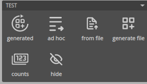
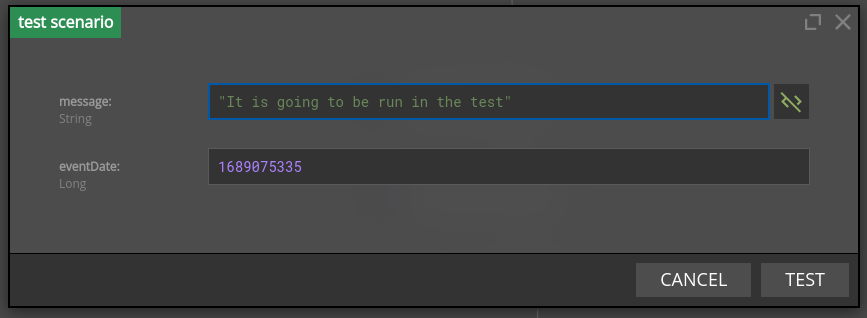
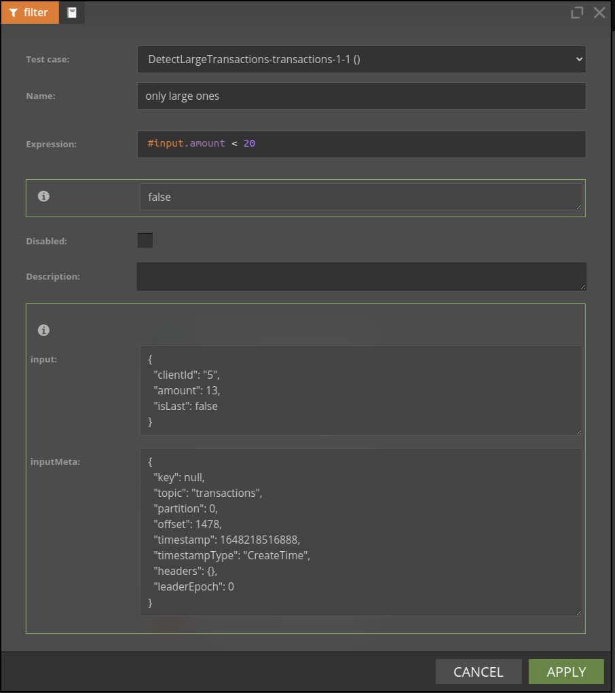
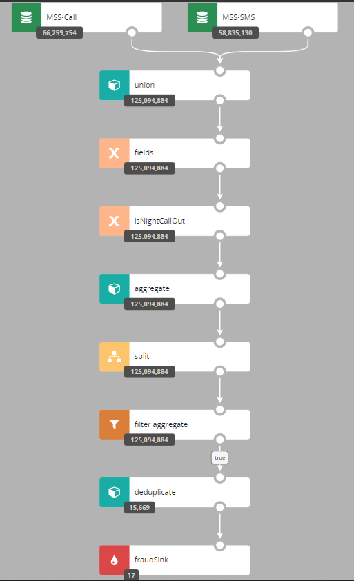

# Testing and Debugging

There are several features in Nussknacker designed specifically to ease testing and debugging; this page provides a brief explanation how to use them. This functionality is grouped in the Test panel; if you did not rearrange panels it is in the right part of the Designer canvas. 




## Test data capture
**(Streaming processing mode only)**

You can use `generate file` button to capture events from the input Kafka topic into the file. You will be prompted to enter number of events to be captured. This feature works also if there are multiple Kafka input topics to the scenario.
Below you can see how such file looks like.
```json
{"sourceId":"kafka1","record":{"keySchemaId":null,"valueSchemaId":null,"consumerRecord":{"key":null,"value":{"clientId":"4","amount":30,"eventDate":1674548921},"topic":"transactions","partition":0,"offset":58209,"timestamp":1674548933921,"timestampType":"CreateTime","headers":{},"leaderEpoch":0}},"timestamp":1674548933921}
{"sourceId":"kafka2","record":{"keySchemaId":null,"valueSchemaId":null,"consumerRecord":{"key":null,"value":{"clientId":"4","amount":30,"eventDate":1674548921},"topic":"transactions","partition":0,"offset":58209,"timestamp":1674548933921,"timestampType":"CreateTime","headers":{},"leaderEpoch":0}},"timestamp":1674548933921}
```
Each line of the generated file contains one event. The `sourceId` field contains name of the source node as specified in the scenario and the `record` field contains json representation of the event. 

You could also use `generated` button to perform `generate file` and `from file` testing at once - without downloading locally and then uploading data to designer.

## Testing using ad hoc form

If you are unable to create data based on recent scenario executions, or it just seems convenient, you can manually provide data using the 'ad hoc' functionality.
It will open a window with the fields that this scenario source expects.



The testing form will validate the types of fields you enter and prevent you from sending test requests that lack needed fields.
You can run a test by pressing the "Test" button.

The input form is generated differently for each source. 
For request-response the form is generated based on input schema declared in properties. 
As for kafka sources the form is generated based on avro or json schema obtained from a schema registry.

If you are using custom source you can also easily implement your own method to generate this form. 

If the scenario relies on sources that do not support the generation of a testing form, the `ad hoc` button will be disabled.

## Testing using events from file

A scenario can be tested with events coming from a file; this can be very handy if several test passes on the same input events are needed before the scenario is deemed ready. Similarly, as with test data capture, this feature also works with multiple sources.
All you need to do is to reuse file you already have from the `Test data capture` step or prepare such file manually e.g. for the **Request-Response** processing mode.

Designer accepts the following formats of test records:
- standard records that are generated using `generate file` button and have `sourceId`, `record` and optional `timestamp` fields
- simplified records that have only `record` JSON inlined. Simplified format can be helpful in **Request-Response**
  or when source records are persisted in logs and can be copied directly to the test file. Note, this format can be
  used only if the tested scenario has exactly one source.

For example, the below records can be used to test if the scenario has exactly one source:
```json
{"sourceId":"kafka1","record":{"keySchemaId":null,"valueSchemaId":null,"consumerRecord":{"key":null,"value":{"clientId":"4","amount":30,"eventDate":1674548921},"topic":"transactions","partition":0,"offset":58209,"timestamp":1674548933921,"timestampType":"CreateTime","headers":{},"leaderEpoch":0}},"timestamp":1674548933921}
{"keySchemaId":null,"valueSchemaId":null,"consumerRecord":{"key":null,"value":{"clientId":"4","amount":30,"eventDate":1674548921},"topic":"transactions","partition":0,"offset":58209,"timestamp":1674548933921,"timestampType":"CreateTime","headers":{},"leaderEpoch":0}}
```
The `sourceId` field contains name of the source node as specified in the scenario; the `record` field contains the json representation of the event. 


If you want to read more than 20 records from file, you will need to change [testing settings](../configuration/DesignerConfiguration.md#testing).


## Debugging node behaviour 

Almost all nodes use SpEL expressions; sometimes it is not clear what was the result of the SpEL expression for the given input record. If scenario is run using data from file it is possible to check results of expression evaluation - separately for each input record. 



## Watching nodes filtering behaviour with counts

Understanding how many events passed through a given node can be very handy during debugging - choose `counts` button to see the counts snapshot. The number displayed is the number of events which entered a given node. 

In some edge cases, you may need to change algorithm used for counts computations - consult the [counts configuration](../configuration/DesignerConfiguration.md#counts) for details.


